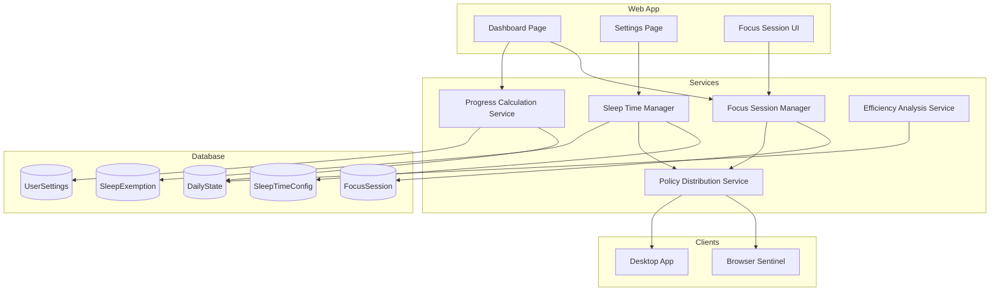

# Design Document: Ad-hoc Focus Session & Sleep Time Management

## Overview

本设计文档描述了临时专注时段（Ad-hoc Focus Session）和睡眠时间管理（Sleep Time Management）功能的技术实现方案，以及 Dashboard 状态显示与预测功能。

系统采用现有的 Octopus 架构，通过 Policy Distribution Service 将策略分发到各个客户端（Browser Sentinel、Desktop App），实现跨平台的专注和睡眠时间执行。

## Architecture



## Components and Interfaces

### 1. Focus Session Manager Service

负责管理临时专注时段的生命周期。

```typescript
// src/services/focus-session.service.ts

interface FocusSession {
  id: string;
  userId: string;
  startTime: Date;
  plannedEndTime: Date;
  actualEndTime?: Date;
  duration: number; // minutes
  status: 'active' | 'completed' | 'cancelled';
  overridesSleepTime: boolean;
  createdAt: Date;
}

interface StartSessionInput {
  duration: number; // 15-240 minutes
  overrideSleepTime?: boolean;
}

interface ExtendSessionInput {
  additionalMinutes: number; // 15-120 minutes
}

export const focusSessionService = {
  // Start a new ad-hoc focus session
  async startSession(userId: string, input: StartSessionInput): Promise<ServiceResult<FocusSession>>;
  
  // End the current active session
  async endSession(userId: string): Promise<ServiceResult<FocusSession>>;
  
  // Extend the current active session
  async extendSession(userId: string, input: ExtendSessionInput): Promise<ServiceResult<FocusSession>>;
  
  // Get the current active session (if any)
  async getActiveSession(userId: string): Promise<ServiceResult<FocusSession | null>>;
  
  // Check if user is currently in a focus session
  async isInFocusSession(userId: string): Promise<ServiceResult<boolean>>;
  
  // Get session history
  async getSessionHistory(userId: string, days: number): Promise<ServiceResult<FocusSession[]>>;
  
  // Check and auto-end expired sessions (called by scheduler)
  async checkExpiredSessions(): Promise<ServiceResult<number>>;
};
```

### 2. Sleep Time Manager Service

负责管理睡眠时间配置和执行。

```typescript
// src/services/sleep-time.service.ts

interface SleepTimeConfig {
  enabled: boolean;
  startTime: string; // "HH:mm" format, e.g., "23:00"
  endTime: string;   // "HH:mm" format, e.g., "07:00"
  enforcementApps: SleepEnforcementApp[];
  snoozeLimit: number; // max snoozes per night, default 2
  snoozeDuration: number; // minutes, default 30
}

interface SleepEnforcementApp {
  bundleId: string;
  name: string;
  isPreset: boolean;
}

interface SleepExemption {
  id: string;
  userId: string;
  type: 'snooze' | 'focus_override';
  timestamp: Date;
  duration: number; // minutes
  focusSessionId?: string;
}

export const sleepTimeService = {
  // Get sleep time configuration
  async getConfig(userId: string): Promise<ServiceResult<SleepTimeConfig>>;
  
  // Update sleep time configuration
  async updateConfig(userId: string, config: Partial<SleepTimeConfig>): Promise<ServiceResult<SleepTimeConfig>>;
  
  // Check if currently in sleep time window
  async isInSleepTime(userId: string): Promise<ServiceResult<boolean>>;
  
  // Request snooze
  async requestSnooze(userId: string): Promise<ServiceResult<SleepExemption>>;
  
  // Get remaining snoozes for tonight
  async getRemainingSnoozes(userId: string): Promise<ServiceResult<number>>;
  
  // Record exemption event
  async recordExemption(userId: string, exemption: Omit<SleepExemption, 'id' | 'userId'>): Promise<ServiceResult<SleepExemption>>;
  
  // Get exemption history
  async getExemptionHistory(userId: string, days: number): Promise<ServiceResult<SleepExemption[]>>;
};
```

### 3. Progress Calculation Service

负责计算每日进度、压力指标和预测。

```typescript
// src/services/progress-calculation.service.ts

type PressureLevel = 'on_track' | 'moderate' | 'high' | 'critical';
type TimeContext = 'work_time' | 'adhoc_focus' | 'sleep_time' | 'free_time';
type ExpectedState = 'in_pomodoro' | 'normal_rest' | 'over_rest';

interface DailyProgress {
  completedPomodoros: number;
  targetPomodoros: number;
  completionPercentage: number;
  remainingPomodoros: number;
  
  // Time calculations
  remainingWorkMinutes: number;
  maxPossiblePomodoros: number;
  requiredPace: string; // e.g., "1 pomodoro every 45 minutes"
  
  // Pressure indicator
  pressureLevel: PressureLevel;
  pressureMessage: string;
  
  // Goal at risk
  isGoalAtRisk: boolean;
  additionalMinutesNeeded: number;
  suggestedGoalReduction: number;
}

interface CurrentStatus {
  timeContext: TimeContext;
  expectedState: ExpectedState;
  overRestMinutes?: number;
  focusSessionRemaining?: number;
  sleepTimeRemaining?: number;
}

interface TaskSuggestion {
  taskId: string;
  taskTitle: string;
  estimatedMinutes: number;
  priority: string;
  reason: string;
}

export const progressCalculationService = {
  // Get current status
  async getCurrentStatus(userId: string): Promise<ServiceResult<CurrentStatus>>;
  
  // Get daily progress with predictions
  async getDailyProgress(userId: string): Promise<ServiceResult<DailyProgress>>;
  
  // Get task suggestions for today
  async getTaskSuggestions(userId: string): Promise<ServiceResult<TaskSuggestion[]>>;
  
  // Adjust today's goal temporarily
  async adjustTodayGoal(userId: string, newTarget: number): Promise<ServiceResult<void>>;
  
  // Calculate pressure level
  calculatePressureLevel(
    remainingPomodoros: number,
    maxPossiblePomodoros: number,
    completionPercentage: number
  ): PressureLevel;
};
```

### 4. Efficiency Analysis Service

负责历史效率分析和智能建议。

```typescript
// src/services/efficiency-analysis.service.ts

interface TimePeriodStats {
  period: 'morning' | 'afternoon' | 'evening';
  averagePomodoros: number;
  completionRate: number;
  totalMinutes: number;
}

interface EfficiencyInsight {
  type: 'best_period' | 'pattern' | 'suggestion';
  message: string;
  data?: Record<string, unknown>;
}

interface HourlyHeatmapData {
  hour: number;
  dayOfWeek: number;
  productivity: number; // 0-100
  pomodoroCount: number;
}

interface HistoricalAnalysis {
  // Overall stats
  averageDailyPomodoros: number;
  goalAchievementRate: number;
  averageRestDuration: number;
  
  // By time period
  byTimePeriod: TimePeriodStats[];
  
  // Insights
  insights: EfficiencyInsight[];
  
  // Heatmap data
  hourlyHeatmap: HourlyHeatmapData[];
  
  // Suggested goal
  suggestedDailyGoal: number;
}

export const efficiencyAnalysisService = {
  // Get historical analysis
  async getHistoricalAnalysis(userId: string, days: number): Promise<ServiceResult<HistoricalAnalysis>>;
  
  // Get efficiency by time period
  async getEfficiencyByTimePeriod(userId: string, days: number): Promise<ServiceResult<TimePeriodStats[]>>;
  
  // Get hourly productivity heatmap
  async getHourlyHeatmap(userId: string, days: number): Promise<ServiceResult<HourlyHeatmapData[]>>;
  
  // Get smart goal suggestion
  async getSuggestedGoal(userId: string): Promise<ServiceResult<number>>;
  
  // Check if current goal is realistic
  async isGoalRealistic(userId: string, goal: number): Promise<ServiceResult<{ realistic: boolean; reason?: string }>>;
};
```

### 5. Policy Integration

扩展现有的 Policy 类型以支持临时专注时段和睡眠时间。

```typescript
// Extended Policy type in src/types/octopus.ts

interface Policy {
  // ... existing fields ...
  
  // Ad-hoc focus session
  adhocFocusSession?: {
    active: boolean;
    endTime: number; // Unix timestamp
  };
  
  // Sleep time configuration
  sleepTime?: {
    enabled: boolean;
    startTime: string;
    endTime: string;
    enforcementApps: SleepEnforcementApp[];
    isCurrentlyActive: boolean;
    isSnoozed: boolean;
    snoozeEndTime?: number;
  };
}
```

## Data Models

### Database Schema Extensions

```prisma
// prisma/schema.prisma additions

model FocusSession {
  id              String    @id @default(uuid())
  userId          String
  user            User      @relation(fields: [userId], references: [id], onDelete: Cascade)
  startTime       DateTime  @default(now())
  plannedEndTime  DateTime
  actualEndTime   DateTime?
  duration        Int       // minutes
  status          String    @default("active") // active, completed, cancelled
  overridesSleepTime Boolean @default(false)
  createdAt       DateTime  @default(now())

  @@index([userId])
  @@index([userId, status])
  @@index([status, plannedEndTime])
}

model SleepExemption {
  id              String    @id @default(uuid())
  userId          String
  user            User      @relation(fields: [userId], references: [id], onDelete: Cascade)
  type            String    // snooze, focus_override
  timestamp       DateTime  @default(now())
  duration        Int       // minutes
  focusSessionId  String?
  focusSession    FocusSession? @relation(fields: [focusSessionId], references: [id])

  @@index([userId])
  @@index([userId, timestamp])
}

// UserSettings extensions
model UserSettings {
  // ... existing fields ...
  
  // Sleep time settings
  sleepTimeEnabled      Boolean   @default(false)
  sleepTimeStart        String    @default("23:00")
  sleepTimeEnd          String    @default("07:00")
  sleepEnforcementApps  Json      @default("[]")
  sleepSnoozeLimit      Int       @default(2)
  sleepSnoozeDuration   Int       @default(30)
  
  // Over rest settings
  overRestGracePeriod   Int       @default(5) // minutes
  overRestActions       String[]  @default(["show_notification"])
  overRestApps          Json      @default("[]")
  
  // Early warning settings
  earlyWarningEnabled   Boolean   @default(true)
  earlyWarningInterval  Int       @default(60) // minutes
  earlyWarningThreshold Int       @default(70) // percentage
  earlyWarningMethod    String[]  @default(["browser_notification"])
  earlyWarningQuietStart String?  // "HH:mm" format
  earlyWarningQuietEnd   String?  // "HH:mm" format
}

// Task extensions
model Task {
  // ... existing fields ...
  
  estimatedMinutes Int? // estimated time in minutes
}

// DailyState extensions
model DailyState {
  // ... existing fields ...
  
  adjustedGoal Int? // temporary goal adjustment for today
}
```

## Correctness Properties

*A property is a characteristic or behavior that should hold true across all valid executions of a system-essentially, a formal statement about what the system should do. Properties serve as the bridge between human-readable specifications and machine-verifiable correctness guarantees.*

### Property 1: Focus Session Lifecycle Consistency

*For any* focus session, the following invariants must hold:
- If status is 'active', actualEndTime must be null
- If status is 'completed' or 'cancelled', actualEndTime must be set
- plannedEndTime must equal startTime + duration (in minutes)
- duration must be between 15 and 240 minutes

**Validates: Requirements 1.1, 1.2, 1.4, 3.2, 3.3**

### Property 2: Single Active Session Constraint

*For any* user at any point in time, there can be at most one focus session with status 'active'.

**Validates: Requirements 1.5**

### Property 3: Policy Enforcement Consistency

*For any* user with an active focus session or within work time slots, the compiled policy must have enforcement enabled (blacklist/whitelist active).

**Validates: Requirements 2.1, 2.2, 2.3, 2.4, 6.1, 6.2, 6.3**

### Property 4: Session Extension Validity

*For any* session extension, the new plannedEndTime must equal the old plannedEndTime plus the extension duration, and the extension duration must be between 15 and 120 minutes.

**Validates: Requirements 4.1, 4.2, 4.3, 4.4**

### Property 5: Sleep Time Snooze Limit

*For any* user on any given night, the number of snooze exemptions must not exceed the configured snoozeLimit.

**Validates: Requirements 12.1, 12.2, 12.3, 12.4**

### Property 6: Sleep Override Recording

*For any* focus session that overrides sleep time, there must be a corresponding SleepExemption record with type 'focus_override'.

**Validates: Requirements 13.3, 14.1, 14.2**

### Property 7: Pressure Level Calculation Consistency

*For any* daily progress calculation:
- If remainingPomodoros <= 0, pressureLevel must be 'on_track'
- If remainingPomodoros > maxPossiblePomodoros, pressureLevel must be 'critical'
- pressureLevel must be monotonically increasing as the ratio of remainingPomodoros/maxPossiblePomodoros increases

**Validates: Requirements 19.1, 19.2, 19.3, 19.4, 19.5, 19.6, 19.7**

### Property 8: Task Estimation Aggregation

*For any* project, the sum of estimatedMinutes from all its tasks must equal the project's calculated total estimated time.

**Validates: Requirements 20.1, 20.3, 21.1, 21.2**

### Property 9: Today's Goal Adjustment Isolation

*For any* daily goal adjustment, the adjustment must only affect the current day's DailyState.adjustedGoal and must not modify UserSettings.expectedPomodoroCount.

**Validates: Requirements 23.1, 23.2, 23.3, 23.4, 23.5**

### Property 10: Historical Analysis Accuracy

*For any* time period analysis, the sum of pomodoros across all time periods (morning, afternoon, evening) must equal the total pomodoros for that day.

**Validates: Requirements 24.1, 24.1.1, 24.1.2, 24.1.3**

## Error Handling

### Error Codes

| Code | Description |
|------|-------------|
| `SESSION_ALREADY_ACTIVE` | User already has an active focus session |
| `SESSION_NOT_FOUND` | No active session found to end/extend |
| `INVALID_DURATION` | Duration outside allowed range |
| `SLEEP_TIME_ACTIVE` | Cannot start session during sleep time without override |
| `SNOOZE_LIMIT_REACHED` | No more snoozes available tonight |
| `GOAL_ADJUSTMENT_INVALID` | Invalid goal adjustment value |

### Error Response Format

```typescript
interface ServiceError {
  code: string;
  message: string;
  details?: Record<string, unknown>;
}
```

## Testing Strategy

### Unit Tests

- Focus session creation with various durations
- Session extension calculations
- Sleep time window detection
- Snooze limit enforcement
- Pressure level calculation
- Time period classification (morning/afternoon/evening)

### Property-Based Tests

Using fast-check for property-based testing:

1. **Session Lifecycle Property Test**: Generate random sessions and verify invariants
2. **Single Active Session Property Test**: Generate concurrent session attempts and verify constraint
3. **Policy Enforcement Property Test**: Generate various time/session combinations and verify policy
4. **Pressure Calculation Property Test**: Generate progress scenarios and verify pressure levels
5. **Estimation Aggregation Property Test**: Generate tasks with estimates and verify project totals

### Integration Tests

- Focus session → Policy distribution → Client enforcement flow
- Sleep time → Desktop app enforcement flow
- Dashboard → Progress calculation → UI update flow
