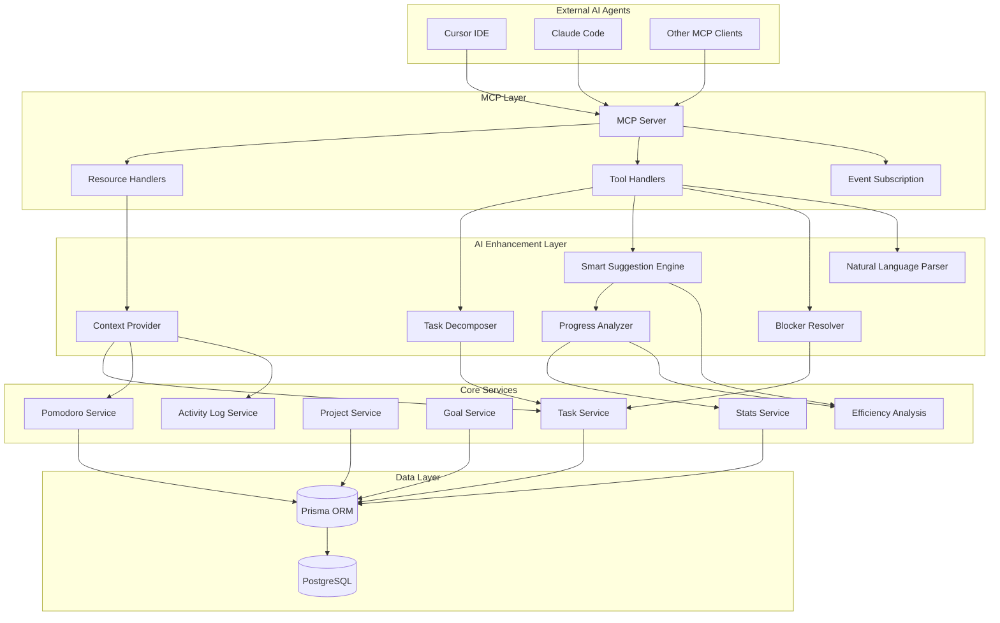
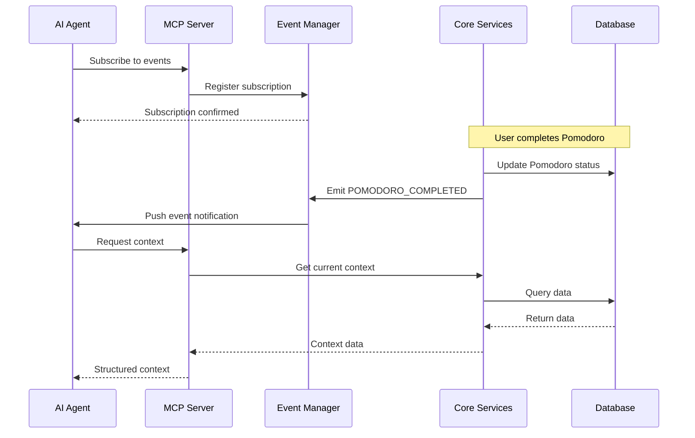
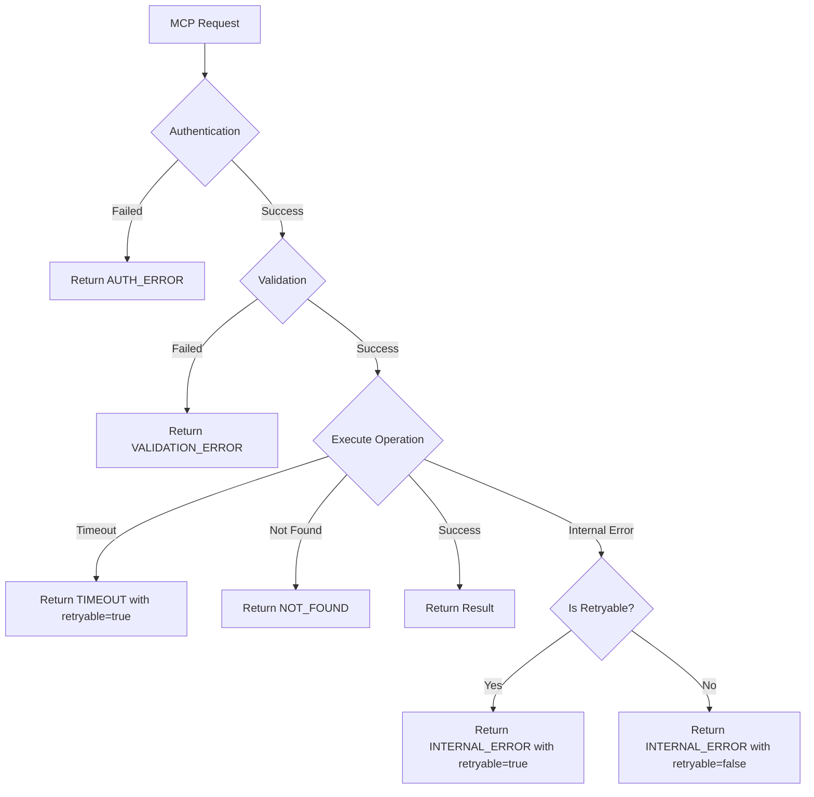

# Design Document: AI-Native Enhancement

## Overview

本设计文档描述了 VibeFlow AI-Native 增强功能的技术架构和实现方案。该功能将 VibeFlow 从传统生产力工具转变为 AI 原生应用，通过扩展 MCP (Model Context Protocol) 能力，实现与外部 AI Agent（如 Cursor、Claude Code）的深度集成。

核心设计目标：
1. **扩展 MCP 资源层** - 暴露更丰富的上下文数据给 AI Agent
2. **增强 MCP 工具层** - 提供批量操作和高级分析工具
3. **智能建议引擎** - 基于历史数据和模式识别提供主动建议
4. **事件订阅系统** - 支持 AI Agent 实时响应系统状态变化
5. **自然语言接口** - 支持自然语言任务创建和交互

## Architecture

### 系统架构图



### 事件流架构



## Components and Interfaces

### 1. 扩展 MCP 资源 (Requirements 1.1-1.5)

#### 新增资源定义

```typescript
// src/mcp/resources.ts - 扩展资源

export const EXTENDED_RESOURCE_URIS = {
  // 现有资源
  ...RESOURCE_URIS,
  
  // 新增资源 (Requirement 1.1)
  WORKSPACE_CONTEXT: 'vibe://context/workspace',
  
  // 新增资源 (Requirement 1.2)
  POMODORO_HISTORY: 'vibe://history/pomodoros',
  
  // 新增资源 (Requirement 1.3)
  PRODUCTIVITY_ANALYTICS: 'vibe://analytics/productivity',
  
  // 新增资源 (Requirement 1.4)
  ACTIVE_BLOCKERS: 'vibe://blockers/active',
} as const;
```

#### 资源接口定义

```typescript
// Requirement 1.1: 工作区上下文
export interface WorkspaceContextResource {
  currentFiles: string[];           // 当前打开的文件
  recentChanges: Array<{
    file: string;
    timestamp: Date;
    changeType: 'created' | 'modified' | 'deleted';
  }>;
  activeBranch: string | null;      // Git 分支
  workspaceRoot: string;
}

// Requirement 1.2: 番茄钟历史
export interface PomodoroHistoryResource {
  sessions: Array<{
    id: string;
    taskId: string;
    taskTitle: string;
    projectId: string;
    projectTitle: string;
    duration: number;
    status: 'COMPLETED' | 'INTERRUPTED' | 'ABORTED';
    startTime: Date;
    endTime: Date | null;
  }>;
  summary: {
    totalSessions: number;
    completedSessions: number;
    totalMinutes: number;
    averageDuration: number;
  };
}

// Requirement 1.3: 生产力分析
export interface ProductivityAnalyticsResource {
  dailyScore: number;               // 0-100
  weeklyScore: number;
  monthlyScore: number;
  peakHours: number[];              // 最高效时段
  trends: 'improving' | 'declining' | 'stable';
  insights: string[];
}

// Requirement 1.4: 活跃阻塞
export interface ActiveBlockersResource {
  blockers: Array<{
    id: string;
    taskId: string;
    taskTitle: string;
    category: 'technical' | 'dependency' | 'unclear_requirements' | 'other';
    description: string;
    reportedAt: Date;
    status: 'active' | 'resolved';
  }>;
}
```

### 2. 智能任务分解器 (Requirements 2.1-2.5)

#### 服务接口

```typescript
// src/services/task-decomposer.service.ts

export interface SubtaskSuggestion {
  title: string;
  estimatedMinutes: number;
  priority: 'P1' | 'P2' | 'P3';
  rationale: string;
}

export interface DecompositionResult {
  shouldOffer: boolean;              // 是否应该提供分解建议
  suggestions: SubtaskSuggestion[];  // 2-5 个子任务建议
  confidence: number;                // 置信度 0-1
}

export const taskDecomposerService = {
  /**
   * 分析任务是否需要分解 (Requirement 2.1)
   * 当描述超过 100 字符时触发
   */
  async shouldOfferDecomposition(
    taskDescription: string
  ): Promise<boolean>;

  /**
   * 生成子任务建议 (Requirements 2.2, 2.3)
   * 返回 2-5 个子任务，每个包含时间估算
   */
  async generateSubtaskSuggestions(
    userId: string,
    taskId: string,
    taskDescription: string
  ): Promise<ServiceResult<DecompositionResult>>;

  /**
   * 接受子任务建议 (Requirement 2.4)
   * 创建子任务并关联到父任务
   */
  async acceptSuggestions(
    userId: string,
    parentTaskId: string,
    acceptedSuggestions: SubtaskSuggestion[]
  ): Promise<ServiceResult<Task[]>>;

  /**
   * 记录用户反馈用于学习 (Requirement 2.5)
   */
  async recordFeedback(
    userId: string,
    taskId: string,
    accepted: string[],
    rejected: string[]
  ): Promise<ServiceResult<void>>;
};
```

#### 分解算法设计

```typescript
// 基于任务描述的关键词和模式识别
const DECOMPOSITION_PATTERNS = [
  { pattern: /implement|create|build/i, suggestCount: 3 },
  { pattern: /refactor|migrate/i, suggestCount: 4 },
  { pattern: /test|debug|fix/i, suggestCount: 2 },
  { pattern: /design|plan|research/i, suggestCount: 3 },
];

// 时间估算基于历史数据
async function estimateSubtaskTime(
  userId: string,
  subtaskType: string
): Promise<number> {
  // 查询用户历史相似任务的实际耗时
  const historicalData = await getHistoricalTaskDurations(userId, subtaskType);
  return calculateMedianDuration(historicalData);
}
```

### 3. 智能建议引擎 (Requirements 3.1-3.5)

#### 服务接口

```typescript
// src/services/smart-suggestion.service.ts

export interface TaskSuggestion {
  taskId: string;
  taskTitle: string;
  projectTitle: string;
  priority: string;
  reason: string;                    // 建议原因 (Requirement 9.2)
  estimatedPomodoros: number;
  deadlineProximity: 'urgent' | 'soon' | 'normal' | 'none';
  goalAlignment: number;             // 0-1 与目标的关联度
}

export interface SuggestionContext {
  trigger: 'pomodoro_complete' | 'idle_detected' | 'airlock_entry' | 'manual';
  currentState: string;
  timeOfDay: 'morning' | 'afternoon' | 'evening';
  dayOfWeek: number;
}

export const smartSuggestionService = {
  /**
   * 获取下一个任务建议 (Requirements 3.1, 3.2)
   * 考虑优先级、截止日期、目标关联
   */
  async getNextTaskSuggestion(
    userId: string,
    context: SuggestionContext
  ): Promise<ServiceResult<TaskSuggestion[]>>;

  /**
   * 检测空闲并提示 (Requirement 3.3)
   * 工作时间内空闲超过 5 分钟触发
   */
  async checkIdleAndSuggest(
    userId: string,
    idleMinutes: number
  ): Promise<ServiceResult<TaskSuggestion[] | null>>;

  /**
   * Airlock 阶段的 Top 3 建议 (Requirements 9.1-9.4)
   */
  async getAirlockSuggestions(
    userId: string
  ): Promise<ServiceResult<{
    suggestions: TaskSuggestion[];
    workloadWarning: string | null;  // Requirement 9.4
    dayOfWeekPattern: string;        // Requirement 9.3
  }>>;

  /**
   * 记录建议反馈 (Requirements 3.5, 9.5)
   */
  async recordSuggestionFeedback(
    userId: string,
    suggestionId: string,
    action: 'accepted' | 'dismissed' | 'modified'
  ): Promise<ServiceResult<void>>;
};
```

#### 建议排序算法

```typescript
// 综合评分算法
function calculateSuggestionScore(task: Task, context: SuggestionContext): number {
  let score = 0;
  
  // 优先级权重 (Requirement 3.2)
  const priorityWeights = { P1: 100, P2: 60, P3: 30 };
  score += priorityWeights[task.priority];
  
  // 截止日期权重 (Requirement 3.2)
  if (task.planDate) {
    const daysUntilDue = daysBetween(new Date(), task.planDate);
    if (daysUntilDue <= 0) score += 150;      // 已过期
    else if (daysUntilDue <= 1) score += 100; // 今天到期
    else if (daysUntilDue <= 3) score += 50;  // 3天内
  }
  
  // 目标关联权重 (Requirement 3.2)
  score += task.goalAlignment * 40;
  
  // 历史模式权重 (Requirement 9.3)
  const dayPattern = getUserDayPattern(context.userId, context.dayOfWeek);
  if (dayPattern.preferredTaskTypes.includes(task.type)) {
    score += 20;
  }
  
  return score;
}
```

### 4. 扩展 MCP 工具 (Requirements 4.1-4.5)

#### 新增工具定义

```typescript
// src/mcp/tools.ts - 扩展工具

export const EXTENDED_TOOLS = {
  ...TOOLS,
  
  // Requirement 4.1
  BATCH_UPDATE_TASKS: 'vibe.batch_update_tasks',
  
  // Requirement 4.2
  CREATE_PROJECT_FROM_TEMPLATE: 'vibe.create_project_from_template',
  
  // Requirement 4.3
  ANALYZE_TASK_DEPENDENCIES: 'vibe.analyze_task_dependencies',
  
  // Requirement 4.4
  GENERATE_DAILY_SUMMARY: 'vibe.generate_daily_summary',
  
  // 自然语言任务创建 (Requirement 8.1)
  CREATE_TASK_FROM_NL: 'vibe.create_task_from_nl',
} as const;
```

#### 工具输入/输出接口

```typescript
// Requirement 4.1: 批量更新任务
interface BatchUpdateTasksInput {
  updates: Array<{
    taskId: string;
    status?: TaskStatus;
    priority?: Priority;
    planDate?: Date;
  }>;
}

interface BatchUpdateTasksOutput {
  success: boolean;
  updated: number;
  failed: Array<{ taskId: string; error: string }>;
}

// Requirement 4.2: 从模板创建项目
interface CreateProjectFromTemplateInput {
  templateId: string;
  projectName: string;
  goalId?: string;
}

interface CreateProjectFromTemplateOutput {
  success: boolean;
  project: {
    id: string;
    title: string;
    tasks: Array<{ id: string; title: string }>;
  };
}

// Requirement 4.3: 分析任务依赖
interface AnalyzeTaskDependenciesInput {
  projectId: string;
}

interface AnalyzeTaskDependenciesOutput {
  dependencies: Array<{
    taskId: string;
    dependsOn: string[];
    blockedBy: string[];
  }>;
  suggestedOrder: string[];  // 最优执行顺序
  criticalPath: string[];    // 关键路径
}

// Requirement 4.4: 生成每日总结
interface GenerateDailySummaryInput {
  date?: Date;  // 默认今天
}

interface GenerateDailySummaryOutput {
  date: string;
  completedTasks: Array<{ title: string; pomodoros: number }>;
  totalPomodoros: number;
  focusMinutes: number;
  efficiencyScore: number;
  highlights: string[];
  tomorrowSuggestions: string[];
}
```

#### 审计日志 (Requirement 4.5)

```typescript
// src/services/mcp-audit.service.ts

export interface MCPAuditLog {
  id: string;
  userId: string;
  agentId: string;
  toolName: string;
  input: Record<string, unknown>;
  output: Record<string, unknown>;
  success: boolean;
  duration: number;
  timestamp: Date;
}

export const mcpAuditService = {
  async logToolCall(
    userId: string,
    agentId: string,
    toolName: string,
    input: Record<string, unknown>,
    output: Record<string, unknown>,
    success: boolean,
    duration: number
  ): Promise<ServiceResult<MCPAuditLog>>;

  async getAuditLogs(
    userId: string,
    options: {
      startDate?: Date;
      endDate?: Date;
      toolName?: string;
      limit?: number;
    }
  ): Promise<ServiceResult<MCPAuditLog[]>>;
};
```

### 5. 阻塞检测与解决 (Requirements 5.1-5.5)

#### 服务接口

```typescript
// src/services/blocker-resolver.service.ts

export type BlockerCategory = 
  | 'technical'           // 技术难题
  | 'dependency'          // 外部依赖
  | 'unclear_requirements' // 需求不清
  | 'other';

export interface Blocker {
  id: string;
  taskId: string;
  userId: string;
  category: BlockerCategory;
  description: string;
  suggestedResolutions: string[];
  status: 'active' | 'resolved';
  reportedAt: Date;
  resolvedAt: Date | null;
  dependencyInfo?: {
    type: 'person' | 'system' | 'external';
    identifier: string;
    expectedResolution: Date | null;
  };
}

export const blockerResolverService = {
  /**
   * 检测潜在阻塞 (Requirement 5.1)
   * 同一任务超过 2 个番茄钟无进度时触发
   */
  async detectPotentialBlocker(
    userId: string,
    taskId: string
  ): Promise<ServiceResult<{ isBlocked: boolean; pomodoroCount: number }>>;

  /**
   * 报告并分类阻塞 (Requirement 5.2)
   */
  async reportBlocker(
    userId: string,
    taskId: string,
    description: string
  ): Promise<ServiceResult<Blocker>>;

  /**
   * 自动分类阻塞 (Requirement 5.2)
   * 基于描述关键词和历史模式
   */
  async categorizeBlocker(
    description: string
  ): Promise<BlockerCategory>;

  /**
   * 获取解决建议 (Requirement 5.3)
   */
  async getSuggestedResolutions(
    category: BlockerCategory,
    userId: string
  ): Promise<ServiceResult<string[]>>;

  /**
   * 跟踪外部依赖 (Requirement 5.4)
   */
  async trackDependency(
    blockerId: string,
    dependencyInfo: Blocker['dependencyInfo']
  ): Promise<ServiceResult<void>>;

  /**
   * 解决阻塞 (Requirement 5.4)
   */
  async resolveBlocker(
    blockerId: string,
    resolution: string
  ): Promise<ServiceResult<Blocker>>;

  /**
   * 获取阻塞历史 (Requirement 5.5)
   */
  async getBlockerHistory(
    userId: string,
    options?: { taskId?: string; category?: BlockerCategory }
  ): Promise<ServiceResult<Blocker[]>>;
};
```

#### 阻塞分类算法

```typescript
// 基于关键词的分类
const CATEGORY_KEYWORDS: Record<BlockerCategory, string[]> = {
  technical: ['bug', 'error', 'crash', 'performance', 'memory', 'api', 'database'],
  dependency: ['waiting', 'blocked by', 'need from', 'depends on', 'external'],
  unclear_requirements: ['unclear', 'ambiguous', 'need clarification', 'spec', 'requirements'],
  other: [],
};

function categorizeByKeywords(description: string): BlockerCategory {
  const lowerDesc = description.toLowerCase();
  
  for (const [category, keywords] of Object.entries(CATEGORY_KEYWORDS)) {
    if (keywords.some(kw => lowerDesc.includes(kw))) {
      return category as BlockerCategory;
    }
  }
  
  return 'other';
}
```

### 6. 上下文提供器 (Requirements 6.1-6.5)

#### 服务接口

```typescript
// src/services/context-provider.service.ts

export interface AIContext {
  // Requirement 6.1: 当前任务和项目
  currentTask: {
    id: string;
    title: string;
    description: string;
    priority: string;
    status: string;
    estimatedMinutes: number | null;
    actualMinutes: number;
  } | null;
  
  currentProject: {
    id: string;
    title: string;
    deliverable: string;
    linkedGoals: Array<{ id: string; title: string }>;
  } | null;
  
  // Requirement 6.3: 编码原则
  codingPrinciples: string[];
  
  // Requirement 6.2: 最近活动
  recentActivity: Array<{
    type: 'pomodoro' | 'task_update' | 'blocker' | 'activity_log';
    description: string;
    timestamp: Date;
  }>;
  
  // Requirement 6.4: 番茄钟状态 (仅 FOCUS 状态)
  pomodoroStatus: {
    isActive: boolean;
    remainingMinutes: number;
    taskId: string;
  } | null;
  
  // 系统状态
  systemState: string;
  
  // 今日进度
  todayProgress: {
    completedPomodoros: number;
    targetPomodoros: number;
    completedTasks: number;
  };
}

export const contextProviderService = {
  /**
   * 获取完整 AI 上下文 (Requirements 6.1-6.4)
   */
  async getFullContext(userId: string): Promise<ServiceResult<AIContext>>;

  /**
   * 序列化为 Markdown 格式 (Requirement 6.5)
   * 优化 LLM 消费
   */
  async serializeToMarkdown(context: AIContext): Promise<string>;

  /**
   * 获取最近 2 小时活动 (Requirement 6.2)
   */
  async getRecentActivity(
    userId: string,
    hours: number
  ): Promise<ServiceResult<AIContext['recentActivity']>>;
};
```

#### Markdown 序列化格式 (Requirement 6.5)

```typescript
function serializeToMarkdown(context: AIContext): string {
  const sections: string[] = [];
  
  // 系统状态
  sections.push(`## Current State: ${context.systemState}`);
  
  // 当前任务
  if (context.currentTask) {
    sections.push(`
## Current Task
- **Title**: ${context.currentTask.title}
- **Priority**: ${context.currentTask.priority}
- **Status**: ${context.currentTask.status}
- **Estimated**: ${context.currentTask.estimatedMinutes ?? 'Not set'} minutes
- **Actual**: ${context.currentTask.actualMinutes} minutes
`);
  }
  
  // 番茄钟状态
  if (context.pomodoroStatus?.isActive) {
    sections.push(`
## Active Pomodoro
- **Remaining**: ${context.pomodoroStatus.remainingMinutes} minutes
`);
  }
  
  // 编码原则
  if (context.codingPrinciples.length > 0) {
    sections.push(`
## Coding Principles
${context.codingPrinciples.map(p => `- ${p}`).join('\n')}
`);
  }
  
  // 今日进度
  sections.push(`
## Today's Progress
- **Pomodoros**: ${context.todayProgress.completedPomodoros}/${context.todayProgress.targetPomodoros}
- **Tasks Completed**: ${context.todayProgress.completedTasks}
`);
  
  // 最近活动
  if (context.recentActivity.length > 0) {
    sections.push(`
## Recent Activity (Last 2 Hours)
${context.recentActivity.slice(0, 10).map(a => 
  `- [${a.type}] ${a.description} (${formatTime(a.timestamp)})`
).join('\n')}
`);
  }
  
  return sections.join('\n');
}
```

### 7. 进度分析器 (Requirements 7.1-7.5)

#### 服务接口

```typescript
// src/services/progress-analyzer.service.ts

export type ProductivityTrend = 'improving' | 'declining' | 'stable';

export interface ProductivityScore {
  daily: number;    // 0-100
  weekly: number;
  monthly: number;
  trend: ProductivityTrend;
}

export interface PeakHoursAnalysis {
  peakHours: number[];           // 最高效时段 (0-23)
  peakDays: number[];            // 最高效星期几 (0-6)
  averageByHour: Record<number, number>;
}

export interface GoalPrediction {
  goalId: string;
  goalTitle: string;
  deadline: Date;
  currentProgress: number;       // 0-100
  predictedCompletion: Date | null;
  completionLikelihood: number;  // 0-100
  requiredVelocity: number;      // 每天需要完成的番茄钟数
  currentVelocity: number;
  isAtRisk: boolean;
}

export interface ProductivityInsight {
  type: 'improvement' | 'decline' | 'pattern' | 'suggestion';
  message: string;
  severity: 'info' | 'warning' | 'critical';
  data?: Record<string, unknown>;
}

export const progressAnalyzerService = {
  /**
   * 计算生产力评分 (Requirement 7.1)
   */
  async calculateProductivityScores(
    userId: string
  ): Promise<ServiceResult<ProductivityScore>>;

  /**
   * 识别高效时段 (Requirement 7.2)
   */
  async identifyPeakHours(
    userId: string,
    days: number
  ): Promise<ServiceResult<PeakHoursAnalysis>>;

  /**
   * 预测目标完成可能性 (Requirement 7.3)
   */
  async predictGoalCompletion(
    userId: string,
    goalId: string
  ): Promise<ServiceResult<GoalPrediction>>;

  /**
   * 检测生产力趋势 (Requirement 7.4)
   */
  async detectProductivityTrend(
    userId: string,
    days: number
  ): Promise<ServiceResult<{
    trend: ProductivityTrend;
    changePercentage: number;
    insights: ProductivityInsight[];
  }>>;

  /**
   * 生成改进建议 (Requirement 7.5)
   */
  async generateImprovementSuggestions(
    userId: string
  ): Promise<ServiceResult<ProductivityInsight[]>>;
};
```

#### 趋势检测算法

```typescript
// 使用简单线性回归检测趋势
function detectTrend(dailyScores: number[]): ProductivityTrend {
  if (dailyScores.length < 7) return 'stable';
  
  // 计算线性回归斜率
  const n = dailyScores.length;
  const sumX = (n * (n - 1)) / 2;
  const sumY = dailyScores.reduce((a, b) => a + b, 0);
  const sumXY = dailyScores.reduce((sum, y, x) => sum + x * y, 0);
  const sumX2 = (n * (n - 1) * (2 * n - 1)) / 6;
  
  const slope = (n * sumXY - sumX * sumY) / (n * sumX2 - sumX * sumX);
  
  // 斜率阈值判断
  if (slope > 0.5) return 'improving';
  if (slope < -0.5) return 'declining';
  return 'stable';
}

// 生产力下降时的建议 (Requirement 7.5)
function generateDeclineSuggestions(
  analysis: HistoricalAnalysis
): ProductivityInsight[] {
  const suggestions: ProductivityInsight[] = [];
  
  // 检查休息时间是否过长
  if (analysis.averageRestDuration > 15) {
    suggestions.push({
      type: 'suggestion',
      message: 'Your average rest duration is longer than recommended. Try shorter, more frequent breaks.',
      severity: 'warning',
    });
  }
  
  // 检查是否在非高效时段工作
  const currentHour = new Date().getHours();
  const peakHours = analysis.byTimePeriod
    .sort((a, b) => b.averagePomodoros - a.averagePomodoros)[0];
  
  if (peakHours && !isInPeakPeriod(currentHour, peakHours.period)) {
    suggestions.push({
      type: 'suggestion',
      message: `Your peak productivity is during ${peakHours.period}. Consider scheduling important tasks then.`,
      severity: 'info',
    });
  }
  
  return suggestions;
}
```

### 8. 自然语言解析器 (Requirements 8.1-8.5)

#### 服务接口

```typescript
// src/services/nl-parser.service.ts

export interface ParsedTask {
  title: string;
  priority: 'P1' | 'P2' | 'P3';
  projectId: string | null;
  planDate: Date | null;
  estimatedMinutes: number | null;
  confidence: number;              // 解析置信度 0-1
  ambiguities: string[];           // 需要用户确认的部分
}

export const nlParserService = {
  /**
   * 解析自然语言任务描述 (Requirements 8.1, 8.2, 8.4)
   */
  async parseTaskDescription(
    userId: string,
    input: string
  ): Promise<ServiceResult<ParsedTask>>;

  /**
   * 获取活跃项目列表用于消歧 (Requirement 8.3)
   */
  async getProjectCandidates(
    userId: string,
    hint: string
  ): Promise<ServiceResult<Array<{ id: string; title: string; score: number }>>>;

  /**
   * 确认并创建任务 (Requirement 8.5)
   */
  async confirmAndCreate(
    userId: string,
    parsed: ParsedTask,
    modifications?: Partial<ParsedTask>
  ): Promise<ServiceResult<Task>>;
};
```

#### 解析规则

```typescript
// 优先级关键词映射 (Requirement 8.2)
const PRIORITY_KEYWORDS: Record<string, 'P1' | 'P2' | 'P3'> = {
  'urgent': 'P1',
  'critical': 'P1',
  'asap': 'P1',
  'important': 'P1',
  'high priority': 'P1',
  'medium': 'P2',
  'normal': 'P2',
  'low': 'P3',
  'low priority': 'P3',
  'when possible': 'P3',
  'nice to have': 'P3',
};

// 日期表达式解析 (Requirement 8.4)
const DATE_EXPRESSIONS: Record<string, () => Date> = {
  'today': () => new Date(),
  'tomorrow': () => addDays(new Date(), 1),
  'next week': () => addDays(new Date(), 7),
  'next monday': () => getNextDayOfWeek(1),
  'end of week': () => getEndOfWeek(),
  'end of month': () => getEndOfMonth(),
  'end of sprint': () => getEndOfSprint(), // 需要配置 sprint 周期
};

function parseNaturalLanguage(input: string): ParsedTask {
  const result: ParsedTask = {
    title: input,
    priority: 'P2',
    projectId: null,
    planDate: null,
    estimatedMinutes: null,
    confidence: 0.5,
    ambiguities: [],
  };
  
  // 提取优先级
  for (const [keyword, priority] of Object.entries(PRIORITY_KEYWORDS)) {
    if (input.toLowerCase().includes(keyword)) {
      result.priority = priority;
      result.title = input.replace(new RegExp(keyword, 'gi'), '').trim();
      result.confidence += 0.1;
      break;
    }
  }
  
  // 提取日期
  for (const [expr, getDate] of Object.entries(DATE_EXPRESSIONS)) {
    if (input.toLowerCase().includes(expr)) {
      result.planDate = getDate();
      result.title = result.title.replace(new RegExp(expr, 'gi'), '').trim();
      result.confidence += 0.1;
      break;
    }
  }
  
  // 提取时间估算 (e.g., "30 minutes", "2 hours")
  const timeMatch = input.match(/(\d+)\s*(minutes?|mins?|hours?|hrs?)/i);
  if (timeMatch) {
    const value = parseInt(timeMatch[1]);
    const unit = timeMatch[2].toLowerCase();
    result.estimatedMinutes = unit.startsWith('h') ? value * 60 : value;
    result.title = result.title.replace(timeMatch[0], '').trim();
    result.confidence += 0.1;
  }
  
  // 清理标题
  result.title = result.title.replace(/\s+/g, ' ').trim();
  
  return result;
}
```

### 9. 事件订阅系统 (Requirements 10.1-10.5)

#### 事件类型定义

```typescript
// src/mcp/events.ts

export type MCPEventType =
  | 'task.status_changed'      // Requirement 10.1
  | 'task.created'
  | 'task.updated'
  | 'task.deleted'
  | 'pomodoro.started'         // Requirement 10.2
  | 'pomodoro.paused'
  | 'pomodoro.completed'
  | 'pomodoro.aborted'
  | 'daily_state.changed'      // Requirement 10.3
  | 'blocker.reported'
  | 'blocker.resolved';

export interface MCPEvent {
  id: string;
  type: MCPEventType;
  userId: string;
  timestamp: Date;
  payload: Record<string, unknown>;
}

export interface EventSubscription {
  id: string;
  agentId: string;
  userId: string;
  eventTypes: MCPEventType[];
  createdAt: Date;
}
```

#### 事件管理器

```typescript
// src/services/mcp-event.service.ts

export const mcpEventService = {
  /**
   * 订阅事件 (Requirements 10.1-10.3)
   */
  async subscribe(
    agentId: string,
    userId: string,
    eventTypes: MCPEventType[]
  ): Promise<ServiceResult<EventSubscription>>;

  /**
   * 取消订阅
   */
  async unsubscribe(subscriptionId: string): Promise<ServiceResult<void>>;

  /**
   * 发布事件 (Requirement 10.4)
   * 通知所有订阅者，目标 100ms 内完成
   */
  async publish(event: Omit<MCPEvent, 'id' | 'timestamp'>): Promise<void>;

  /**
   * 获取事件历史 (Requirement 10.5)
   * 返回最近 24 小时的事件
   */
  async getEventHistory(
    userId: string,
    options?: {
      eventTypes?: MCPEventType[];
      since?: Date;
      limit?: number;
    }
  ): Promise<ServiceResult<MCPEvent[]>>;

  /**
   * 获取订阅列表
   */
  async getSubscriptions(
    agentId: string
  ): Promise<ServiceResult<EventSubscription[]>>;
};
```

#### 事件分发架构

```typescript
// 使用 Socket.io 进行实时事件分发
import { Server as SocketServer } from 'socket.io';

class MCPEventManager {
  private subscriptions = new Map<string, EventSubscription>();
  private eventHistory: MCPEvent[] = [];
  private io: SocketServer;

  constructor(io: SocketServer) {
    this.io = io;
  }

  async publish(event: MCPEvent): Promise<void> {
    // 存储到历史 (Requirement 10.5)
    this.eventHistory.push(event);
    this.pruneOldEvents();

    // 查找匹配的订阅
    const matchingSubscriptions = Array.from(this.subscriptions.values())
      .filter(sub => 
        sub.userId === event.userId && 
        sub.eventTypes.includes(event.type)
      );

    // 并行通知所有订阅者 (Requirement 10.4)
    const startTime = Date.now();
    await Promise.all(
      matchingSubscriptions.map(sub =>
        this.notifySubscriber(sub, event)
      )
    );
    
    const duration = Date.now() - startTime;
    if (duration > 100) {
      console.warn(`Event notification took ${duration}ms, exceeding 100ms target`);
    }
  }

  private async notifySubscriber(
    subscription: EventSubscription,
    event: MCPEvent
  ): Promise<void> {
    // 通过 Socket.io 发送事件
    this.io.to(`agent:${subscription.agentId}`).emit('mcp:event', event);
  }

  private pruneOldEvents(): void {
    const cutoff = Date.now() - 24 * 60 * 60 * 1000; // 24 hours
    this.eventHistory = this.eventHistory.filter(
      e => e.timestamp.getTime() > cutoff
    );
  }
}
```

## Data Models

### 数据库 Schema 扩展

```prisma
// prisma/schema.prisma - 新增模型

// 阻塞记录 (Requirements 5.1-5.5)
model Blocker {
  id          String   @id @default(uuid())
  userId      String
  taskId      String
  category    String   // 'technical' | 'dependency' | 'unclear_requirements' | 'other'
  description String
  status      String   @default("active") // 'active' | 'resolved'
  resolution  String?
  
  // 外部依赖跟踪 (Requirement 5.4)
  dependencyType       String?  // 'person' | 'system' | 'external'
  dependencyIdentifier String?
  expectedResolution   DateTime?
  
  reportedAt  DateTime @default(now())
  resolvedAt  DateTime?
  
  user        User     @relation(fields: [userId], references: [id])
  task        Task     @relation(fields: [taskId], references: [id])
  
  @@index([userId, status])
  @@index([taskId])
}

// MCP 审计日志 (Requirement 4.5)
model MCPAuditLog {
  id        String   @id @default(uuid())
  userId    String
  agentId   String
  toolName  String
  input     Json
  output    Json
  success   Boolean
  duration  Int      // milliseconds
  timestamp DateTime @default(now())
  
  user      User     @relation(fields: [userId], references: [id])
  
  @@index([userId, timestamp])
  @@index([toolName])
}

// MCP 事件历史 (Requirement 10.5)
model MCPEvent {
  id        String   @id @default(uuid())
  userId    String
  type      String
  payload   Json
  timestamp DateTime @default(now())
  
  user      User     @relation(fields: [userId], references: [id])
  
  @@index([userId, timestamp])
  @@index([type])
}

// 事件订阅 (Requirements 10.1-10.3)
model MCPSubscription {
  id         String   @id @default(uuid())
  agentId    String
  userId     String
  eventTypes String[] // Array of event type strings
  createdAt  DateTime @default(now())
  
  user       User     @relation(fields: [userId], references: [id])
  
  @@unique([agentId, userId])
  @@index([userId])
}

// 任务分解反馈 (Requirement 2.5)
model TaskDecompositionFeedback {
  id              String   @id @default(uuid())
  userId          String
  taskId          String
  suggestions     Json     // 原始建议
  accepted        String[] // 接受的建议标题
  rejected        String[] // 拒绝的建议标题
  createdAt       DateTime @default(now())
  
  user            User     @relation(fields: [userId], references: [id])
  task            Task     @relation(fields: [taskId], references: [id])
  
  @@index([userId])
}

// 建议反馈 (Requirements 3.5, 9.5)
model SuggestionFeedback {
  id           String   @id @default(uuid())
  userId       String
  suggestionId String
  taskId       String?
  action       String   // 'accepted' | 'dismissed' | 'modified'
  context      Json?    // 触发上下文
  createdAt    DateTime @default(now())
  
  user         User     @relation(fields: [userId], references: [id])
  
  @@index([userId, createdAt])
}

// 项目模板 (Requirement 4.2)
model ProjectTemplate {
  id          String   @id @default(uuid())
  name        String
  description String?
  structure   Json     // 模板结构定义
  isSystem    Boolean  @default(false) // 系统预设 vs 用户自定义
  userId      String?  // null for system templates
  createdAt   DateTime @default(now())
  
  user        User?    @relation(fields: [userId], references: [id])
  
  @@index([userId])
}
```

## Correctness Properties

*A property is a characteristic or behavior that should hold true across all valid executions of a system—essentially, a formal statement about what the system should do. Properties serve as the bridge between human-readable specifications and machine-verifiable correctness guarantees.*

### Property 1: MCP Resource Data Completeness

*For any* valid user context request, the MCP server SHALL return all required fields (workspace context, pomodoro history, productivity analytics, active blockers) with valid data types and no null values for required fields.

**Validates: Requirements 1.1, 1.2, 1.3, 1.4**

### Property 2: Task Decomposition Bounds

*For any* task with description longer than 100 characters, when decomposition is triggered, the Task_Decomposer SHALL generate between 2 and 5 subtasks (inclusive), each with a non-negative time estimate.

**Validates: Requirements 2.1, 2.2, 2.3**

### Property 3: Subtask Parent Linkage

*For any* set of accepted subtask suggestions, all created subtasks SHALL have their parentId correctly set to the original task's id, and all subtasks SHALL belong to the same project as the parent task.

**Validates: Requirements 2.4**

### Property 4: Suggestion Ordering Consistency

*For any* set of task suggestions, tasks with higher priority (P1 > P2 > P3) SHALL appear before tasks with lower priority, and within the same priority level, tasks with closer deadlines SHALL appear first.

**Validates: Requirements 3.2, 9.1**

### Property 5: MCP Tool Audit Completeness

*For any* MCP tool call (successful or failed), an audit log entry SHALL be created containing the tool name, input parameters, output result, success status, and timestamp.

**Validates: Requirements 4.5**

### Property 6: Batch Update Atomicity

*For any* batch update operation, either all specified task updates SHALL succeed, or the operation SHALL fail with a detailed error report for each failed update, and no partial updates SHALL be persisted.

**Validates: Requirements 4.1**

### Property 7: Blocker Categorization Completeness

*For any* reported blocker, the system SHALL assign exactly one category from the set {technical, dependency, unclear_requirements, other}, and the category SHALL be deterministic for the same input description.

**Validates: Requirements 5.2**

### Property 8: Context Serialization Round-Trip

*For any* AI context object, serializing to markdown and parsing the essential fields back SHALL preserve all critical information (current task id, project id, system state, pomodoro status).

**Validates: Requirements 6.1, 6.4, 6.5**

### Property 9: Productivity Score Bounds

*For any* productivity score calculation, the daily, weekly, and monthly scores SHALL be within the range [0, 100], and the trend SHALL be one of {improving, declining, stable}.

**Validates: Requirements 7.1, 7.4**

### Property 10: Natural Language Priority Inference

*For any* task description containing priority keywords (urgent, important, low priority, etc.), the parsed priority SHALL match the expected mapping, and descriptions without priority keywords SHALL default to P2.

**Validates: Requirements 8.1, 8.2**

### Property 11: Date Expression Parsing

*For any* supported date expression (tomorrow, next week, end of month, etc.), the parsed date SHALL be in the future relative to the current date, and the date SHALL be correctly calculated according to the expression semantics.

**Validates: Requirements 8.4**

### Property 12: Event Subscription Delivery

*For any* published event matching a subscription's event types and user id, the subscribed agent SHALL receive exactly one notification containing the complete event payload.

**Validates: Requirements 10.1, 10.2, 10.3**

### Property 13: Event History Retention

*For any* event published within the last 24 hours, the event SHALL be retrievable via the event history API, and events older than 24 hours SHALL NOT be included in the history response.

**Validates: Requirements 10.5**


## Error Handling

### 错误分类与处理策略

```typescript
// src/mcp/errors.ts

export type MCPErrorCode =
  | 'AUTH_ERROR'           // 认证失败
  | 'VALIDATION_ERROR'     // 输入验证失败
  | 'NOT_FOUND'            // 资源不存在
  | 'RATE_LIMITED'         // 请求频率限制
  | 'INTERNAL_ERROR'       // 内部错误
  | 'TIMEOUT'              // 操作超时
  | 'SUBSCRIPTION_ERROR';  // 订阅相关错误

export interface MCPError {
  code: MCPErrorCode;
  message: string;
  details?: Record<string, unknown>;
  retryable: boolean;
  retryAfter?: number;  // seconds
}
```

### 错误处理流程



### 重试策略

| 错误类型 | 可重试 | 重试间隔 | 最大重试次数 |
|---------|--------|---------|-------------|
| TIMEOUT | 是 | 指数退避 (1s, 2s, 4s) | 3 |
| RATE_LIMITED | 是 | retryAfter 指定 | 1 |
| INTERNAL_ERROR | 视情况 | 5s | 2 |
| AUTH_ERROR | 否 | - | 0 |
| VALIDATION_ERROR | 否 | - | 0 |
| NOT_FOUND | 否 | - | 0 |

### 服务层错误处理

```typescript
// 统一错误处理包装器
async function withErrorHandling<T>(
  operation: () => Promise<ServiceResult<T>>,
  context: { userId: string; operation: string }
): Promise<ServiceResult<T>> {
  try {
    const result = await operation();
    return result;
  } catch (error) {
    // 记录错误日志
    console.error(`[${context.operation}] Error for user ${context.userId}:`, error);
    
    // 返回标准化错误
    return {
      success: false,
      error: {
        code: 'INTERNAL_ERROR',
        message: error instanceof Error ? error.message : 'Unknown error occurred',
      },
    };
  }
}
```

## Testing Strategy

### 测试金字塔

```
        /\
       /  \     E2E Tests (Playwright)
      /----\    - MCP 集成流程
     /      \   - AI Agent 交互场景
    /--------\  
   /          \ Property Tests (fast-check + Vitest)
  /            \ - 数据完整性
 /--------------\ - 算法正确性
/                \ Unit Tests (Vitest)
/------------------\ - 服务方法
                    - 工具函数
```

### Property-Based Tests

使用 fast-check 进行属性测试，每个测试至少运行 100 次迭代。

```typescript
// tests/property/mcp-resources.property.ts
// Feature: ai-native-enhancement, Property 1: MCP Resource Data Completeness

import { describe, it, expect } from 'vitest';
import { fc } from '@fast-check/vitest';

describe('MCP Resource Data Completeness', () => {
  it('should return all required fields for workspace context', async () => {
    await fc.assert(
      fc.asyncProperty(
        fc.uuid(), // userId
        async (userId) => {
          const result = await getWorkspaceContext(userId);
          
          // 验证必需字段存在
          expect(result).toHaveProperty('currentFiles');
          expect(result).toHaveProperty('recentChanges');
          expect(result).toHaveProperty('activeBranch');
          expect(Array.isArray(result.currentFiles)).toBe(true);
        }
      ),
      { numRuns: 100 }
    );
  });
});
```

```typescript
// tests/property/task-decomposer.property.ts
// Feature: ai-native-enhancement, Property 2: Task Decomposition Bounds

describe('Task Decomposition Bounds', () => {
  it('should generate 2-5 subtasks for long descriptions', async () => {
    await fc.assert(
      fc.asyncProperty(
        fc.uuid(),
        fc.string({ minLength: 101, maxLength: 1000 }),
        async (userId, description) => {
          const result = await taskDecomposerService.generateSubtaskSuggestions(
            userId,
            'task-id',
            description
          );
          
          if (result.success && result.data) {
            const count = result.data.suggestions.length;
            expect(count).toBeGreaterThanOrEqual(2);
            expect(count).toBeLessThanOrEqual(5);
            
            // 每个子任务都有非负时间估算
            result.data.suggestions.forEach(s => {
              expect(s.estimatedMinutes).toBeGreaterThanOrEqual(0);
            });
          }
        }
      ),
      { numRuns: 100 }
    );
  });
});
```

### Unit Tests

```typescript
// tests/unit/nl-parser.test.ts

describe('Natural Language Parser', () => {
  describe('Priority Inference', () => {
    it.each([
      ['urgent task', 'P1'],
      ['important meeting', 'P1'],
      ['low priority cleanup', 'P3'],
      ['normal task', 'P2'],
      ['task without keywords', 'P2'],
    ])('should parse "%s" as %s', (input, expected) => {
      const result = nlParserService.parseTaskDescription('user-id', input);
      expect(result.data?.priority).toBe(expected);
    });
  });

  describe('Date Expression Parsing', () => {
    it.each([
      ['do this tomorrow', 1],
      ['finish next week', 7],
      ['complete today', 0],
    ])('should parse "%s" correctly', (input, daysFromNow) => {
      const result = nlParserService.parseTaskDescription('user-id', input);
      const expected = addDays(new Date(), daysFromNow);
      expect(result.data?.planDate?.toDateString()).toBe(expected.toDateString());
    });
  });
});
```

### E2E Tests

```typescript
// e2e/tests/mcp-ai-native.spec.ts

import { test, expect } from '@playwright/test';

test.describe('MCP AI-Native Enhancement', () => {
  test('should expose extended resources', async ({ request }) => {
    // 测试新增资源端点
    const resources = [
      'vibe://context/workspace',
      'vibe://history/pomodoros',
      'vibe://analytics/productivity',
      'vibe://blockers/active',
    ];

    for (const uri of resources) {
      const response = await request.get(`/api/mcp/resource?uri=${uri}`, {
        headers: { 'X-Dev-User-Email': 'test@example.com' },
      });
      expect(response.ok()).toBeTruthy();
    }
  });

  test('should handle task decomposition flow', async ({ request }) => {
    // 创建长描述任务
    const createResponse = await request.post('/api/trpc/task.create', {
      headers: { 'X-Dev-User-Email': 'test@example.com' },
      data: {
        title: 'Implement user authentication with OAuth2, including Google and GitHub providers, session management, and role-based access control',
        projectId: 'test-project-id',
      },
    });
    
    const task = await createResponse.json();
    
    // 请求分解建议
    const decomposeResponse = await request.post('/api/mcp/tool', {
      headers: { 'X-Dev-User-Email': 'test@example.com' },
      data: {
        tool: 'vibe.decompose_task',
        args: { taskId: task.id },
      },
    });
    
    const suggestions = await decomposeResponse.json();
    expect(suggestions.suggestions.length).toBeGreaterThanOrEqual(2);
    expect(suggestions.suggestions.length).toBeLessThanOrEqual(5);
  });
});
```

### 测试覆盖要求

| 组件 | 单元测试 | 属性测试 | E2E 测试 |
|------|---------|---------|---------|
| MCP Resources | ✓ | ✓ (Property 1) | ✓ |
| Task Decomposer | ✓ | ✓ (Property 2, 3) | ✓ |
| Smart Suggestion | ✓ | ✓ (Property 4) | - |
| MCP Tools | ✓ | ✓ (Property 5, 6) | ✓ |
| Blocker Resolver | ✓ | ✓ (Property 7) | - |
| Context Provider | ✓ | ✓ (Property 8) | - |
| Progress Analyzer | ✓ | ✓ (Property 9) | - |
| NL Parser | ✓ | ✓ (Property 10, 11) | - |
| Event System | ✓ | ✓ (Property 12, 13) | ✓ |
