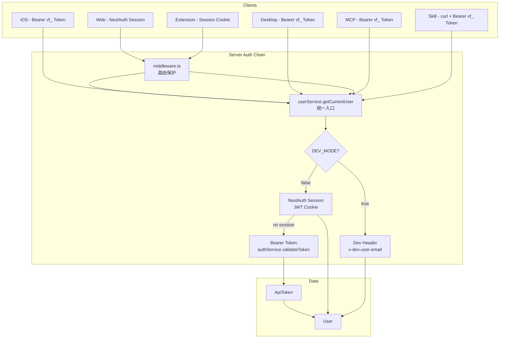

# Auth Activation & Skill API — Design

## Overview

激活已有的认证基础设施，统一 API Key 体系，并以 Skill 方式暴露 VibeFlow 能力。

## Architecture

### 认证链路（改造后）



### Token 统一

```
改造前（3种互不兼容的 token）：
  Web:       NextAuth JWT cookie
  iOS:       vf_<64hex> Bearer token
  MCP:       vibeflow_<userId>_<secret> 自定义格式
  Socket:    vibeflow_<userId> legacy + email fallback

改造后（2种，统一验证链路）：
  交互式客户端:  NextAuth JWT cookie（Web/Extension）
  非交互式:      vf_<64hex> Bearer token（iOS/Desktop/MCP/Skill/API）
  开发模式:      x-dev-user-email header（仅 DEV_MODE=true）
```

## Components and Interfaces

### 1. 数据迁移脚本

```typescript
// scripts/migrate-user-data.ts
interface MigrateOptions {
  sourceEmail: string;     // 源用户 email（dev@vibeflow.local）
  targetEmail: string;     // 目标用户 email（新注册的账号）
  dryRun: boolean;         // 只输出计划，不执行
}

// 迁移范围（按 Prisma schema 中所有含 userId FK 的模型）
// 分三层：核心数据（必须迁移）、辅助数据（建议迁移）、日志/瞬态（可跳过）

// 第一层：核心业务数据（必须迁移，有依赖顺序）
const MIGRATE_CORE = [
  'UserSettings',       // 1:1，先迁移
  'Goal',               // 被 ProjectGoal/HabitGoal 引用
  'Project',            // 被 Task/ProjectGoal 引用
  'ProjectGoal',        // 依赖 Project + Goal（无直接 userId，通过 FK 映射）
  'Task',               // 自引用 parentId，需按层级插入；被 Pomodoro/TaskTimeSlice 引用
  'Pomodoro',           // 被 TaskTimeSlice/PomodoroTimeSlice 引用
  'TaskTimeSlice',      // 依赖 Pomodoro + Task（无直接 userId，通过 FK 映射）
  'Habit',              // 被 HabitEntry/HabitGoal 引用
  'HabitGoal',          // 依赖 Habit + Goal（无直接 userId，通过 FK 映射）
  'HabitEntry',         // 依赖 Habit
  'DailyState',         // 独立
  'FocusSession',       // 独立
  'Blocker',            // 独立
  'DailyReview',        // 独立
  'PolicyVersion',      // 独立
  'Conversation',       // 被 ChatMessage 引用
  'ChatMessage',        // 依赖 Conversation（无直接 userId）
] as const;

// 第二层：辅助数据（建议迁移，丢失可恢复）
const MIGRATE_AUXILIARY = [
  'ProjectTemplate',           // userId 可为 null（系统模板），只迁移非 null 的
  'ActivityAggregate',         // 聚合数据，可重新计算
  'WorkStartRecord',
  'DailyEntertainmentState',
  'SkipTokenUsage',
  'SuggestionFeedback',
  'TaskDecompositionFeedback',
  'DemoToken',
] as const;

// 第三层：日志/瞬态数据（可跳过，不影响功能）
const SKIP_MODELS = [
  'ActivityLog',              // 流水表，数据量大
  'TimelineEvent',            // 流水表，数据量大
  'StateTransitionLog',       // 审计日志，30 天保留
  'SettingsModificationLog',  // 审计日志
  'MCPAuditLog',              // 审计日志
  'MCPEvent',                 // 24 小时事件缓冲
  'MCPSubscription',          // 瞬态订阅
  'DataAccessLog',            // 审计日志
  'ClientRegistry',           // 瞬态：连接的客户端
  'ClientConnection',         // 瞬态：心跳追踪
  'ClientOfflineEvent',       // 日志
  'CommandQueue',             // 瞬态：离线命令队列（userId 无 @relation）
  'BypassAttempt',            // 审计日志
  'DemoModeEvent',            // 日志
  'LLMUsageLog',              // 日志
  'RestExemption',            // 豁免记录
  'SleepExemption',           // 豁免记录
  'ScreenTimeExemption',      // 豁免记录
  'ApiToken',                 // 不迁移——新用户自己创建新 token
] as const;

// 执行方式
// npx tsx scripts/migrate-user-data.ts --source dev@vibeflow.local --target my@email.com --dry-run
// npx tsx scripts/migrate-user-data.ts --source dev@vibeflow.local --target my@email.com
// npx tsx scripts/migrate-user-data.ts --source dev@vibeflow.local --target my@email.com --skip-auxiliary
```

迁移策略：
- 使用 Prisma interactive transaction，显式设置 `timeout: 120000`（2 分钟）
- **依赖顺序**：先父模型后子模型（Goal/Project → ProjectGoal → Task → Pomodoro → TaskTimeSlice）
- **Task 自引用处理**：先插入所有 Task（parentId 置空），记录新旧 ID 映射，再批量 update parentId
- ID 映射表：`Map<oldId, newId>` 确保 FK 正确映射
- 迁移后验证：FK 完整性检查 + 唯一约束检查（如 DailyState 的 `@@unique([userId, date])`）
- 输出迁移报告（每个模型迁移了多少条记录）
- 默认迁移第一层（核心）+ 第二层（辅助），`--skip-auxiliary` 跳过第二层

### 2. 服务端认证改造

#### 2.1 userService.getCurrentUser 改造

```typescript
// src/services/user.service.ts
async getCurrentUser(req: { headers: Headers; session?: any }): Promise<UserContext | null> {
  // Path 1: DEV_MODE header (仅开发模式)
  if (devModeConfig.enabled) {
    const devEmail = req.headers.get('x-dev-user-email');
    if (devEmail) return this.getOrCreateDevUser(devEmail);
    // dev 模式仍继续尝试正式认证路径（允许开发时测试正式流程）
  }

  // Path 2: NextAuth session
  if (req.session?.user?.email) {
    const user = await prisma.user.findUnique({ where: { email: req.session.user.email } });
    if (user) return { userId: user.id, email: user.email, isDevMode: false };
  }

  // Path 3: Bearer API token
  const authHeader = req.headers.get('authorization');
  if (authHeader?.startsWith('Bearer vf_')) {
    const token = authHeader.slice(7);
    const result = await authService.validateToken(token);
    if (result.success) {
      // scope 检查放在 tRPC middleware 层，这里只做身份认证
      return { userId: result.data.userId, email: result.data.email, isDevMode: false, tokenScopes: result.data.scopes };
    }
  }

  // Path 4: DEV_MODE fallback (仅开发模式，无任何认证信息时)
  if (devModeConfig.enabled) {
    return this.getOrCreateDevUser(devModeConfig.defaultUserEmail);
  }

  return null;
}
```

#### 2.2 UserContext 扩展

```typescript
interface UserContext {
  userId: string;
  email: string;
  isDevMode: boolean;
  tokenScopes?: string[];  // 新增：API token 的权限范围
}
```

#### 2.3 Scope 中间件

```typescript
// src/server/trpc.ts
function withScope(requiredScope: 'read' | 'write' | 'admin') {
  return t.middleware(async ({ ctx, next }) => {
    // Session 用户（Web/Extension）拥有全部权限
    if (!ctx.user.tokenScopes) return next();

    // Token 用户检查 scope
    if (!ctx.user.tokenScopes.includes(requiredScope)) {
      throw new TRPCError({ code: 'FORBIDDEN', message: `Requires '${requiredScope}' scope` });
    }
    return next();
  });
}

// 使用
export const readProcedure = protectedProcedure.use(withScope('read'));
export const writeProcedure = protectedProcedure.use(withScope('write'));
export const adminProcedure = protectedProcedure.use(withScope('admin'));
```

现有 router 的 scope 映射（需一次性全面应用，多用户场景下不能有越权窗口期）：
- 所有 query → `readProcedure`（要求 `read` scope）
- 所有 mutation（任务/项目/番茄钟操作）→ `writeProcedure`（要求 `write` scope）
- token 管理、settings 修改 → `adminProcedure`（要求 `admin` scope）
- Session 用户（Web/Extension）无 tokenScopes → 全部放行

**多用户安全保证**：API Token 请求如果 scope 不匹配，直接 403 拒绝。不存在 read-only token 能执行 write 操作的窗口期。

### 3. 客户端认证改造

#### 3.1 iOS AppProvider 改造

```typescript
// vibeflow-ios/src/providers/AppProvider.tsx
const checkAuth = async () => {
  // 检查环境变量（仅本地开发时跳过）
  if (__DEV__ && process.env.EXPO_PUBLIC_DEV_MODE === 'true') {
    const devEmail = 'dev@vibeflow.local';
    setCachedEmail(devEmail);
    setAuthUser({ id: '', email: devEmail });
    setAuthStatus('authenticated');
    return;
  }

  // 正式流程：从 SecureStore 读取 token 并验证
  try {
    const token = await getToken();
    if (token) {
      const user = await verifyToken(token);
      if (user) {
        setAuthUser(user);
        setAuthStatus('authenticated');
        return;
      }
    }
  } catch (e) {
    console.warn('[Auth] Token verification failed:', e);
  }

  // 无有效 token → 显示登录页
  setAuthStatus('unauthenticated');
};
```

#### 3.2 Desktop main.ts 改造

```typescript
// vibeflow-desktop/electron/main.ts
// 替换 isDevelopment 判断为环境变量
const skipLogin = process.env.VIBEFLOW_DEV_BYPASS === 'true';

if (!isAuthenticated && !skipLogin) {
  isAuthenticated = await authManager.openLoginWindow();
  if (!isAuthenticated) {
    app.quit();
    return;
  }
}
```

#### 3.3 Desktop 登录 token 传回流程（已实现，需验证）

`auth-manager.ts` 已完整实现以下流程，本次改造只需验证生产环境 cookie 传递：

1. `openLoginWindow()` 创建 BrowserWindow 加载 `${serverUrl}/login`
2. 监听 `did-navigate` 事件，URL 不再是 `/login`/`/register`/`/api/auth/` 时视为登录成功
3. `acquireTokenFromSession()` 从 Electron `session.defaultSession.cookies` 读取 NextAuth session cookie
4. 用 session cookie POST `/api/auth/token` 获取 `vf_` token（90 天有效期）
5. token + userId + email 存入 `electron-store`（`~/Library/Application Support/vibeflow-desktop/vibeflow-auth.json`）

**需验证**：生产环境（非 localhost）NextAuth 的 httpOnly cookie 是否能被 Electron `session.cookies.get()` 正确读取。

### 4. API Key 管理 UI

#### 4.1 数据模型扩展

```prisma
model ApiToken {
  // ... 已有字段不变 ...
  scopes      String[]  @default(["read", "write"])
  description String?
}
```

#### 4.2 tRPC Router（新增或扩展）

```typescript
// src/server/routers/api-key.ts
export const apiKeyRouter = router({
  list: readProcedure.query(async ({ ctx }) => {
    // 返回当前用户的所有活跃 token（不返回 hash）
    return authService.listTokens(ctx.user.userId);
  }),

  create: adminProcedure
    .input(z.object({
      name: z.string().min(1).max(50),
      description: z.string().max(200).optional(),
      scopes: z.array(z.enum(['read', 'write', 'admin'])).default(['read', 'write']),
    }))
    .mutation(async ({ ctx, input }) => {
      const count = await authService.countActiveTokens(ctx.user.userId);
      if (count >= 10) throw new TRPCError({ code: 'FORBIDDEN', message: 'Max 10 active keys' });
      // 返回明文 token（唯一一次）
      return authService.createToken({ ...input, userId: ctx.user.userId, clientType: 'api' });
    }),

  revoke: adminProcedure
    .input(z.object({ tokenId: z.string() }))
    .mutation(async ({ ctx, input }) => {
      return authService.revokeToken(input.tokenId, ctx.user.userId);
    }),
});
```

#### 4.3 Settings 页面 UI

位置：`src/app/(main)/settings/` 中新增 API Keys tab（或 section）。

UI 组件：
- `ApiKeyList`：展示已有 Key 列表
- `CreateApiKeyDialog`：创建新 Key 的对话框
- `ApiKeyCreatedDialog`：创建成功后显示明文 token（只显示一次）+ 安全警告
- `RevokeApiKeyDialog`：确认吊销对话框

### 5. MCP 认证统一

```typescript
// src/mcp/auth.ts — 改造后
async function authenticate(token?: string): Promise<MCPContext> {
  // Dev mode: 保留 dev_<email> 支持
  if (isDevMode()) {
    if (!token) return devFallback();
    if (token.startsWith('dev_')) return devAuth(token);
  }

  // Production: 只接受 vf_ token
  if (!token) throw new McpError(ErrorCode.InvalidRequest, 'API key required');
  if (!token.startsWith('vf_')) throw new McpError(ErrorCode.InvalidRequest, 'Invalid token format');

  const result = await authService.validateToken(token);
  if (!result.success) throw new McpError(ErrorCode.InvalidRequest, result.error.message);

  return { userId: result.data.userId, email: result.data.email, isAuthenticated: true };
}
```

```typescript
// src/mcp/trpc-client.ts — 改造后
const apiKey = process.env.VIBEFLOW_API_KEY;
const serverUrl = process.env.VIBEFLOW_SERVER_URL || 'http://localhost:3000';

const trpcClient = createTRPCClient<AppRouter>({
  links: [httpBatchLink({
    url: `${serverUrl}/api/trpc`,
    headers: () => ({
      ...(apiKey ? { 'authorization': `Bearer ${apiKey}` } : {}),
      ...(isDevMode() ? { 'x-dev-user-email': process.env.MCP_USER_EMAIL || 'dev@vibeflow.local' } : {}),
    }),
  })],
});
```

### 6. Skill REST Adapter

**问题**：tRPC 启用了 SuperJSON transformer，导致请求/响应不是标准 JSON（Date 等类型有特殊序列化格式）。Skill 让 Claude 通过 curl 拼写 SuperJSON 格式极其困难且易错。

**方案**：添加一组轻量 REST route handlers（`src/app/api/skill/`），接收标准 JSON，内部调用 service 层，返回标准 JSON。这些端点绕过 tRPC，不受 SuperJSON 影响。

```typescript
// src/app/api/skill/tasks/route.ts
import { taskService } from '@/services';
import { authenticateRequest } from '@/lib/skill-auth';

export async function GET(req: NextRequest) {
  const user = await authenticateRequest(req);  // 验证 Bearer vf_ token
  if (!user) return NextResponse.json({ error: 'Unauthorized' }, { status: 401 });

  const tasks = await taskService.getTodayTasks(user.userId);
  return NextResponse.json(tasks);
}

export async function POST(req: NextRequest) {
  const user = await authenticateRequest(req);
  if (!user) return NextResponse.json({ error: 'Unauthorized' }, { status: 401 });

  const body = await req.json();
  const result = await taskService.createTask({ ...body, userId: user.userId });
  return NextResponse.json(result);
}
```

REST 端点规划（对应 MCP 的 28 个 tool）：

| 端点 | GET | POST | PUT | DELETE |
|------|-----|------|-----|--------|
| `/api/skill/state` | 当前状态 | — | — | — |
| `/api/skill/tasks` | 今日任务 | 创建任务 | — | — |
| `/api/skill/tasks/[id]` | 任务详情 | — | 更新任务 | 删除任务 |
| `/api/skill/tasks/backlog` | Backlog 列表 | — | — | — |
| `/api/skill/tasks/overdue` | 逾期任务 | — | — | — |
| `/api/skill/tasks/batch` | — | 批量更新 | — | — |
| `/api/skill/tasks/[id]/subtasks` | — | 添加子任务 | — | — |
| `/api/skill/pomodoro` | 当前番茄钟 | 启动番茄钟 | — | — |
| `/api/skill/pomodoro/complete` | — | 完成番茄钟 | — | — |
| `/api/skill/pomodoro/abort` | — | 中止番茄钟 | — | — |
| `/api/skill/projects` | 项目列表 | 创建项目 | — | — |
| `/api/skill/projects/[id]` | 项目详情 | — | 更新项目 | — |
| `/api/skill/analytics` | 生产力分析 | — | — | — |
| `/api/skill/timeline` | 今日时间线 | — | — | — |
| `/api/skill/top3` | Top 3 任务 | 设置 Top 3 | — | — |

`authenticateRequest` 工具函数（含 scope 检查）：
```typescript
// src/lib/skill-auth.ts
export async function authenticateRequest(
  req: NextRequest,
  requiredScope: 'read' | 'write' | 'admin' = 'read'
): Promise<UserContext | null> {
  const authHeader = req.headers.get('authorization');
  if (!authHeader?.startsWith('Bearer vf_')) return null;
  const token = authHeader.slice(7);
  const result = await authService.validateToken(token);
  if (!result.success) return null;

  // Scope 检查
  const scopes = result.data.scopes || [];
  if (!scopes.includes(requiredScope)) return null;  // 返回 null，handler 中返回 403

  return { userId: result.data.userId, email: result.data.email, isDevMode: false, tokenScopes: scopes };
}
```

### 7. Skill 目录结构

```
vibeflow-skills/
├── README.md
├── LICENSE                         (MIT)
├── skills-lock.json
│
├── vibeflow/                       # Hub skill
│   ├── SKILL.md
│   └── reference/
│       ├── api-reference.md        # tRPC 端点文档
│       ├── authentication.md       # 认证说明 + scope 表
│       └── examples.md             # 常见操作示例
│
├── vibeflow-setup/                 # 配置引导
│   └── SKILL.md
│
├── vibeflow-focus/                 # 番茄钟操作
│   └── SKILL.md                    # start/stop/status/switch/record
│
├── vibeflow-tasks/                 # 任务管理
│   └── SKILL.md                    # CRUD/batch/inbox/overdue/backlog
│
├── vibeflow-projects/              # 项目管理
│   └── SKILL.md                    # create/update/get/list/templates
│
└── vibeflow-analytics/             # 数据分析
    └── SKILL.md                    # productivity/timeline/summary/top3
```

### 7.1 Skill YAML Frontmatter 模板

```yaml
---
name: vibeflow-focus
description: >
  VibeFlow focus session management. Start pomodoros, switch tasks during focus,
  complete or abort sessions, record retrospective pomodoros. Use when user wants
  to manage focus sessions, start a pomodoro, track focus time, or check current
  focus status.
version: 1.0.0
user-invocable: true
argument-hint: "[start|stop|status|switch|record] [task_id]"
---
```

### 7.2 Skill 认证模式

每个 skill body 的统一认证段落：

```markdown
## Setup

Requires `VIBEFLOW_API_KEY` and `VIBEFLOW_SERVER_URL` environment variables.
If not set, run `/vibeflow-setup` first.

NEVER display the API key in output. Refer to it only as `$VIBEFLOW_API_KEY`.

## API Call Pattern

All calls use the Skill REST API (plain JSON, no SuperJSON):

    curl -s -H "Authorization: Bearer $VIBEFLOW_API_KEY" \
         "$VIBEFLOW_SERVER_URL/api/skill/tasks"

    curl -s -X POST -H "Authorization: Bearer $VIBEFLOW_API_KEY" \
         -H "Content-Type: application/json" \
         -d '{"taskId": "xxx", "duration": 25}' \
         "$VIBEFLOW_SERVER_URL/api/skill/pomodoro"

On 401 response: inform user their API key may be expired or invalid,
suggest running `/vibeflow-setup` to reconfigure.
```

## Data Models

### ApiToken 扩展

```prisma
model ApiToken {
  id          String    @id @default(uuid())
  userId      String
  user        User      @relation(fields: [userId], references: [id], onDelete: Cascade)
  token       String    @unique  // SHA-256 hash
  name        String
  clientType  String              // 'web' | 'desktop' | 'browser_ext' | 'mobile' | 'api'
  scopes      String[]  @default(["read", "write"])  // NEW
  description String?                                 // NEW
  lastUsedAt  DateTime?
  expiresAt   DateTime?
  revokedAt   DateTime?
  createdAt   DateTime  @default(now())
}
```

## Error Handling

### 认证错误

| 场景 | HTTP Status | 行为 |
|------|-------------|------|
| 无认证信息 + DEV_MODE=false | 401 | Web 重定向 /login，API 返回 JSON error |
| Token 过期/吊销 | 401 | iOS/Desktop 弹登录页，API 返回 JSON error |
| Scope 不足 | 403 | 返回 "Requires 'xxx' scope" |
| Token 格式错误 | 401 | 返回 "Invalid token format" |

### 迁移错误

| 场景 | 行为 |
|------|------|
| 源用户不存在 | 脚本报错退出 |
| 目标用户不存在 | 脚本报错，提示先注册 |
| 迁移中断 | 事务回滚，两边数据不变 |
| 部分模型迁移失败 | 整体回滚（原子性） |

## Testing Strategy

### 单元测试

1. `authService.validateToken` + scope 检查
2. `userService.getCurrentUser` 四条路径（dev header → session → bearer → fallback）
3. API Key CRUD（create/list/revoke/countActive）
4. Scope 中间件（read/write/admin 权限矩阵）

### 集成测试

1. 迁移脚本 dry-run + 实际迁移（用测试数据库）
2. Web 登录流程：`/login` → 认证 → 重定向
3. iOS token 流程：登录 → 存 SecureStore → 刷新 → 401 → 重新登录
4. MCP `vf_` token 认证

### 手动测试 Checklist

1. [ ] 生产环境关闭 DEV_MODE 后 Web 重定向到 /login
2. [ ] Web 登录/注册正常工作
3. [ ] iOS 启动显示登录页，登录后正常使用
4. [ ] Desktop 弹出登录窗口，登录后正常连接
5. [ ] Settings 创建 API Key，Key 只显示一次
6. [ ] MCP 使用 vf_ token 可以调用 tool
7. [ ] Skill 安装后 Claude Code 可操作 VibeFlow
8. [ ] 切回 DEV_MODE=true 后一切恢复正常（兜底验证）

## Migration & Rollback

### 迁移流程

```
0. 确保所有客户端已升级到新版代码（含认证改造），此时仍 DEV_MODE=true
1. 保持 DEV_MODE=true
2. 通过 /register 注册新账号（真实邮箱 + 密码）
3. 运行 migrate-user-data.ts --dry-run 确认数据量
4. 运行 migrate-user-data.ts 执行迁移
5. 切换 DEV_MODE=false（代码已部署，只改环境变量）
6. 用新账号登录验证
7. 如有问题：DEV_MODE=true 回退
```

### 回滚方案

- **Level 1**（最轻）：`.env` 改 `DEV_MODE=true` → 恢复 dev mode 行为
  - Socket email fallback 仍有效（改造代码在 DEV_MODE=true 时保留所有 dev 路径）
  - MCP trpc-client 在 DEV_MODE=true 时仍走 email header（改造后保留）
  - **注意**：新账号在正式期产生的数据对默认账号不可见（不同 userId），需要反向迁移脚本或重新登录新账号
- **Level 2**（代码回滚）：git revert 认证改造 commit
- **Level 3**（数据回滚）：默认账号数据未动，直接可用

### 回滚兼容性保证

改造代码必须确保 DEV_MODE=true 时的完整兼容：
- `socket.ts`：DEV_MODE=true 时仍接受纯 email 认证（删除 legacy `vibeflow_<userId>` 格式不影响 email fallback）
- `mcp/trpc-client.ts`：DEV_MODE=true 时保留 `x-dev-user-email` header（不是"删除 email"，而是"生产模式不用 email"）
- `middleware.ts`：DEV_MODE=true 时 allow everything（当前行为不变）
