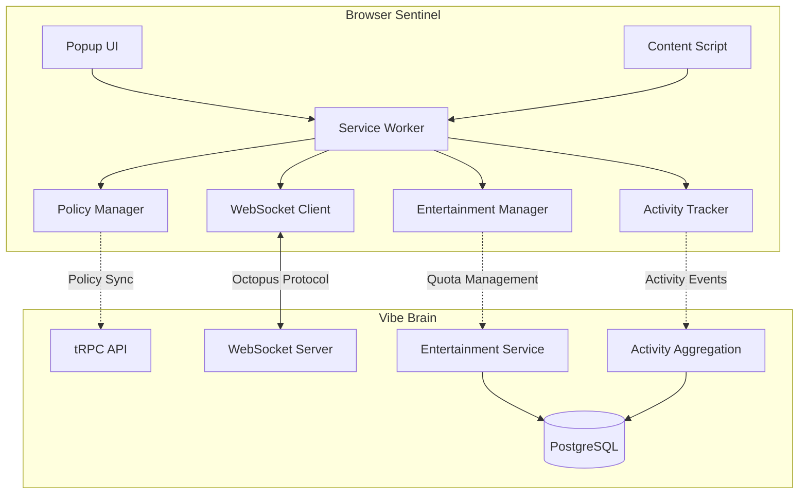
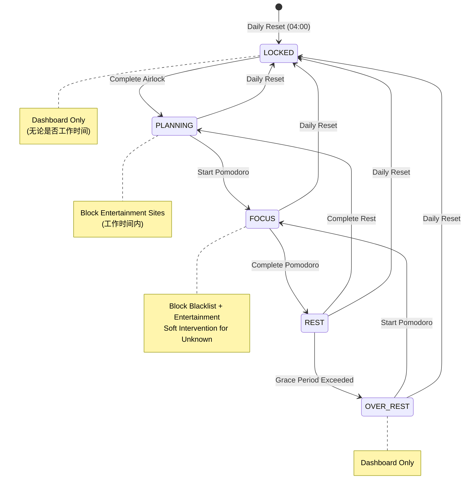
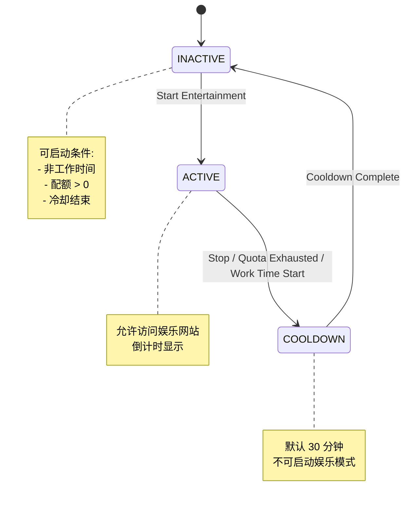

# Design Document: Browser Sentinel Enhancement

## Overview

本设计文档描述 Browser Sentinel（浏览器插件）的增强功能，包括娱乐时间管理、LOCKED/OVER_REST 状态处理、活动追踪和工作启动时间追踪。

### 设计目标

1. **状态感知浏览控制**：根据系统状态（LOCKED、OVER_REST）限制浏览行为
2. **娱乐时间管理**：提供配额制的娱乐时间，仅在非工作时间可用
3. **统一活动追踪**：使用 Octopus 协议与桌面端统一数据上报格式
4. **工作纪律追踪**：记录工作启动时间，帮助用户识别拖延模式

### 技术栈

- Chrome Extension Manifest V3
- TypeScript 5.7
- WebSocket (Socket.io 客户端)
- Chrome Storage API
- Chrome DeclarativeNetRequest API

## Architecture

### 系统架构图



### 状态流转图



### 娱乐模式状态图



## Components and Interfaces

### 1. Entertainment Manager

```typescript
/**
 * 娱乐模式管理器
 * 负责娱乐时间配额、冷却时间和模式切换
 */
interface EntertainmentManager {
  // 初始化
  initialize(): Promise<void>;
  
  // 检查是否可以启动娱乐模式
  canStartEntertainment(): EntertainmentStartCheck;
  
  // 启动娱乐模式
  startEntertainment(): Promise<EntertainmentStartResult>;
  
  // 停止娱乐模式
  stopEntertainment(): Promise<void>;
  
  // 获取当前状态
  getStatus(): EntertainmentStatus;
  
  // 检查 URL 是否为娱乐网站
  isEntertainmentSite(url: string): boolean;
  
  // 检查 URL 是否在白名单中
  isWhitelisted(url: string): boolean;
  
  // 更新配额使用（从服务器同步）
  updateQuotaUsage(usedMinutes: number): void;
  
  // 重置每日配额
  resetDailyQuota(): void;
}

interface EntertainmentStartCheck {
  canStart: boolean;
  reason?: 'within_work_time' | 'quota_exhausted' | 'cooldown_active' | 'locked_state';
  cooldownRemaining?: number;  // minutes
  quotaRemaining?: number;     // minutes
}

interface EntertainmentStartResult {
  success: boolean;
  sessionId?: string;
  endTime?: number;  // Unix timestamp
  error?: string;
}

interface EntertainmentStatus {
  isActive: boolean;
  sessionId: string | null;
  startTime: number | null;
  endTime: number | null;
  quotaTotal: number;      // minutes
  quotaUsed: number;       // minutes
  quotaRemaining: number;  // minutes
  cooldownEndTime: number | null;
  lastSessionEndTime: number | null;
}
```

### 2. Entertainment Site Configuration

```typescript
/**
 * 娱乐网站配置
 */
interface EntertainmentSiteConfig {
  // 黑名单（域名级别）
  blacklist: EntertainmentBlacklistEntry[];
  
  // 白名单（URL 模式级别）
  whitelist: EntertainmentWhitelistEntry[];
}

interface EntertainmentBlacklistEntry {
  domain: string;           // e.g., "twitter.com", "x.com"
  isPreset: boolean;        // 是否为预设
  enabled: boolean;         // 是否启用
  addedAt: number;          // Unix timestamp
}

interface EntertainmentWhitelistEntry {
  pattern: string;          // e.g., "weibo.com/fav/*", "twitter.com/i/bookmarks"
  description?: string;     // 用户备注
  isPreset: boolean;
  enabled: boolean;
  addedAt: number;
}

// 预设娱乐网站黑名单
const PRESET_ENTERTAINMENT_BLACKLIST: string[] = [
  'twitter.com',
  'x.com',
  'weibo.com',
  'youtube.com',
  'bilibili.com',
  'tiktok.com',
  'douyin.com',
  'instagram.com',
  'facebook.com',
  'reddit.com',
  'twitch.tv',
];

// 预设白名单模式
const PRESET_ENTERTAINMENT_WHITELIST: string[] = [
  'weibo.com/fav/*',
  'twitter.com/i/bookmarks',
  'bilibili.com/video/*',
  'bilibili.com/search/*',
];
```

### 3. Enhanced Policy Manager

```typescript
/**
 * 增强的策略管理器
 * 扩展现有 PolicyManager 以支持娱乐网站和状态感知
 */
interface EnhancedPolicyManager extends PolicyManager {
  // 检查 URL 是否应该被阻止（考虑所有因素）
  shouldBlockUrl(url: string): UrlBlockResult;
  
  // 获取当前阻止原因
  getBlockReason(url: string): BlockReason | null;
  
  // 检查是否在工作时间内
  isWithinWorkTime(): boolean;
  
  // 检查是否为 LOCKED 或 OVER_REST 状态
  isRestrictedState(): boolean;
  
  // 获取 Dashboard URL
  getDashboardUrl(): string;
}

interface UrlBlockResult {
  blocked: boolean;
  reason?: BlockReason;
  redirectUrl?: string;
  showOverlay?: boolean;
  overlayType?: 'screensaver' | 'soft_block' | 'locked' | 'over_rest';
  message?: string;
}

type BlockReason = 
  | 'locked_state'           // LOCKED 状态，需完成 Airlock
  | 'over_rest_state'        // OVER_REST 状态，需开始工作
  | 'entertainment_blocked'  // 娱乐网站在工作时间被阻止
  | 'focus_blacklist'        // FOCUS 状态下的黑名单
  | 'unknown_site_focus';    // FOCUS 状态下的未知网站
```

### 4. Work Start Tracker

```typescript
/**
 * 工作启动时间追踪器
 * 记录用户完成 Airlock 的时间，用于分析工作拖延模式
 */
interface WorkStartTracker {
  // 记录工作启动事件
  recordWorkStart(airlockCompletionTime: number): Promise<void>;
  
  // 获取今日工作启动信息
  getTodayWorkStart(): WorkStartInfo | null;
  
  // 计算启动延迟
  calculateDelay(configuredStartTime: string, actualStartTime: number): number;
}

interface WorkStartInfo {
  date: string;                    // YYYY-MM-DD
  configuredStartTime: string;     // HH:mm
  actualStartTime: number;         // Unix timestamp
  delayMinutes: number;            // 延迟分钟数（0 表示准时或提前）
}
```

### 5. Octopus Protocol Events (Entertainment)

```typescript
/**
 * 娱乐模式相关的 Octopus 事件
 */
interface EntertainmentModeEvent extends OctopusBaseEvent {
  eventType: 'ENTERTAINMENT_MODE';
  payload: {
    action: 'start' | 'stop';
    sessionId: string;
    timestamp: number;
    quotaUsedBefore: number;   // minutes
    quotaUsedAfter?: number;   // minutes (only for stop)
    duration?: number;         // seconds (only for stop)
    sitesVisited?: string[];   // domains visited during session
    reason?: 'manual' | 'quota_exhausted' | 'work_time_start';
  };
}

interface WorkStartEvent extends OctopusBaseEvent {
  eventType: 'WORK_START';
  payload: {
    date: string;                  // YYYY-MM-DD
    configuredStartTime: string;   // HH:mm
    actualStartTime: number;       // Unix timestamp
    delayMinutes: number;
    trigger: 'airlock_complete';
  };
}

// 扩展 OctopusEventType
type ExtendedOctopusEventType = OctopusEventType 
  | 'ENTERTAINMENT_MODE'
  | 'WORK_START';
```

### 6. Server-Side Entertainment Service

```typescript
/**
 * 服务端娱乐配额管理服务
 */
interface EntertainmentService {
  // 获取用户娱乐状态
  getStatus(userId: string): Promise<EntertainmentStatus>;
  
  // 启动娱乐模式
  startEntertainment(userId: string): Promise<EntertainmentStartResult>;
  
  // 停止娱乐模式
  stopEntertainment(userId: string, reason: string): Promise<void>;
  
  // 更新配额使用
  updateQuotaUsage(userId: string, usedMinutes: number): Promise<void>;
  
  // 检查并自动结束过期的娱乐模式
  checkAndEndExpiredSessions(): Promise<void>;
  
  // 重置每日配额（04:00 调用）
  resetDailyQuotas(): Promise<void>;
}
```

## Data Models

### Prisma Schema Extensions

```prisma
// 添加到 UserSettings 模型
model UserSettings {
  // ... existing fields ...
  
  // Entertainment settings (Requirements 9.1-9.4)
  entertainmentBlacklist     Json     @default("[]")  // EntertainmentBlacklistEntry[]
  entertainmentWhitelist     Json     @default("[]")  // EntertainmentWhitelistEntry[]
  entertainmentQuotaMinutes  Int      @default(120)   // 每日配额（分钟）
  entertainmentCooldownMinutes Int    @default(30)    // 冷却时间（分钟）
}

// 新增：每日娱乐状态
model DailyEntertainmentState {
  id                String   @id @default(uuid())
  userId            String
  user              User     @relation(fields: [userId], references: [id], onDelete: Cascade)
  date              DateTime @db.Date
  
  // 配额使用
  quotaUsedMinutes  Int      @default(0)
  
  // 当前会话
  activeSessionId   String?
  sessionStartTime  DateTime?
  
  // 冷却状态
  lastSessionEndTime DateTime?
  
  // 统计
  sessionCount      Int      @default(0)
  sitesVisited      String[] @default([])
  
  createdAt         DateTime @default(now())
  updatedAt         DateTime @updatedAt
  
  @@unique([userId, date])
  @@index([userId])
}

// 新增：工作启动记录
model WorkStartRecord {
  id                  String   @id @default(uuid())
  userId              String
  user                User     @relation(fields: [userId], references: [id], onDelete: Cascade)
  date                DateTime @db.Date
  
  configuredStartTime String   // HH:mm
  actualStartTime     DateTime
  delayMinutes        Int      // 0 表示准时或提前
  
  createdAt           DateTime @default(now())
  
  @@unique([userId, date])
  @@index([userId])
  @@index([userId, date])
}
```

### Chrome Storage Schema

```typescript
/**
 * Browser Sentinel 本地存储结构
 */
interface BrowserSentinelStorage {
  // 现有字段
  serverUrl: string;
  userEmail: string;
  isConnected: boolean;
  policyCache: PolicyCache;
  
  // 娱乐模式状态
  entertainmentState: {
    isActive: boolean;
    sessionId: string | null;
    startTime: number | null;
    endTime: number | null;
    quotaUsedToday: number;      // minutes
    lastSessionEndTime: number | null;
    sitesVisitedThisSession: string[];
  };
  
  // 娱乐网站配置（从服务器同步）
  entertainmentConfig: {
    blacklist: EntertainmentBlacklistEntry[];
    whitelist: EntertainmentWhitelistEntry[];
    quotaMinutes: number;
    cooldownMinutes: number;
    lastSync: number;
  };
  
  // 工作启动记录
  todayWorkStart: WorkStartInfo | null;
}
```

## Correctness Properties

### Property 1: LOCKED State Dashboard Restriction

*For any* browser navigation attempt when system state is LOCKED (Airlock not completed today), the Browser Sentinel SHALL redirect to Dashboard, regardless of whether current time is within configured work hours.

**Validates: Requirements 1.1, 1.2, 1.10**

### Property 2: OVER_REST State Dashboard Restriction

*For any* browser navigation attempt when system state is OVER_REST, the Browser Sentinel SHALL redirect to Dashboard.

**Validates: Requirements 1.1, 1.6**

### Property 3: Entertainment Mode Work Time Exclusivity

*For any* attempt to start Entertainment Mode, if current time is within configured work hours, the attempt SHALL fail with reason 'within_work_time'.

**Validates: Requirements 5.2, 5.3, 6.7**

### Property 4: Entertainment Quota Enforcement

*For any* Entertainment Mode session, when quotaUsed reaches quotaTotal, the session SHALL automatically end and Entertainment Sites SHALL be blocked.

**Validates: Requirements 5.5, 5.6**

### Property 5: Entertainment Cooldown Enforcement

*For any* attempt to start Entertainment Mode within cooldownMinutes of the last session end, the attempt SHALL fail with reason 'cooldown_active'.

**Validates: Requirements 5.13, 5.14, 6.9**

### Property 6: Entertainment Blacklist Domain Blocking

*For any* URL whose domain matches an enabled Entertainment Blacklist entry, when NOT in Entertainment Mode AND within work time, the URL SHALL be blocked.

**Validates: Requirements 2.1, 2.3**

### Property 7: Entertainment Whitelist Override

*For any* URL that matches both an Entertainment Blacklist domain AND an Entertainment Whitelist pattern, the URL SHALL be allowed (whitelist takes precedence).

**Validates: Requirements 2.5, 2.6, 2.7**

### Property 8: Entertainment Mode Site Access

*For any* Entertainment Site URL, when Entertainment Mode is active, the URL SHALL be allowed regardless of work time.

**Validates: Requirements 2.10, 3.8**

### Property 9: Daily Quota Reset

*For any* user, at 04:00 AM daily, the entertainmentQuotaUsed SHALL reset to 0.

**Validates: Requirements 5.7**

### Property 10: Work Start Delay Calculation

*For any* Work Start event, if actualStartTime is before configuredStartTime, delayMinutes SHALL be 0. Otherwise, delayMinutes SHALL equal (actualStartTime - configuredStartTime) in minutes.

**Validates: Requirements 14.7, 14.8**

### Property 11: Entertainment Session Duration Tracking

*For any* Entertainment Mode session, the duration recorded SHALL equal (endTime - startTime) in seconds, and quotaUsedAfter SHALL equal quotaUsedBefore + (duration / 60).

**Validates: Requirements 5.4, 12.2**

### Property 12: State Transition Work Start Recording

*For any* state transition from LOCKED to PLANNING (Airlock completion), a Work Start event SHALL be recorded with the transition timestamp.

**Validates: Requirements 14.1, 14.10**

### Property 13: Entertainment Settings Modification Restriction

*For any* attempt to modify Entertainment settings (blacklist, whitelist, quota, cooldown) during work time, the modification SHALL be rejected.

**Validates: Requirements 5.12, 7.11, 7.12**

### Property 14: Octopus Protocol Consistency

*For any* activity event sent from Browser Sentinel, the event format SHALL match the Octopus protocol specification used by Desktop Client.

**Validates: Requirements 10.3, 10.11, 13.7, 13.8**

### Property 15: Entertainment Tab Closure on Mode End

*For any* Entertainment Mode session end, all tabs with Entertainment Site URLs SHALL be closed.

**Validates: Requirements 5.10**

## Error Handling

### Error Categories

| Category | Code | Description | User Message |
|----------|------|-------------|--------------|
| Entertainment | ENT_WORK_TIME | Cannot start during work time | 仅在非工作时间可用 |
| Entertainment | ENT_QUOTA_EXHAUSTED | Daily quota exhausted | 今日配额已用完 |
| Entertainment | ENT_COOLDOWN | Cooldown period active | 冷却中，还需等待 X 分钟 |
| Entertainment | ENT_LOCKED | System in LOCKED state | 请先完成今日计划 |
| State | STATE_RESTRICTED | LOCKED or OVER_REST | 请完成今日计划 / 请开始工作 |
| Connection | CONN_OFFLINE | Server unreachable | 无法连接服务器 |
| Sync | SYNC_FAILED | State sync failed | 同步失败，使用本地缓存 |

### Error Response Schema

```typescript
interface EntertainmentError {
  code: string;
  message: string;
  details?: {
    cooldownRemaining?: number;  // minutes
    quotaRemaining?: number;     // minutes
    workTimeEnd?: string;        // HH:mm
  };
  recoverable: boolean;
}
```

### Offline Behavior

```typescript
/**
 * 离线时的娱乐模式行为
 */
const offlineBehavior = {
  // 使用本地缓存的配额状态
  useLocalQuota: true,
  
  // 允许启动娱乐模式（如果本地配额允许）
  allowOfflineStart: true,
  
  // 本地记录使用时间，重连后同步
  queueUsageUpdates: true,
  
  // 重连后同步服务器状态
  syncOnReconnect: true,
};
```

## Testing Strategy

### Property-Based Tests

```typescript
// tests/property/entertainment-mode.property.ts

describe('Property 3: Entertainment Mode Work Time Exclusivity', () => {
  it('should reject entertainment start during work time', () => {
    fc.assert(
      fc.property(
        fc.integer({ min: 0, max: 23 }),  // hour
        fc.integer({ min: 0, max: 59 }),  // minute
        fc.array(workTimeSlotArbitrary),  // work time slots
        (hour, minute, workTimeSlots) => {
          const isWithinWorkTime = checkWorkTime(hour, minute, workTimeSlots);
          const result = entertainmentManager.canStartEntertainment();
          
          if (isWithinWorkTime) {
            expect(result.canStart).toBe(false);
            expect(result.reason).toBe('within_work_time');
          }
          return true;
        }
      ),
      { numRuns: 100 }
    );
  });
});

describe('Property 7: Entertainment Whitelist Override', () => {
  it('should allow whitelisted URLs even if domain is blacklisted', () => {
    fc.assert(
      fc.property(
        fc.constantFrom(...PRESET_ENTERTAINMENT_BLACKLIST),
        fc.constantFrom(...PRESET_ENTERTAINMENT_WHITELIST),
        (blacklistDomain, whitelistPattern) => {
          // Generate URL that matches both
          const url = generateMatchingUrl(blacklistDomain, whitelistPattern);
          if (!url) return true;  // Skip if no matching URL possible
          
          const isBlacklisted = entertainmentManager.isEntertainmentSite(url);
          const isWhitelisted = entertainmentManager.isWhitelisted(url);
          const shouldBlock = policyManager.shouldBlockUrl(url);
          
          if (isBlacklisted && isWhitelisted) {
            expect(shouldBlock.blocked).toBe(false);
          }
          return true;
        }
      ),
      { numRuns: 100 }
    );
  });
});
```

### Unit Test Coverage

```
tests/
├── property/
│   ├── entertainment-mode.property.ts
│   ├── entertainment-quota.property.ts
│   ├── entertainment-whitelist.property.ts
│   ├── locked-state-restriction.property.ts
│   └── work-start-tracking.property.ts
├── unit/
│   ├── entertainment-manager.test.ts
│   ├── enhanced-policy-manager.test.ts
│   ├── work-start-tracker.test.ts
│   └── entertainment-site-matcher.test.ts
└── integration/
    ├── entertainment-flow.test.ts
    ├── state-restriction.test.ts
    └── octopus-sync.test.ts
```

### Test Scenarios

1. **Entertainment Mode Lifecycle**
   - Start entertainment outside work time with quota
   - Track time usage during session
   - Auto-end when quota exhausted
   - Verify cooldown enforcement

2. **State Restrictions**
   - LOCKED state blocks all non-Dashboard URLs
   - OVER_REST state blocks all non-Dashboard URLs
   - State change restores normal browsing

3. **Whitelist/Blacklist**
   - Blacklist domain blocks entire domain
   - Whitelist pattern allows specific URLs
   - Whitelist overrides blacklist for matching URLs

4. **Work Start Tracking**
   - Record work start on Airlock completion
   - Calculate delay correctly
   - Handle early start (delay = 0)
