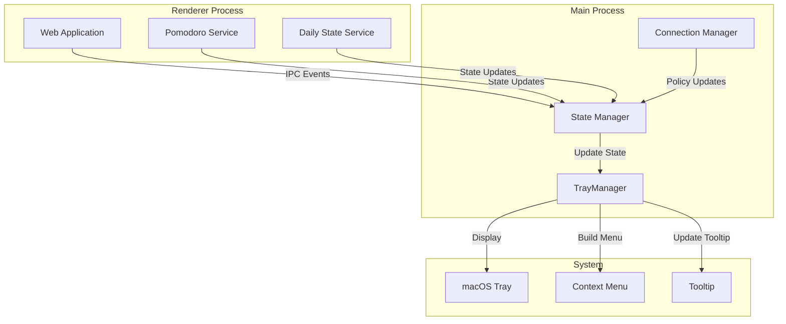

# Design Document

## Overview

This document outlines the design for enhancing the VibeFlow desktop application's system tray functionality. The enhancement focuses on providing real-time status information, countdown displays, and improved user interaction through the macOS menu bar.

The design builds upon the existing `TrayManager` class in `vibeflow-desktop/electron/modules/tray-manager.ts` and integrates with the current state management system to provide accurate, real-time feedback to users without requiring them to open the main application window.

## Architecture

### System Components



### Data Flow

1. **State Changes**: Web application services (Pomodoro, Daily State) emit state changes
2. **IPC Communication**: State changes are sent to main process via IPC
3. **State Management**: Main process updates internal state representation
4. **Tray Updates**: TrayManager receives state updates and refreshes display
5. **User Interaction**: User interacts with tray, triggering actions back to renderer

## Components and Interfaces

### Enhanced TrayMenuState Interface

```typescript
export interface TrayMenuState {
  // Existing fields
  pomodoroActive: boolean;
  pomodoroTimeRemaining?: string; // MM:SS format
  currentTask?: string;
  isWithinWorkHours: boolean; // Reserved for future use
  skipTokensRemaining: number;
  enforcementMode: 'strict' | 'gentle';
  appMode?: AppMode;
  isInDemoMode?: boolean;
  
  // New fields for enhanced functionality
  systemState: 'LOCKED' | 'PLANNING' | 'FOCUS' | 'REST' | 'OVER_REST';
  restTimeRemaining?: string; // MM:SS format for rest countdown (pre-formatted)
  overRestDuration?: string; // Formatted duration for over-rest display (e.g., "15 min")
}
```

### State Update Events

```typescript
// IPC event types for state synchronization
interface TrayStateUpdateEvent {
  type: 'tray:updateState';
  payload: Partial<TrayMenuState>;
}

interface PomodoroStateEvent {
  type: 'pomodoro:stateChange';
  payload: {
    active: boolean;
    timeRemaining?: string; // Pre-formatted MM:SS
    taskName?: string;
    taskId?: string;
  };
}

interface SystemStateEvent {
  type: 'system:stateChange';
  payload: {
    state: SystemState;
    restTimeRemaining?: string; // Pre-formatted MM:SS
    overRestDuration?: string; // Pre-formatted duration (e.g., "15 min")
  };
}
```

### Icon Management

```typescript
interface TrayIconConfig {
  // Template image for macOS dark/light mode adaptation
  templateImage: boolean;
  
  // Simple fallback icon generation
  placeholderConfig: {
    size: { width: 16, height: 16 };
    backgroundColor: string; // Brand color
    foregroundColor: string; // Contrasting color
    shape: 'circle'; // Fixed simple shape
  };
}
```

## Data Models

### Time Formatting Utilities

```typescript
class TimeFormatter {
  /**
   * Format seconds to MM:SS display format
   * Used in renderer process before sending to tray
   */
  static formatTime(seconds: number): string {
    const minutes = Math.floor(seconds / 60);
    const remainingSeconds = seconds % 60;
    return `${minutes.toString().padStart(2, '0')}:${remainingSeconds.toString().padStart(2, '0')}`;
  }
  
  /**
   * Format duration for over-rest display
   * Used in renderer process before sending to tray
   */
  static formatOverRestDuration(seconds: number): string {
    if (seconds < 60) {
      return `${seconds}s`;
    } else if (seconds < 3600) {
      const minutes = Math.floor(seconds / 60);
      return `${minutes} min`;
    } else {
      const hours = Math.floor(seconds / 3600);
      const minutes = Math.floor((seconds % 3600) / 60);
      return `${hours}h ${minutes}m`;
    }
  }
}
```

## Correctness Properties

*A property is a characteristic or behavior that should hold true across all valid executions of a system-essentially, a formal statement about what the system should do. Properties serve as the bridge between human-readable specifications and machine-verifiable correctness guarantees.*

### Property 1: Countdown Display Accuracy
*For any* active pomodoro session, the displayed countdown time should accurately reflect the remaining time and update every second without drift.
**Validates: Requirements 1.1, 1.2**

### Property 2: State Display Consistency
*For any* system state transition, the tray display should update within 1 second to reflect the new state accurately.
**Validates: Requirements 2.5, 5.1, 5.2, 5.3**

### Property 3: Rest Time Calculation
*For any* completed pomodoro, the rest countdown should start from the configured rest duration and count down to zero, then transition to over-rest display.
**Validates: Requirements 8.1, 8.4, 8.6**

### Property 4: Over-Rest Duration Accuracy
*For any* over-rest state, the displayed over-rest duration should accurately reflect the time elapsed since the rest period ended.
**Validates: Requirements 2.7, 8.6**

### Property 5: Icon Visibility
*For any* macOS appearance mode (light/dark), the tray icon should use template image mode for automatic adaptation, and when template image fails, display a clearly visible placeholder icon.
**Validates: Requirements 3.1, 3.2, 3.3**

### Property 6: State Transition Logic
*For any* pomodoro completion event, if the system is already in OVER_REST state, no rest prompt should be shown and the state should remain OVER_REST.
**Validates: Requirements 7.1, 7.2, 7.5**

### Property 7: Menu Content Accuracy
*For any* tray menu display, the shown information should accurately reflect the current system state, including countdown times, task names, and status indicators.
**Validates: Requirements 4.1, 4.3, 1.4, 1.5**

### Property 8: Time Format Consistency
*For any* time display (pomodoro countdown, rest countdown, over-rest duration), the format should be consistent and follow the MM:SS pattern for countdowns.
**Validates: Requirements 1.7, 8.7**

## Error Handling

### Invalid State Scenarios
- **Malformed Time Data**: Default to "00:00" display and log error
- **Missing Task Information**: Display "Unknown Task" placeholder
- **State Inconsistencies**: Fall back to PLANNING state and request full state refresh

### Icon Loading Failures
- **Missing Icon Files**: Generate colored placeholder icon automatically using brand colors
- **Template Image Failures**: Fall back to standard icon mode
- **Resource Constraints**: Use minimal memory footprint for simple circular placeholder icon

## Testing Strategy

### Unit Testing Approach
- **State Display Tests**: Verify correct tray display based on received state data
- **Time Formatting Tests**: Ensure consistent and accurate time display formatting (in renderer process)
- **Icon Generation Tests**: Validate placeholder icon creation and template image handling
- **Menu Building Tests**: Verify correct menu structure and content based on state

### Property-Based Testing Configuration
- **Testing Framework**: Use fast-check for property-based testing in TypeScript
- **Test Iterations**: Minimum 100 iterations per property test
- **Test Tagging**: Each property test tagged with format: **Feature: desktop-tray-enhancement, Property {number}: {property_text}**

### Integration Testing
- **IPC Communication**: Test state synchronization between renderer and main process
- **System Integration**: Test actual tray display and interaction on macOS
- **State Persistence**: Verify state accuracy across application restarts

### Test Data Generation
- **Time Ranges**: Generate random pomodoro durations (10-120 minutes)
- **State Transitions**: Generate random sequences of state changes
- **Edge Cases**: Test boundary conditions (0 seconds remaining, very long over-rest periods)
- **System States**: Generate all valid combinations of pomodoro/rest states

The testing strategy ensures comprehensive coverage of both specific scenarios and general correctness properties, providing confidence in the system's reliability and accuracy.