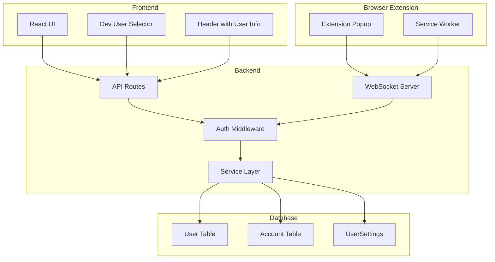

# Design Document: Dev User System

## Overview

本设计文档描述了 VibeFlow 开发阶段用户系统的技术实现方案。系统需要实现用户数据隔离、开发模式用户切换、前端用户身份显示、浏览器插件用户认证，并为后续 OAuth 集成做好准备。

## Architecture



## Components and Interfaces

### 1. User Context Provider

前端 React Context，提供当前用户信息给所有组件。

```typescript
interface UserContextValue {
  user: {
    id: string;
    email: string;
  } | null;
  isDevMode: boolean;
  isLoading: boolean;
  switchUser: (email: string) => Promise<void>;
  logout: () => Promise<void>;
}
```

### 2. Dev User Selector Component

开发模式下的用户切换组件，显示在 Header 中。

```typescript
interface DevUserSelectorProps {
  currentEmail: string;
  onSwitch: (email: string) => void;
  recentEmails: string[];
}
```

### 3. Auth Middleware (Enhanced)

增强现有的 dev-auth.middleware.ts，支持从多种来源获取用户身份。

```typescript
interface AuthSource {
  type: 'dev-header' | 'session' | 'api-token';
  identifier: string;
}

interface AuthResult {
  success: boolean;
  user?: UserContext;
  source?: AuthSource;
  error?: { code: string; message: string };
}
```

### 4. WebSocket Auth Enhancement

增强 WebSocket 认证，支持用户身份验证和房间隔离。

```typescript
interface SocketAuthPayload {
  email?: string;      // Dev mode
  token?: string;      // API token
  sessionId?: string;  // NextAuth session
}
```

### 5. Browser Extension Auth

插件认证流程，存储用户身份并显示在 popup 中。

```typescript
interface ExtensionAuthState {
  serverUrl: string;
  userEmail: string;
  isConnected: boolean;
  lastConnected?: number;
}
```

### 6. MCP Authentication (Enhanced)

MCP 服务器认证，支持开发模式和生产模式。

```typescript
// 开发模式 token 格式
type DevToken = `dev_${string}`; // dev_user@example.com

// 生产模式 token 格式  
type ProdToken = `vibeflow_${string}_${string}`; // vibeflow_<userId>_<secret>

interface MCPAuthConfig {
  devMode: boolean;
  defaultUserEmail: string;
  logAuthMode: boolean;
}
```

本地开发配置示例（mcp.json）：
```json
{
  "mcpServers": {
    "vibeflow": {
      "command": "node",
      "args": ["path/to/vibeflow/dist/mcp-server.js"],
      "env": {
        "DEV_MODE": "true",
        "DEV_USER_EMAIL": "dev@vibeflow.local"
      }
    }
  }
}
```

## Data Models

### Account Table (New)

为 OAuth 集成准备的账户关联表。

```prisma
model Account {
  id                String  @id @default(uuid())
  userId            String
  user              User    @relation(fields: [userId], references: [id], onDelete: Cascade)
  type              String  // "credentials" | "oauth"
  provider          String  // "credentials" | "google" | "github"
  providerAccountId String  // Provider-specific ID
  
  // OAuth tokens (optional, for OAuth providers)
  access_token      String?
  refresh_token     String?
  expires_at        Int?
  token_type        String?
  scope             String?
  
  createdAt         DateTime @default(now())
  updatedAt         DateTime @updatedAt
  
  @@unique([provider, providerAccountId])
}
```

### User Table (Enhanced)

```prisma
model User {
  id        String    @id @default(uuid())
  email     String    @unique
  password  String?   // Optional for OAuth users
  name      String?   // Display name
  image     String?   // Avatar URL
  createdAt DateTime  @default(now())
  updatedAt DateTime  @updatedAt
  
  accounts  Account[]
  // ... existing relations
}
```

## Correctness Properties

*A property is a characteristic or behavior that should hold true across all valid executions of a system-essentially, a formal statement about what the system should do. Properties serve as the bridge between human-readable specifications and machine-verifiable correctness guarantees.*


### Property 1: Data Isolation

*For any* user A and user B, when user A queries resources (projects, tasks, goals, pomodoros), the result SHALL contain only resources where userId equals user A's ID, and SHALL NOT contain any resources belonging to user B.

**Validates: Requirements 1.1, 1.2, 1.3, 1.4, 6.2**

### Property 2: Cross-User Access Prevention

*For any* resource R owned by user A, when user B attempts to access R by ID, the system SHALL return a NOT_FOUND error (not FORBIDDEN, to avoid information leakage).

**Validates: Requirements 1.5, 6.4**

### Property 3: Resource Creation Ownership

*For any* resource created by user A, the resource's userId field SHALL equal user A's ID, regardless of any userId provided in the request body.

**Validates: Requirements 1.6, 6.3**

### Property 4: Dev Mode Authentication

*For any* request with X-Dev-User-Email header containing email E while dev mode is enabled, the authenticated user context SHALL have email equal to E. If no user with email E exists, a new user SHALL be created.

**Validates: Requirements 2.1, 2.3, 7.2**

### Property 5: Registration Validation

*For any* registration request with invalid email format OR password shorter than 8 characters, the system SHALL return a VALIDATION_ERROR and SHALL NOT create a user.

**Validates: Requirements 3.3, 3.4**

### Property 6: Password Hashing

*For any* user created with password P, the stored password field SHALL NOT equal P (must be hashed), AND verifying P against the stored hash SHALL return true.

**Validates: Requirements 3.5**

### Property 7: Credential Authentication

*For any* user with email E and password P, authenticating with (E, P) SHALL succeed, AND authenticating with (E, wrong_password) SHALL fail with AUTH_ERROR.

**Validates: Requirements 4.1, 4.2**

### Property 8: User Context Switching

*For any* user switch from user A to user B in dev mode, after the switch completes, all subsequent data queries SHALL return user B's data, not user A's data.

**Validates: Requirements 9.2, 9.4**

### Property 9: WebSocket User Isolation

*For any* WebSocket broadcast to user A, only connections authenticated as user A SHALL receive the message. Connections authenticated as user B SHALL NOT receive messages intended for user A.

**Validates: Requirements 11.2, 11.3, 11.4**

### Property 10: MCP Dev Mode Authentication

*For any* MCP tool call with dev_<email> token while dev mode is enabled, the tool SHALL execute with the context of the user with that email. If no user exists, one SHALL be created.

**Validates: Requirements 12.1, 12.2, 12.4, 12.5**

## Error Handling

### Authentication Errors

| Error Code | HTTP Status | Description |
|------------|-------------|-------------|
| AUTH_ERROR | 401 | Invalid credentials or missing authentication |
| AUTH_EXPIRED | 401 | Session token has expired |
| AUTH_INVALID_TOKEN | 401 | Malformed or invalid token |

### Validation Errors

| Error Code | HTTP Status | Description |
|------------|-------------|-------------|
| VALIDATION_ERROR | 400 | Invalid input data (email format, password length) |
| CONFLICT | 409 | Email already registered |

### Authorization Errors

| Error Code | HTTP Status | Description |
|------------|-------------|-------------|
| NOT_FOUND | 404 | Resource not found or not accessible |

## Testing Strategy

### Unit Tests

- User service methods (getOrCreateDevUser, getCurrentUser, register)
- Password hashing and verification
- Email validation
- Auth middleware extraction logic

### Property-Based Tests

使用 fast-check 库实现以下属性测试：

1. **Data Isolation Property Test**: 生成随机用户和资源，验证查询隔离
2. **Cross-User Access Prevention Test**: 生成两个用户，验证跨用户访问被拒绝
3. **Resource Creation Ownership Test**: 生成随机资源创建请求，验证 userId 正确设置
4. **Dev Mode Authentication Test**: 生成随机邮箱，验证 dev mode 认证行为
5. **Registration Validation Test**: 生成无效输入，验证验证逻辑
6. **Password Hashing Test**: 生成随机密码，验证哈希和验证
7. **Credential Authentication Test**: 生成用户和凭证，验证认证逻辑
8. **User Context Switching Test**: 生成用户切换序列，验证数据隔离
9. **WebSocket User Isolation Test**: 生成多用户连接，验证广播隔离

### Integration Tests

- API 路由认证流程
- WebSocket 连接和认证
- 前端用户切换流程

### Configuration

- 每个属性测试运行至少 100 次迭代
- 测试标签格式: `Feature: dev-user-system, Property N: {property_text}`
