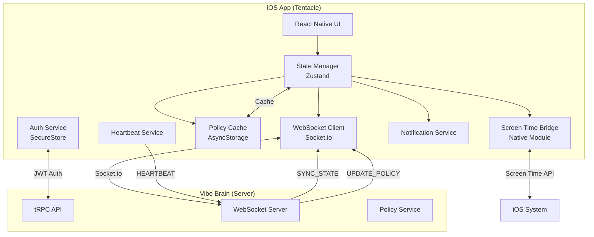
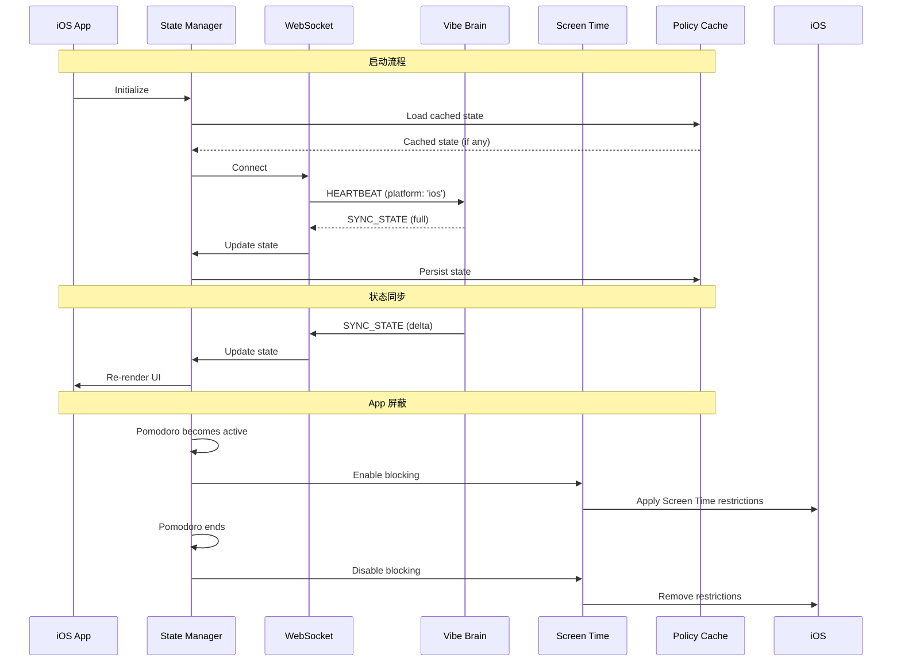

# Design Document: iOS MVP

## Overview

VibeFlow iOS MVP 是一个轻量级的 iOS 客户端，作为八爪鱼架构中的 Tentacle 运行。该版本专注于两个核心能力：
1. **只读状态感知**：通过 WebSocket 实时同步显示番茄钟状态和今日任务
2. **专注模式 App 屏蔽**：利用 iOS Screen Time API 在番茄钟期间屏蔽干扰应用

### 设计原则

- **只读优先**：MVP 版本不支持任何状态修改，所有变更通过 Web/Desktop 完成
- **离线友好**：缓存最后已知状态，支持离线查看
- **原生集成**：充分利用 iOS Screen Time API 实现 App 屏蔽
- **最小依赖**：使用 Expo managed workflow 简化开发和部署

### 技术栈

| 层级 | 技术 | 说明 |
|------|------|------|
| 框架 | React Native + Expo | Managed workflow |
| 语言 | TypeScript 5.x | Strict mode |
| 状态管理 | Zustand | 轻量级状态管理 |
| 实时通信 | Socket.io Client | WebSocket 连接 |
| 存储 | AsyncStorage + SecureStore | 缓存 + 安全存储 |
| 原生模块 | expo-screen-time (自定义) | Screen Time API 桥接 |
| 导航 | React Navigation | Tab + Stack 导航 |

## Architecture

### 系统架构图



### 数据流图



## Components and Interfaces

### 1. State Manager (Zustand Store)

```typescript
/**
 * 核心状态管理 Store
 * 管理所有从服务器同步的状态
 */
interface AppState {
  // 连接状态
  connectionStatus: 'connected' | 'connecting' | 'disconnected';
  lastSyncTime: number | null;
  
  // 认证状态
  isAuthenticated: boolean;
  userId: string | null;
  userEmail: string | null;
  
  // 每日状态 (只读)
  dailyState: DailyStateData | null;
  
  // 番茄钟状态 (只读)
  activePomodoro: ActivePomodoroData | null;
  
  // 任务列表 (只读)
  top3Tasks: TaskData[];
  todayTasks: TaskData[];
  
  // 策略数据
  policy: PolicyData | null;
  
  // 屏蔽状态
  isBlockingActive: boolean;
  blockedApps: BlockedApp[];
  
  // Actions
  setConnectionStatus: (status: ConnectionStatus) => void;
  handleSyncState: (command: SyncStateCommand) => void;
  handlePolicyUpdate: (command: UpdatePolicyCommand) => void;
  clearState: () => void;
}

interface DailyStateData {
  state: 'LOCKED' | 'PLANNING' | 'FOCUS' | 'REST';
  completedPomodoros: number;
  dailyCap: number;
  totalFocusMinutes: number;
}

interface ActivePomodoroData {
  id: string;
  taskId: string;
  taskTitle: string;
  startTime: number;      // Unix timestamp
  duration: number;       // Minutes
  status: 'active' | 'paused';
}

interface TaskData {
  id: string;
  title: string;
  priority: 'P1' | 'P2' | 'P3';
  status: 'pending' | 'in_progress' | 'completed';
  isTop3: boolean;
  isCurrentTask: boolean;
}

interface PolicyData {
  version: number;
  distractionApps: BlockedApp[];
  updatedAt: number;
}

interface BlockedApp {
  bundleId: string;
  name: string;
}
```

### 2. WebSocket Client Service

```typescript
/**
 * WebSocket 客户端服务
 * 负责与 Vibe Brain 的实时通信
 */
interface WebSocketService {
  // 连接管理
  connect(token: string): Promise<void>;
  disconnect(): void;
  isConnected(): boolean;
  
  // 事件发送
  sendHeartbeat(): void;
  sendEvent(event: OctopusEvent): void;
  
  // 事件监听
  onSyncState(handler: (command: SyncStateCommand) => void): void;
  onPolicyUpdate(handler: (command: UpdatePolicyCommand) => void): void;
  onDisconnect(handler: () => void): void;
  onReconnect(handler: () => void): void;
}

/**
 * 重连策略配置
 */
interface ReconnectionConfig {
  initialDelay: 1000;      // 1 second
  maxDelay: 30000;         // 30 seconds
  multiplier: 2;           // Exponential backoff
  maxAttempts: Infinity;   // Keep trying
}

/**
 * 计算重连延迟
 * @param attempt 当前尝试次数 (0-indexed)
 * @returns 延迟毫秒数
 */
function calculateReconnectDelay(attempt: number): number {
  const delay = Math.min(
    1000 * Math.pow(2, attempt),
    30000
  );
  return delay;
}
```

### 3. Heartbeat Service

```typescript
/**
 * 心跳服务
 * 定期发送心跳事件维持连接
 */
interface HeartbeatService {
  start(): void;
  stop(): void;
  isRunning(): boolean;
}

/**
 * 心跳事件构造
 */
function createHeartbeatEvent(
  userId: string,
  clientId: string
): HeartbeatEvent {
  return {
    eventId: generateUUID(),
    eventType: 'HEARTBEAT',
    userId,
    clientId,
    clientType: 'mobile',
    timestamp: Date.now(),
    sequenceNumber: getNextSequenceNumber(),
    payload: {
      clientVersion: APP_VERSION,
      platform: 'ios',
      connectionQuality: getConnectionQuality(),
      localStateHash: computeStateHash(),
      capabilities: ['sensor:heartbeat', 'action:app_block'],
      uptime: getAppUptime(),
    },
  };
}
```

### 4. Policy Cache Service

```typescript
/**
 * 策略缓存服务
 * 使用 AsyncStorage 持久化状态
 */
interface PolicyCacheService {
  // 存储
  saveState(state: CachedState): Promise<void>;
  
  // 读取
  loadState(): Promise<CachedState | null>;
  
  // 检查过期
  isExpired(cachedAt: number): boolean;
  
  // 清除
  clearCache(): Promise<void>;
}

interface CachedState {
  dailyState: DailyStateData;
  activePomodoro: ActivePomodoroData | null;
  todayTasks: TaskData[];
  policy: PolicyData;
  cachedAt: number;        // Unix timestamp
}

const CACHE_EXPIRY_MS = 24 * 60 * 60 * 1000; // 24 hours

function isExpired(cachedAt: number): boolean {
  return Date.now() - cachedAt > CACHE_EXPIRY_MS;
}
```

### 5. Screen Time Bridge (Native Module)

```typescript
/**
 * Screen Time 原生模块接口
 * 桥接 iOS Family Controls / Screen Time API
 */
interface ScreenTimeBridge {
  // 授权
  requestAuthorization(): Promise<AuthorizationStatus>;
  getAuthorizationStatus(): Promise<AuthorizationStatus>;
  
  // 屏蔽控制
  enableBlocking(apps: BlockedApp[]): Promise<void>;
  disableBlocking(): Promise<void>;
  isBlockingEnabled(): Promise<boolean>;
  
  // 状态持久化
  persistBlockingState(state: BlockingState): Promise<void>;
  loadBlockingState(): Promise<BlockingState | null>;
}

type AuthorizationStatus = 
  | 'authorized'
  | 'denied'
  | 'notDetermined'
  | 'restricted';

interface BlockingState {
  isActive: boolean;
  blockedApps: BlockedApp[];
  pomodoroId: string | null;
  activatedAt: number | null;
}

/**
 * 默认屏蔽应用列表
 */
const DEFAULT_BLOCKED_APPS: BlockedApp[] = [
  { bundleId: 'com.tencent.xin', name: '微信' },
  { bundleId: 'com.sina.weibo', name: '微博' },
  { bundleId: 'com.ss.iphone.ugc.Aweme', name: '抖音' },
  { bundleId: 'com.xingin.discover', name: '小红书' },
  { bundleId: 'tv.danmaku.bilianime', name: 'B站' },
];
```

### 6. Dev Auth Config

```typescript
/**
 * 开发模式认证配置
 * MVP 使用默认用户，无需登录流程
 */
const DEV_USER_EMAIL = 'test@example.com';

/**
 * 获取 HTTP 请求头
 */
function getAuthHeaders(): Record<string, string> {
  return {
    'X-Dev-User-Email': DEV_USER_EMAIL,
  };
}

/**
 * 获取当前用户 ID（从服务器同步获取）
 */
function getUserId(): string | null {
  return appStore.getState().userId;
}
```

### 7. Notification Service

```typescript
/**
 * 通知服务
 * 处理本地推送通知
 */
interface NotificationService {
  // 权限
  requestPermission(): Promise<boolean>;
  hasPermission(): Promise<boolean>;
  
  // 发送通知
  showPomodoroComplete(): Promise<void>;
  showRestComplete(): Promise<void>;
  
  // 配置
  setNotificationsEnabled(enabled: boolean): Promise<void>;
  isNotificationsEnabled(): Promise<boolean>;
}

const NOTIFICATION_CONTENT = {
  pomodoroComplete: {
    title: '番茄钟完成！',
    body: '恭喜完成一个番茄钟，休息一下吧',
  },
  restComplete: {
    title: '休息结束',
    body: '准备开始下一个番茄钟',
  },
};
```

### 8. Pomodoro Time Calculator

```typescript
/**
 * 番茄钟时间计算工具
 */
interface PomodoroTimeCalculator {
  // 计算剩余时间
  calculateRemainingTime(pomodoro: ActivePomodoroData): number;
  
  // 格式化显示
  formatRemainingTime(seconds: number): string;
  
  // 计算进度百分比
  calculateProgress(pomodoro: ActivePomodoroData): number;
}

/**
 * 计算剩余秒数
 */
function calculateRemainingTime(pomodoro: ActivePomodoroData): number {
  const elapsedMs = Date.now() - pomodoro.startTime;
  const totalMs = pomodoro.duration * 60 * 1000;
  const remainingMs = Math.max(0, totalMs - elapsedMs);
  return Math.ceil(remainingMs / 1000);
}

/**
 * 格式化为 MM:SS
 */
function formatRemainingTime(seconds: number): string {
  const mins = Math.floor(seconds / 60);
  const secs = seconds % 60;
  return `${mins.toString().padStart(2, '0')}:${secs.toString().padStart(2, '0')}`;
}

/**
 * 计算进度 0-100
 */
function calculateProgress(pomodoro: ActivePomodoroData): number {
  const elapsedMs = Date.now() - pomodoro.startTime;
  const totalMs = pomodoro.duration * 60 * 1000;
  return Math.min(100, Math.max(0, (elapsedMs / totalMs) * 100));
}
```

## Data Models

### Client ID Generation

```typescript
/**
 * 生成并持久化唯一客户端 ID
 */
async function getOrCreateClientId(): Promise<string> {
  const stored = await SecureStore.getItemAsync('clientId');
  if (stored) {
    return stored;
  }
  
  const newId = `ios_${generateUUID()}`;
  await SecureStore.setItemAsync('clientId', newId);
  return newId;
}
```

### Task Filtering

```typescript
/**
 * 过滤今日任务
 */
function filterTodayTasks(tasks: TaskData[], today: string): TaskData[] {
  return tasks.filter(task => task.planDate === today);
}

/**
 * 获取今日日期字符串 YYYY-MM-DD
 */
function getTodayString(): string {
  return new Date().toISOString().split('T')[0];
}
```

## Correctness Properties

*A property is a characteristic or behavior that should hold true across all valid executions of a system—essentially, a formal statement about what the system should do. Properties serve as the bridge between human-readable specifications and machine-verifiable correctness guarantees.*

### Property 1: Mobile Client Registration Consistency

*For any* heartbeat event sent from the iOS app, the clientType SHALL be 'mobile' and the platform SHALL be 'ios', and the clientId SHALL be a non-empty string that remains consistent across app sessions.

**Validates: Requirements 1.3, 1.4, 2.2**

### Property 2: State Sync Round-Trip

*For any* valid SYNC_STATE command received from the server, storing the state in cache and then loading it SHALL produce an equivalent state object.

**Validates: Requirements 2.3, 7.1**

### Property 3: Reconnection Backoff Calculation

*For any* reconnection attempt number N (0-indexed), the calculated delay SHALL equal min(1000 * 2^N, 30000) milliseconds.

**Validates: Requirements 2.4**

### Property 4: Connection Status Indicator

*For any* WebSocket connection state change, the connectionStatus in the state manager SHALL accurately reflect the current connection state ('connected', 'connecting', or 'disconnected').

**Validates: Requirements 2.5**

### Property 5: Dev Auth Header Consistency

*For any* HTTP request sent from the iOS app, the X-Dev-User-Email header SHALL be set to the configured default user email.

**Validates: Requirements 3.2, 3.3**

### Property 7: Pomodoro Remaining Time Calculation

*For any* active pomodoro with startTime and duration, the calculated remaining time SHALL be non-negative and SHALL decrease monotonically as time passes, reaching 0 when elapsed time equals duration.

**Validates: Requirements 4.2**

### Property 8: Pomodoro Count Display Format

*For any* completed pomodoro count C and daily cap D, the display format SHALL be "{C}/{D} 番茄" where C and D are non-negative integers.

**Validates: Requirements 4.4**

### Property 9: Today Task Filtering

*For any* list of tasks, filtering by today's date SHALL return only tasks where planDate equals the current date string (YYYY-MM-DD format).

**Validates: Requirements 5.2**

### Property 10: Task Display Completeness

*For any* task in the filtered list, the rendered output SHALL contain the task title, priority (P1/P2/P3), and status.

**Validates: Requirements 5.3**

### Property 11: App Blocking State Consistency

*For any* state where activePomodoro is not null and Screen Time is authorized, isBlockingActive SHALL be true. Conversely, when activePomodoro is null, isBlockingActive SHALL be false.

**Validates: Requirements 6.2, 6.3**

### Property 12: Policy Sync Updates Blocked Apps

*For any* UPDATE_POLICY command with distractionApps list, the local blockedApps list SHALL be updated to match the policy's distractionApps.

**Validates: Requirements 6.6**

### Property 13: Blocking State Persistence Round-Trip

*For any* blocking state, persisting it and then loading it SHALL produce an equivalent blocking state object.

**Validates: Requirements 6.8**

### Property 14: Cache Completeness

*For any* cached state, it SHALL contain all required fields: dailyState, activePomodoro (nullable), todayTasks, policy, and cachedAt timestamp.

**Validates: Requirements 7.3**

### Property 15: Offline Remaining Time Estimation

*For any* cached active pomodoro, the estimated remaining time SHALL be calculated as max(0, (startTime + duration*60*1000 - currentTime) / 1000) seconds.

**Validates: Requirements 7.4**

### Property 16: Cache Expiry Detection

*For any* cached state with cachedAt timestamp, isExpired SHALL return true if and only if (currentTime - cachedAt) > 24 hours.

**Validates: Requirements 7.6**

## Error Handling

### Error Categories

| 类别 | 处理方式 |
|------|----------|
| 网络错误 | 显示离线指示器，使用缓存数据，自动重连 |
| 认证错误 | 清除 token，跳转登录页 |
| Screen Time 授权拒绝 | 显示警告，继续运行但不屏蔽 |
| 缓存过期 | 显示过期提示，等待网络恢复 |

### Error Response Handling

```typescript
/**
 * 统一错误处理
 */
function handleError(error: AppError): void {
  switch (error.type) {
    case 'NETWORK_ERROR':
      store.setConnectionStatus('disconnected');
      // 使用缓存数据
      break;
      
    case 'AUTH_ERROR':
      authService.clearToken();
      navigation.navigate('Login');
      break;
      
    case 'SCREEN_TIME_DENIED':
      store.setScreenTimeWarning(true);
      // 继续运行，但不启用屏蔽
      break;
      
    case 'CACHE_EXPIRED':
      store.setCacheExpiredWarning(true);
      break;
  }
}
```

## Testing Strategy

### 测试类型

| 类型 | 工具 | 位置 |
|------|------|------|
| 单元测试 | Jest | `vibeflow-ios/__tests__/` |
| 属性测试 | fast-check + Jest | `vibeflow-ios/__tests__/property/` |
| 组件测试 | React Native Testing Library | `vibeflow-ios/__tests__/components/` |

### 属性测试配置

```typescript
// vibeflow-ios/jest.config.js
module.exports = {
  preset: 'jest-expo',
  testMatch: ['**/__tests__/**/*.test.ts', '**/__tests__/**/*.property.ts'],
  setupFilesAfterEnv: ['@testing-library/jest-native/extend-expect'],
};
```

### 测试重点

1. **状态同步逻辑**：验证 SYNC_STATE 命令正确更新本地状态
2. **时间计算**：验证番茄钟剩余时间计算的准确性
3. **缓存逻辑**：验证缓存存储、加载、过期检测
4. **屏蔽状态**：验证屏蔽启用/禁用逻辑与番茄钟状态的一致性
5. **重连逻辑**：验证指数退避算法的正确性

### 单元测试示例

```typescript
// 番茄钟时间计算测试
describe('PomodoroTimeCalculator', () => {
  it('should calculate remaining time correctly', () => {
    const pomodoro = {
      startTime: Date.now() - 10 * 60 * 1000, // 10 minutes ago
      duration: 25, // 25 minutes
    };
    const remaining = calculateRemainingTime(pomodoro);
    expect(remaining).toBeCloseTo(15 * 60, -1); // ~15 minutes
  });
  
  it('should return 0 when time is up', () => {
    const pomodoro = {
      startTime: Date.now() - 30 * 60 * 1000, // 30 minutes ago
      duration: 25, // 25 minutes
    };
    const remaining = calculateRemainingTime(pomodoro);
    expect(remaining).toBe(0);
  });
});
```

### 属性测试示例

```typescript
// Feature: ios-mvp, Property 3: Reconnection Backoff Calculation
import * as fc from 'fast-check';

describe('Reconnection Backoff', () => {
  it('should follow exponential backoff with max 30s', () => {
    fc.assert(
      fc.property(
        fc.integer({ min: 0, max: 100 }),
        (attempt) => {
          const delay = calculateReconnectDelay(attempt);
          const expected = Math.min(1000 * Math.pow(2, attempt), 30000);
          return delay === expected;
        }
      ),
      { numRuns: 100 }
    );
  });
});
```
