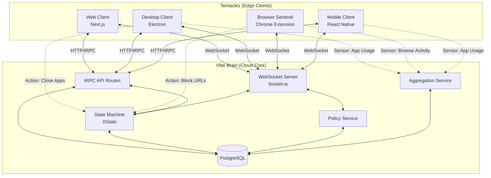
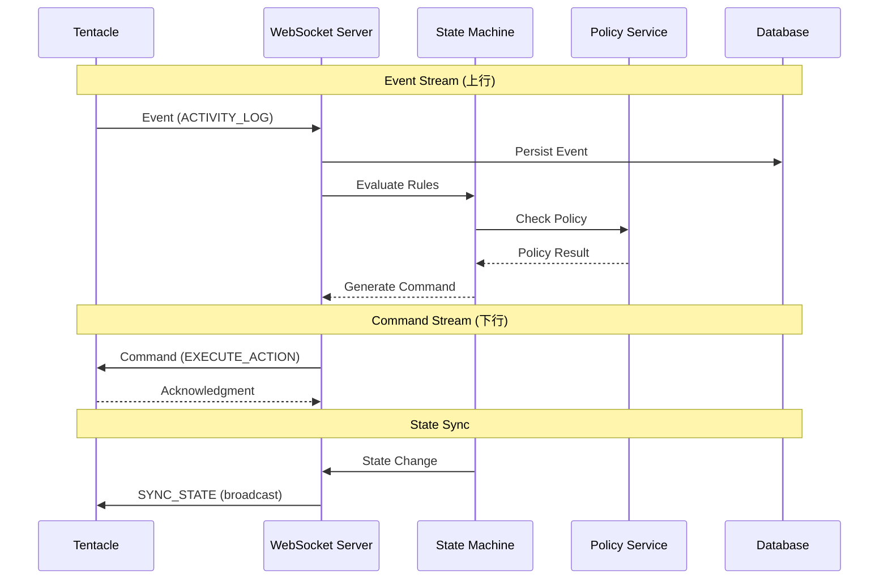
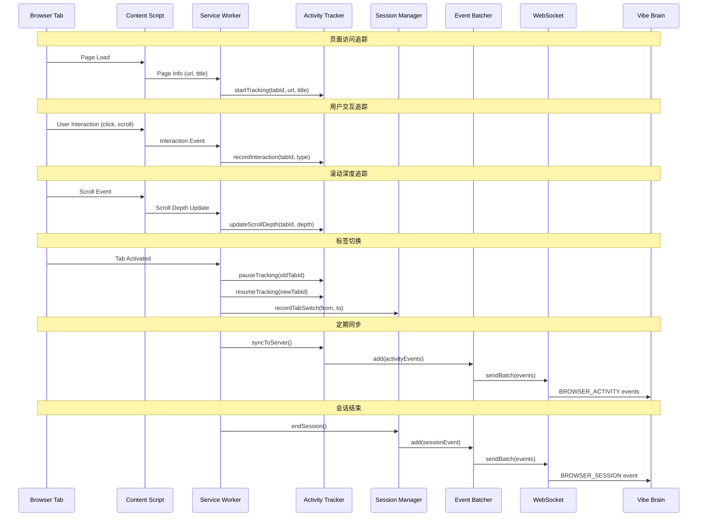

# Design Document: Octopus Architecture

## Overview

VibeFlow 采用"八爪鱼架构 (Octopus Architecture)"——一个以云端大脑 (Vibe Brain) 为核心、多触手客户端 (Tentacles) 协同工作的分布式系统。每个客户端具备双重职责：
1. **Sensor（感知器）**：收集运行环境的事件和用户行为数据
2. **Action Executor（动作执行器）**：基于服务端返回的状态执行必要的干预动作

### 设计原则

- **中央集权，边缘执行**：所有决策由 Vibe Brain 做出，Tentacles 只负责感知和执行
- **统一状态源**：所有客户端共享同一状态源，通过 WebSocket 实时同步
- **平台特化**：每个客户端针对其运行平台的特性进行优化
- **离线优先**：客户端缓存策略，支持离线场景

### 技术栈

- **Vibe Brain**: Next.js 14 + tRPC + Socket.io + PostgreSQL + Prisma
- **Web Client**: Next.js 14 (App Router) + React 19 + TypeScript
- **Desktop Client**: Electron + TypeScript + macOS APIs
- **Browser Sentinel**: Chrome Extension Manifest V3 + TypeScript
- **Mobile Client**: React Native + Expo (未来)

## Architecture

### 系统拓扑图



### 数据流图



## Components and Interfaces

### 1. Event Stream Protocol

#### 1.1 Base Event Interface

```typescript
/**
 * Base interface for all events from Tentacles to Vibe Brain
 */
interface BaseEvent {
  // Required fields for all events
  eventId: string;           // UUID, generated by client
  eventType: EventType;      // Discriminator
  userId: string;            // User identifier
  clientId: string;          // Unique client instance ID
  clientType: ClientType;    // 'web' | 'desktop' | 'browser_ext' | 'mobile'
  timestamp: number;         // Unix timestamp (ms)
  sequenceNumber: number;    // Monotonic counter per client
}

type EventType = 
  | 'ACTIVITY_LOG'
  | 'STATE_CHANGE'
  | 'USER_ACTION'
  | 'HEARTBEAT'
  | 'TIMELINE_EVENT'
  | 'BLOCK_EVENT'
  | 'INTERRUPTION_EVENT';

type ClientType = 'web' | 'desktop' | 'browser_ext' | 'mobile';
```

#### 1.2 Activity Log Event

```typescript
/**
 * Activity log from sensors (browser, desktop, mobile)
 */
interface ActivityLogEvent extends BaseEvent {
  eventType: 'ACTIVITY_LOG';
  payload: {
    source: 'browser' | 'desktop_app' | 'mobile_app';
    identifier: string;      // URL or app bundle ID
    title: string;           // Page title or app name
    duration: number;        // Seconds
    category: 'productive' | 'neutral' | 'distracting';
    metadata?: {
      domain?: string;
      appBundleId?: string;
      windowTitle?: string;
    };
  };
}
```

#### 1.2.1 Enhanced Browser Activity Event

```typescript
/**
 * Enhanced browser activity log with detailed tracking
 * Requirements: 5.6-5.20
 */
interface BrowserActivityEvent extends BaseEvent {
  eventType: 'BROWSER_ACTIVITY';
  payload: {
    // Basic info
    url: string;
    title: string;
    domain: string;
    
    // Time tracking
    startTime: number;       // Unix timestamp (ms)
    endTime: number;         // Unix timestamp (ms)
    duration: number;        // Total time on page (seconds)
    activeDuration: number;  // Time with user interaction (seconds)
    idleTime: number;        // Time without interaction (seconds)
    
    // Categorization
    category: 'productive' | 'neutral' | 'distracting';
    productivityScore: number;  // 0-100
    
    // User engagement metrics
    scrollDepth: number;     // 0-100 percentage
    interactionCount: number; // clicks, inputs, etc.
    
    // Media tracking
    isMediaPlaying: boolean;
    mediaPlayDuration: number; // seconds
    
    // Navigation context
    referrer?: string;
    navigationType: 'link' | 'typed' | 'reload' | 'back_forward' | 'other';
    
    // Search tracking (for search engines)
    searchQuery?: string;
    searchEngine?: 'google' | 'bing' | 'duckduckgo' | 'other';
  };
}

/**
 * Browser session summary event
 * Requirements: 5.13-5.17
 */
interface BrowserSessionEvent extends BaseEvent {
  eventType: 'BROWSER_SESSION';
  payload: {
    sessionId: string;
    startTime: number;
    endTime: number;
    totalDuration: number;   // seconds
    activeDuration: number;  // seconds with browser focused
    
    // Domain breakdown
    domainBreakdown: Array<{
      domain: string;
      duration: number;
      activeDuration: number;
      category: 'productive' | 'neutral' | 'distracting';
      visitCount: number;
    }>;
    
    // Behavior patterns
    tabSwitchCount: number;
    rapidTabSwitches: number;  // switches within 3 seconds
    uniqueDomainsVisited: number;
    
    // Productivity summary
    productiveTime: number;
    distractingTime: number;
    neutralTime: number;
    productivityScore: number;  // 0-100
  };
}

/**
 * Tab switch event for distraction detection
 * Requirements: 5.3, 5.17
 */
interface TabSwitchEvent extends BaseEvent {
  eventType: 'TAB_SWITCH';
  payload: {
    fromTabId: number;
    toTabId: number;
    fromUrl: string;
    toUrl: string;
    fromDomain: string;
    toDomain: string;
    timeSinceLastSwitch: number;  // milliseconds
    isRapidSwitch: boolean;       // < 3 seconds since last switch
  };
}

/**
 * Browser focus event
 * Requirements: 5.9, 5.16
 */
interface BrowserFocusEvent extends BaseEvent {
  eventType: 'BROWSER_FOCUS';
  payload: {
    isFocused: boolean;      // true = browser gained focus, false = lost focus
    previousState: 'focused' | 'blurred' | 'unknown';
    focusDuration?: number;  // seconds (only when losing focus)
  };
}
```

#### 1.3 Heartbeat Event

```typescript
/**
 * Periodic heartbeat from clients
 */
interface HeartbeatEvent extends BaseEvent {
  eventType: 'HEARTBEAT';
  payload: {
    clientVersion: string;
    platform: string;        // 'macos' | 'windows' | 'linux' | 'ios' | 'android' | 'chrome'
    connectionQuality: 'good' | 'degraded' | 'poor';
    localStateHash: string;  // Hash of local state for conflict detection
    capabilities: string[];  // ['sensor:app', 'action:close_app', etc.]
    uptime: number;          // Seconds since client start
  };
}
```

### 2. Command Stream Protocol

#### 2.1 Base Command Interface

```typescript
/**
 * Base interface for all commands from Vibe Brain to Tentacles
 */
interface BaseCommand {
  commandId: string;         // UUID
  commandType: CommandType;  // Discriminator
  targetClient: ClientType | 'all';  // Target client type or broadcast
  priority: 'low' | 'normal' | 'high' | 'critical';
  requiresAck: boolean;      // Whether client must acknowledge
  expiryTime?: number;       // Unix timestamp, command expires after this
  createdAt: number;         // Unix timestamp
}

type CommandType = 
  | 'SYNC_STATE'
  | 'EXECUTE_ACTION'
  | 'UPDATE_POLICY'
  | 'SHOW_UI';
```

#### 2.2 Sync State Command

```typescript
/**
 * Synchronize state to clients
 */
interface SyncStateCommand extends BaseCommand {
  commandType: 'SYNC_STATE';
  payload: {
    syncType: 'full' | 'delta';
    version: number;
    state?: FullState;       // For full sync
    delta?: StateDelta;      // For delta sync
  };
}

interface FullState {
  systemState: SystemState;
  dailyState: DailyState;
  activePomodoro: Pomodoro | null;
  top3Tasks: Task[];
  settings: UserSettings;
}

interface StateDelta {
  changes: Array<{
    path: string;            // JSON path
    operation: 'set' | 'delete';
    value?: unknown;
  }>;
}
```

#### 2.3 Execute Action Command

```typescript
/**
 * Execute an action on client
 */
interface ExecuteActionCommand extends BaseCommand {
  commandType: 'EXECUTE_ACTION';
  payload: {
    action: ActionType;
    parameters: Record<string, unknown>;
    timeout?: number;        // Milliseconds
    fallbackAction?: ActionType;
  };
}

type ActionType = 
  // Desktop actions
  | 'CLOSE_APP'
  | 'HIDE_APP'
  | 'BRING_TO_FRONT'
  | 'SHOW_NOTIFICATION'
  // Browser actions
  | 'CLOSE_TAB'
  | 'REDIRECT_TAB'
  | 'INJECT_OVERLAY'
  | 'ADD_SESSION_WHITELIST'
  // Mobile actions
  | 'SEND_PUSH'
  | 'PLAY_SOUND'
  | 'VIBRATE';
```

#### 2.4 Update Policy Command

```typescript
/**
 * Update policy on client
 */
interface UpdatePolicyCommand extends BaseCommand {
  commandType: 'UPDATE_POLICY';
  payload: {
    policyType: 'full' | 'partial';
    policy: Policy;
    effectiveTime: number;   // When policy takes effect
  };
}

interface Policy {
  version: number;
  blacklist: string[];
  whitelist: string[];
  enforcementMode: 'strict' | 'gentle';
  workTimeSlots: TimeSlot[];
  skipTokens: {
    remaining: number;
    maxPerDay: number;
    delayMinutes: number;
  };
  distractionApps: DistractionApp[];
  updatedAt: number;
}

interface TimeSlot {
  dayOfWeek: number;         // 0-6
  startHour: number;
  startMinute: number;
  endHour: number;
  endMinute: number;
}

interface DistractionApp {
  bundleId: string;
  name: string;
  action: 'force_quit' | 'hide_window';
}
```

### 3. Client Registry Service

```typescript
/**
 * Manages connected client instances
 */
interface ClientRegistryService {
  // Register a new client connection
  register(connection: ClientConnection): Promise<RegisteredClient>;
  
  // Update client metadata
  updateMetadata(clientId: string, metadata: Partial<ClientMetadata>): Promise<void>;
  
  // Mark client as disconnected
  markDisconnected(clientId: string): Promise<void>;
  
  // Get all clients for a user
  getClientsByUser(userId: string): Promise<RegisteredClient[]>;
  
  // Get online clients for a user
  getOnlineClients(userId: string): Promise<RegisteredClient[]>;
  
  // Revoke a client
  revokeClient(userId: string, clientId: string): Promise<void>;
  
  // Check if client is online
  isOnline(clientId: string): boolean;
}

interface ClientConnection {
  socketId: string;
  userId: string;
  clientType: ClientType;
  clientVersion: string;
  platform: string;
  capabilities: string[];
}

interface RegisteredClient {
  clientId: string;
  userId: string;
  clientType: ClientType;
  metadata: ClientMetadata;
  status: 'online' | 'offline';
  lastSeenAt: number;
  registeredAt: number;
}

interface ClientMetadata {
  clientVersion: string;
  platform: string;
  capabilities: string[];
  deviceName?: string;
  localStateHash?: string;
}
```

### 4. Policy Distribution Service

```typescript
/**
 * Compiles and distributes policies to clients
 */
interface PolicyDistributionService {
  // Compile user settings into policy
  compilePolicy(userId: string): Promise<Policy>;
  
  // Distribute policy to all user's clients
  distributePolicy(userId: string): Promise<void>;
  
  // Get current policy for user
  getCurrentPolicy(userId: string): Promise<Policy>;
  
  // Check if client policy is outdated
  isPolicyOutdated(userId: string, clientVersion: number): boolean;
  
  // Handle policy version conflict
  resolveConflict(userId: string, clientId: string, clientVersion: number): Promise<Policy>;
}
```

### 5. Activity Aggregation Service

```typescript
/**
 * Aggregates and analyzes activity data from all sources
 */
interface ActivityAggregationService {
  // Ingest activity events
  ingestActivity(event: ActivityLogEvent): Promise<void>;
  
  // Ingest batch of activities
  ingestBatch(events: ActivityLogEvent[]): Promise<{ count: number }>;
  
  // Deduplicate overlapping activities
  deduplicateActivities(userId: string, date: Date): Promise<void>;
  
  // Get aggregated stats for a period
  getAggregatedStats(userId: string, period: 'day' | 'week' | 'month'): Promise<AggregatedStats>;
  
  // Calculate productivity score
  calculateProductivityScore(userId: string, date: Date): Promise<number>;
  
  // Export activity data
  exportActivities(userId: string, startDate: Date, endDate: Date): Promise<ActivityExport>;
}

interface AggregatedStats {
  totalDuration: number;
  productiveDuration: number;
  distractingDuration: number;
  neutralDuration: number;
  productivityScore: number;
  topActivities: Array<{
    identifier: string;
    title: string;
    duration: number;
    category: string;
  }>;
  bySource: Record<string, {
    duration: number;
    count: number;
  }>;
}

interface ActivityExport {
  userId: string;
  period: { start: Date; end: Date };
  activities: ActivityLogEvent[];
  summary: AggregatedStats;
}
```

### 6. Command Queue Service

```typescript
/**
 * Manages command queuing for offline clients
 */
interface CommandQueueService {
  // Queue a command for a client
  enqueue(clientId: string, command: BaseCommand): Promise<void>;
  
  // Get pending commands for a client
  getPendingCommands(clientId: string): Promise<BaseCommand[]>;
  
  // Mark command as delivered
  markDelivered(commandId: string): Promise<void>;
  
  // Mark command as acknowledged
  markAcknowledged(commandId: string): Promise<void>;
  
  // Remove expired commands
  cleanupExpired(): Promise<number>;
  
  // Get queue stats
  getQueueStats(userId: string): Promise<QueueStats>;
}

interface QueueStats {
  pendingCount: number;
  deliveredCount: number;
  acknowledgedCount: number;
  expiredCount: number;
}
```

### 7. Browser Sentinel Sensor Architecture

```typescript
/**
 * Browser Sentinel 增强传感器架构
 * 负责收集详细的浏览器活动数据
 * Requirements: 5.1-5.20
 */

/**
 * Enhanced Activity Tracker - 核心追踪器
 */
interface EnhancedActivityTracker {
  // 初始化追踪器
  initialize(): Promise<void>;
  
  // 开始追踪一个标签页
  startTracking(tabId: number, url: string, title: string): void;
  
  // 停止追踪一个标签页
  stopTracking(tabId: number): BrowserActivityEvent | null;
  
  // 暂停追踪（标签页失去焦点）
  pauseTracking(tabId: number): void;
  
  // 恢复追踪（标签页获得焦点）
  resumeTracking(tabId: number): void;
  
  // 更新滚动深度
  updateScrollDepth(tabId: number, depth: number): void;
  
  // 记录用户交互
  recordInteraction(tabId: number, type: InteractionType): void;
  
  // 更新媒体播放状态
  updateMediaState(tabId: number, isPlaying: boolean): void;
  
  // 获取当前追踪状态
  getTrackingStats(): TrackerStats;
  
  // 同步到服务器
  syncToServer(): Promise<void>;
}

type InteractionType = 'click' | 'input' | 'scroll' | 'keypress' | 'video_play' | 'video_pause';

interface TrackerStats {
  activeTabCount: number;
  pendingEvents: number;
  lastSyncTime: number;
  sessionStartTime: number;
}

/**
 * Tab Activity State - 单个标签页的活动状态
 */
interface TabActivityState {
  tabId: number;
  url: string;
  title: string;
  domain: string;
  
  // 时间追踪
  startTime: number;
  lastActiveTime: number;
  totalActiveTime: number;
  totalIdleTime: number;
  isActive: boolean;
  
  // 用户参与度
  scrollDepth: number;
  interactionCount: number;
  interactions: InteractionRecord[];
  
  // 媒体状态
  isMediaPlaying: boolean;
  mediaPlayStartTime: number | null;
  totalMediaPlayTime: number;
  
  // 导航上下文
  referrer: string | null;
  navigationType: 'link' | 'typed' | 'reload' | 'back_forward' | 'other';
  
  // 搜索追踪
  searchQuery: string | null;
  searchEngine: string | null;
}

interface InteractionRecord {
  type: InteractionType;
  timestamp: number;
  target?: string;  // CSS selector or element type
}

/**
 * Session Manager - 会话管理器
 */
interface SessionManager {
  // 开始新会话
  startSession(): string;
  
  // 结束当前会话
  endSession(): BrowserSessionEvent | null;
  
  // 获取当前会话ID
  getCurrentSessionId(): string | null;
  
  // 记录标签切换
  recordTabSwitch(fromTabId: number, toTabId: number): void;
  
  // 记录浏览器焦点变化
  recordBrowserFocus(isFocused: boolean): void;
  
  // 获取会话摘要
  getSessionSummary(): SessionSummary;
  
  // 检测快速切换模式
  detectRapidSwitching(): boolean;
}

interface SessionSummary {
  sessionId: string;
  startTime: number;
  duration: number;
  activeDuration: number;
  tabSwitchCount: number;
  rapidSwitchCount: number;
  uniqueDomains: string[];
  productivityScore: number;
}

/**
 * Idle Detector - 空闲检测器
 */
interface IdleDetector {
  // 开始检测
  start(idleThresholdMs: number): void;
  
  // 停止检测
  stop(): void;
  
  // 记录用户活动
  recordActivity(): void;
  
  // 检查是否空闲
  isIdle(): boolean;
  
  // 获取空闲时长
  getIdleDuration(): number;
  
  // 设置空闲回调
  onIdle(callback: (duration: number) => void): void;
}

/**
 * Search Query Extractor - 搜索查询提取器
 */
interface SearchQueryExtractor {
  // 从URL提取搜索查询
  extractQuery(url: string): SearchQueryResult | null;
  
  // 支持的搜索引擎
  getSupportedEngines(): string[];
}

interface SearchQueryResult {
  engine: 'google' | 'bing' | 'duckduckgo' | 'baidu' | 'other';
  query: string;
  url: string;
}

/**
 * Domain Categorizer - 域名分类器
 */
interface DomainCategorizer {
  // 分类域名
  categorize(domain: string): CategoryResult;
  
  // 批量分类
  categorizeBatch(domains: string[]): Map<string, CategoryResult>;
  
  // 更新分类规则（从服务器同步）
  updateRules(rules: CategoryRule[]): void;
}

interface CategoryResult {
  category: 'productive' | 'neutral' | 'distracting';
  confidence: number;  // 0-1
  matchedRule?: string;
}

interface CategoryRule {
  pattern: string;  // glob or regex
  category: 'productive' | 'neutral' | 'distracting';
  priority: number;
}

/**
 * Event Batcher - 事件批处理器
 */
interface EventBatcher {
  // 添加事件到批次
  add(event: BaseEvent): void;
  
  // 强制刷新批次
  flush(): Promise<void>;
  
  // 获取待发送事件数
  getPendingCount(): number;
  
  // 设置批次大小
  setBatchSize(size: number): void;
  
  // 设置刷新间隔
  setFlushInterval(ms: number): void;
}
```

#### Browser Sentinel 数据流



## Data Models

### Prisma Schema Extensions

```prisma
// Add to existing schema.prisma

model ClientRegistry {
  id            String       @id @default(uuid())
  clientId      String       @unique
  userId        String
  user          User         @relation(fields: [userId], references: [id])
  clientType    String       // 'web' | 'desktop' | 'browser_ext' | 'mobile'
  clientVersion String
  platform      String
  capabilities  String[]
  deviceName    String?
  status        String       @default("offline") // 'online' | 'offline'
  lastSeenAt    DateTime     @default(now())
  registeredAt  DateTime     @default(now())
  revokedAt     DateTime?
  
  @@index([userId])
  @@index([status])
}

model CommandQueue {
  id            String       @id @default(uuid())
  commandId     String       @unique
  clientId      String
  userId        String
  commandType   String
  payload       Json
  priority      String       @default("normal")
  requiresAck   Boolean      @default(false)
  status        String       @default("pending") // 'pending' | 'delivered' | 'acknowledged' | 'expired'
  expiryTime    DateTime?
  createdAt     DateTime     @default(now())
  deliveredAt   DateTime?
  acknowledgedAt DateTime?
  
  @@index([clientId, status])
  @@index([userId])
  @@index([expiryTime])
}

model PolicyVersion {
  id            String       @id @default(uuid())
  userId        String
  user          User         @relation(fields: [userId], references: [id])
  version       Int
  policy        Json
  createdAt     DateTime     @default(now())
  
  @@unique([userId, version])
  @@index([userId])
}

model ActivityAggregate {
  id            String       @id @default(uuid())
  userId        String
  user          User         @relation(fields: [userId], references: [id])
  date          DateTime     @db.Date
  source        String       // 'browser' | 'desktop_app' | 'mobile_app'
  category      String       // 'productive' | 'neutral' | 'distracting'
  totalDuration Int          // seconds
  activityCount Int
  topIdentifiers Json        // Array of top activities
  
  @@unique([userId, date, source, category])
  @@index([userId, date])
}
```


## Correctness Properties

*A property is a characteristic or behavior that should hold true across all valid executions of a system—essentially, a formal statement about what the system should do. Properties serve as the bridge between human-readable specifications and machine-verifiable correctness guarantees.*

### Property 1: Event Schema Validation

*For any* event sent from a Tentacle to Vibe Brain, the event SHALL contain all required base fields (eventId, eventType, userId, clientId, clientType, timestamp, sequenceNumber) and type-specific payload fields. Events missing required fields SHALL be rejected with a validation error.

**Validates: Requirements 2.3, 7.2, 7.3, 7.4, 7.5, 7.6**

### Property 2: Command Schema Validation

*For any* command sent from Vibe Brain to a Tentacle, the command SHALL contain all required base fields (commandId, commandType, targetClient, priority, requiresAck, createdAt) and type-specific payload fields.

**Validates: Requirements 2.4, 8.2, 8.3, 8.4, 8.5, 8.6**

### Property 3: Policy Schema Completeness

*For any* Policy object distributed to clients, the policy SHALL contain all required fields (version, blacklist, whitelist, enforcementMode, workTimeSlots, skipTokens, distractionApps, updatedAt).

**Validates: Requirements 10.5, 10.6**

### Property 4: State Consistency

*For any* user with multiple connected Tentacles, after a state change broadcast, all online Tentacles SHALL have the same state version within the sync timeout period.

**Validates: Requirements 1.1, 1.4**

### Property 5: Event Persistence

*For any* valid event received from a Tentacle, the event SHALL be persisted to the database and retrievable by eventId.

**Validates: Requirements 1.2**

### Property 6: Authentication Enforcement

*For any* connection attempt without valid credentials, the Vibe Brain SHALL reject the connection with an authentication error.

**Validates: Requirements 1.6, 13.2**

### Property 7: Client Registration Uniqueness

*For any* Tentacle connection, the Vibe Brain SHALL assign a unique clientId that does not conflict with any existing registered client.

**Validates: Requirements 9.1**

### Property 8: Multiple Client Support

*For any* user, the system SHALL support multiple simultaneous connections of the same client type, each with a distinct clientId.

**Validates: Requirements 9.6**

### Property 9: Offline Client Timeout

*For any* Tentacle that disconnects, the Vibe Brain SHALL mark it as offline after the configured timeout period (default: 30 seconds).

**Validates: Requirements 9.4**

### Property 10: Policy Distribution Broadcast

*For any* policy change, the Vibe Brain SHALL broadcast the updated policy to all online Tentacles for that user within 1 second.

**Validates: Requirements 10.2, 10.3**

### Property 11: Policy Version Sync

*For any* Tentacle reconnection with an outdated policy version, the Vibe Brain SHALL send the current policy before processing other commands.

**Validates: Requirements 10.7**

### Property 12: Activity Aggregation

*For any* set of activity events from multiple sources for the same user and time period, the aggregation service SHALL produce a single aggregated result that accounts for all sources.

**Validates: Requirements 11.1**

### Property 13: Activity Deduplication

*For any* overlapping activity events (same user, same identifier, overlapping time ranges), the system SHALL deduplicate them to prevent double-counting duration.

**Validates: Requirements 11.2**

### Property 14: Activity Categorization

*For any* activity event, the system SHALL assign exactly one category (productive, neutral, or distracting) based on the configured rules.

**Validates: Requirements 11.3**

### Property 15: Event Replay Idempotency

*For any* sequence of events replayed after reconnection, processing the same event multiple times SHALL produce the same final state as processing it once.

**Validates: Requirements 12.2, 12.3**

### Property 16: Server State Authority

*For any* state conflict between client and server, the server state SHALL be treated as authoritative and the client state SHALL be overwritten.

**Validates: Requirements 12.4**

### Property 17: User Data Isolation

*For any* two distinct users A and B, user A SHALL NOT be able to access, view, or modify user B's activity data, events, or settings.

**Validates: Requirements 13.3**

### Property 18: Rate Limiting

*For any* client sending events at a rate exceeding the configured limit (default: 100 events/minute), the system SHALL reject excess events with a rate limit error.

**Validates: Requirements 13.5**

### Property 19: Command Acknowledgment

*For any* command with requiresAck=true, the system SHALL track delivery status and retry delivery up to 3 times if acknowledgment is not received within timeout.

**Validates: Requirements 2.6**

### Property 20: Offline Queue Ordering

*For any* commands queued for an offline client, when the client reconnects, commands SHALL be delivered in the order they were created (FIFO).

**Validates: Requirements 2.7**

### Property 21: Browser Activity Duration Accuracy

*For any* browser activity event, the sum of activeDuration and idleTime SHALL equal the total duration, and activeDuration SHALL be less than or equal to duration.

**Validates: Requirements 5.2, 5.8, 5.9**

### Property 22: Scroll Depth Bounds

*For any* browser activity event with scrollDepth, the value SHALL be between 0 and 100 inclusive.

**Validates: Requirements 5.6**

### Property 23: Session Consistency

*For any* browser session event, the sum of productiveTime, distractingTime, and neutralTime SHALL equal totalDuration, and the domainBreakdown durations SHALL sum to totalDuration.

**Validates: Requirements 5.13, 5.14, 5.15**

### Property 24: Tab Switch Detection

*For any* tab switch event, if timeSinceLastSwitch is less than 3000ms, isRapidSwitch SHALL be true.

**Validates: Requirements 5.3, 5.17**

### Property 25: Search Query Extraction

*For any* URL from a supported search engine (Google, Bing, DuckDuckGo), the SearchQueryExtractor SHALL extract the search query correctly.

**Validates: Requirements 5.12**

### Property 26: Event Batching Limit

*For any* batch of events sent to the server, the batch size SHALL NOT exceed 50 events.

**Validates: Requirements 5.20**

### Property 27: Offline Event Storage Limit

*For any* Browser Sentinel in offline mode, the number of stored pending events SHALL NOT exceed 1000.

**Validates: Requirements 5.29**

### Property 28: Domain Categorization Consistency

*For any* domain, calling categorize multiple times with the same rules SHALL return the same category.

**Validates: Requirements 5.4, 5.15**

## Error Handling

### Error Categories

| Category | Code | HTTP Status | Description |
|----------|------|-------------|-------------|
| Validation | VALIDATION_ERROR | 400 | Invalid event/command format |
| Authentication | AUTH_ERROR | 401 | Invalid or missing credentials |
| Authorization | FORBIDDEN | 403 | Action not allowed |
| Not Found | NOT_FOUND | 404 | Resource does not exist |
| Conflict | CONFLICT | 409 | State or version conflict |
| Rate Limit | RATE_LIMITED | 429 | Too many requests |
| Server | INTERNAL_ERROR | 500 | Unexpected server error |

### Error Response Schema

```typescript
interface ErrorResponse {
  success: false;
  error: {
    code: string;
    message: string;
    details?: Record<string, unknown>;
    retryable: boolean;
    retryAfter?: number;  // Seconds
  };
}
```

### WebSocket Error Handling

```typescript
// Server emits error event
socket.emit('error', {
  code: 'VALIDATION_ERROR',
  message: 'Invalid event format',
  details: { field: 'timestamp', reason: 'required' },
  retryable: true,
});

// Client should handle and potentially retry
socket.on('error', (error) => {
  if (error.retryable && error.retryAfter) {
    setTimeout(() => retryLastEvent(), error.retryAfter * 1000);
  }
});
```

### Conflict Resolution

```typescript
/**
 * Handle state conflicts between client and server
 */
async function resolveStateConflict(
  userId: string,
  clientId: string,
  clientState: FullState,
  serverState: FullState
): Promise<ResolutionResult> {
  // Log conflict for debugging
  await logConflict(userId, clientId, clientState, serverState);
  
  // Server state is authoritative
  return {
    resolution: 'server_wins',
    state: serverState,
    conflictId: generateConflictId(),
  };
}
```

## Testing Strategy

### Testing Approach

本项目采用双重测试策略：
1. **Unit Tests**: 验证具体示例和边界情况
2. **Property-Based Tests**: 验证所有输入的通用属性

### Property-Based Testing Framework

- **Framework**: fast-check (TypeScript)
- **Minimum iterations**: 100 per property
- **Shrinking**: Enabled for minimal failing examples

### Test Structure

```
tests/
├── property/
│   ├── octopus/
│   │   ├── event-schema.property.ts
│   │   ├── command-schema.property.ts
│   │   ├── policy-schema.property.ts
│   │   ├── state-consistency.property.ts
│   │   ├── client-registry.property.ts
│   │   ├── activity-aggregation.property.ts
│   │   ├── event-replay.property.ts
│   │   └── data-isolation.property.ts
│   └── ...
├── unit/
│   ├── services/
│   │   ├── client-registry.test.ts
│   │   ├── policy-distribution.test.ts
│   │   ├── activity-aggregation.test.ts
│   │   └── command-queue.test.ts
│   └── ...
└── integration/
    ├── websocket-protocol.test.ts
    ├── multi-client-sync.test.ts
    └── offline-reconnect.test.ts
```

### Property Test Examples

```typescript
import fc from 'fast-check';
import { describe, it, expect } from 'vitest';

describe('Property 1: Event Schema Validation', () => {
  // Feature: octopus-architecture, Property 1: Event Schema Validation
  // Validates: Requirements 2.3, 7.2, 7.3, 7.4, 7.5, 7.6
  
  it('should reject events missing required base fields', () => {
    fc.assert(
      fc.property(
        fc.record({
          // Randomly omit one or more required fields
          eventId: fc.option(fc.uuid(), { nil: undefined }),
          eventType: fc.option(fc.constantFrom('ACTIVITY_LOG', 'HEARTBEAT'), { nil: undefined }),
          userId: fc.option(fc.uuid(), { nil: undefined }),
          clientId: fc.option(fc.uuid(), { nil: undefined }),
          timestamp: fc.option(fc.integer({ min: 0 }), { nil: undefined }),
        }),
        async (partialEvent) => {
          const hasAllRequired = 
            partialEvent.eventId !== undefined &&
            partialEvent.eventType !== undefined &&
            partialEvent.userId !== undefined &&
            partialEvent.clientId !== undefined &&
            partialEvent.timestamp !== undefined;
          
          const result = await validateEvent(partialEvent);
          
          if (hasAllRequired) {
            // May still fail on payload validation
            return true;
          } else {
            expect(result.success).toBe(false);
            expect(result.error?.code).toBe('VALIDATION_ERROR');
            return true;
          }
        }
      ),
      { numRuns: 100 }
    );
  });
});

describe('Property 17: User Data Isolation', () => {
  // Feature: octopus-architecture, Property 17: User Data Isolation
  // Validates: Requirements 13.3
  
  it('should prevent cross-user data access', () => {
    fc.assert(
      fc.property(
        fc.uuid(), // userA
        fc.uuid(), // userB
        fc.array(fc.record({
          url: fc.webUrl(),
          duration: fc.integer({ min: 1, max: 3600 }),
        })),
        async (userA, userB, activities) => {
          // Create activities for userA
          for (const activity of activities) {
            await createActivity(userA, activity);
          }
          
          // UserB should not see userA's activities
          const userBActivities = await getActivities(userB);
          const userAIds = activities.map(a => a.url);
          
          const hasLeakedData = userBActivities.some(
            a => userAIds.includes(a.url)
          );
          
          expect(hasLeakedData).toBe(false);
          return true;
        }
      ),
      { numRuns: 100 }
    );
  });
});
```

### Unit Test Coverage Requirements

- Services: 90% line coverage
- Protocol handlers: 100% endpoint coverage
- Validators: 100% branch coverage

### Integration Test Scenarios

1. **Multi-Client Sync**: Connect multiple clients, change state, verify all receive update
2. **Offline Reconnect**: Disconnect client, queue commands, reconnect, verify delivery
3. **Policy Distribution**: Change settings, verify all clients receive updated policy
4. **Activity Aggregation**: Send activities from multiple sources, verify aggregation
5. **Conflict Resolution**: Create state conflict, verify server wins

