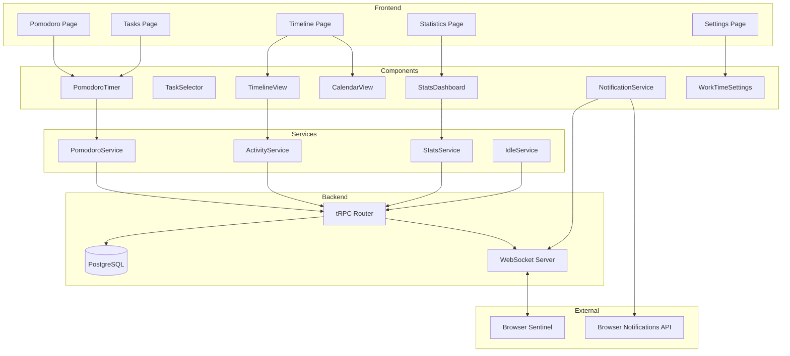
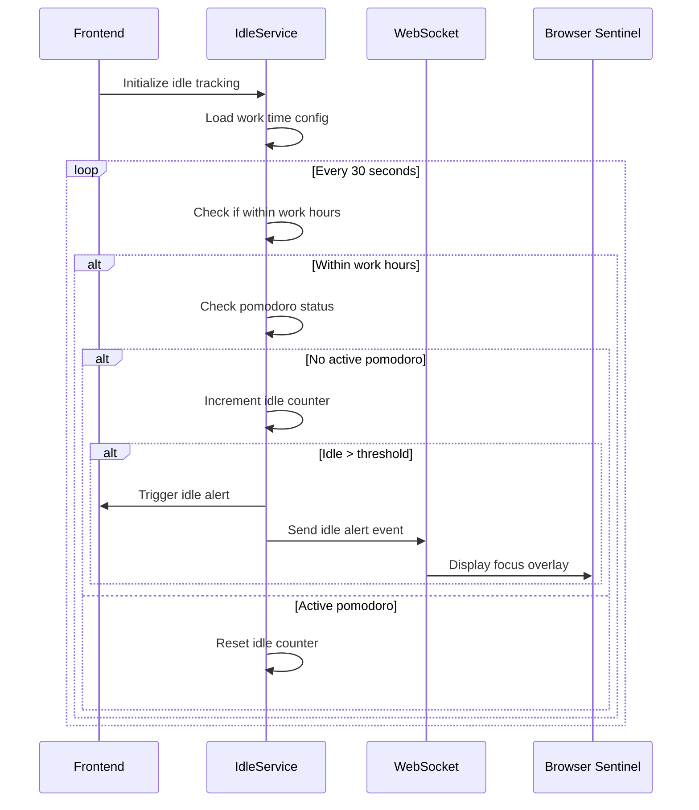
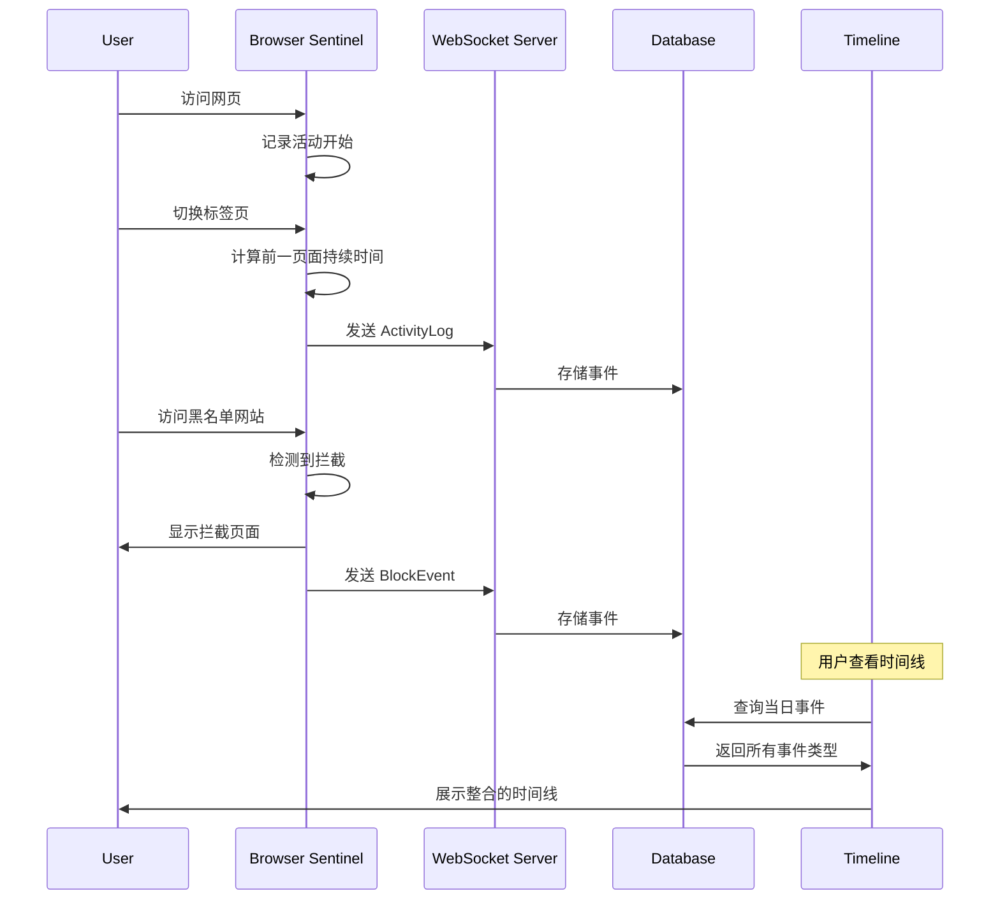

# Design Document: Pomodoro Enhancement

## Overview

本设计文档描述了 VibeFlow 番茄工作法功能增强的技术实现方案。主要包括：
- 番茄状态持久化机制
- 任务页面快速启动番茄
- 多维度统计仪表板
- 完成提醒系统
- 多时间段工作时间管理
- 活动时间线与日历视图
- 浏览器插件事件整合

## Architecture



## Components and Interfaces

### 1. PomodoroTimer Component (Enhanced)

增强现有的 `PomodoroTimer` 组件，支持状态持久化和跨页面同步。

```typescript
interface PomodoroTimerProps {
  taskId?: string;           // 预选任务ID（从任务页面启动时传入）
  onComplete?: () => void;
  onAbort?: () => void;
  compact?: boolean;         // 紧凑模式（用于任务页面内嵌）
}

interface PomodoroState {
  id: string;
  taskId: string;
  taskTitle: string;
  duration: number;          // 总时长（分钟）
  startTime: Date;
  remainingSeconds: number;
  status: 'IN_PROGRESS' | 'COMPLETED' | 'ABORTED' | 'INTERRUPTED';
}

// Local Storage Key
const POMODORO_STATE_KEY = 'vibeflow_pomodoro_state';
```

### 2. TaskPomodoroButton Component

新增组件，用于在任务列表中显示启动番茄按钮。

```typescript
interface TaskPomodoroButtonProps {
  taskId: string;
  taskTitle: string;
  disabled?: boolean;
  size?: 'sm' | 'md';
}

// 状态显示：
// - 无活动番茄：显示 "🍅 Start" 按钮
// - 当前任务有活动番茄：显示剩余时间
// - 其他任务有活动番茄：禁用按钮
```

### 3. StatsDashboard Component

新增统计仪表板组件。

```typescript
interface StatsDashboardProps {
  userId: string;
}

interface TimeRangeFilter {
  type: 'today' | 'week' | 'month' | 'custom';
  startDate?: Date;
  endDate?: Date;
}

interface DimensionFilter {
  type: 'all' | 'project' | 'task';
  projectId?: string;
  taskId?: string;
}

interface PomodoroStats {
  totalMinutes: number;
  completedCount: number;
  interruptedCount: number;
  abortedCount: number;
  averageDuration: number;
  byProject: ProjectStats[];
  byTask: TaskStats[];
  byDay: DayStats[];
}

interface ProjectStats {
  projectId: string;
  projectTitle: string;
  totalMinutes: number;
  percentage: number;
  pomodoroCount: number;
}

interface TaskStats {
  taskId: string;
  taskTitle: string;
  projectTitle: string;
  totalMinutes: number;
  completedCount: number;
  interruptedCount: number;
}

interface DayStats {
  date: string;
  totalMinutes: number;
  pomodoroCount: number;
  sessions: PomodoroSession[];
}
```

### 4. CalendarTimeline Component

新增日历时间线组件。

```typescript
interface CalendarTimelineProps {
  userId: string;
}

interface TimelineEvent {
  id: string;
  type: 'pomodoro' | 'distraction' | 'scheduled_task' | 'break';
  startTime: Date;
  endTime?: Date;
  duration: number;          // 秒
  title: string;
  metadata?: {
    taskId?: string;
    projectId?: string;
    category?: string;       // productive, neutral, distracting
    status?: string;
  };
}

interface TimelineFilter {
  showPomodoros: boolean;
  showDistractions: boolean;
  showScheduledTasks: boolean;
  showBreaks: boolean;
}
```

### 5. WorkTimeSettings Component

新增多时间段工作时间设置组件。

```typescript
interface WorkTimeSlot {
  id: string;
  startTime: string;         // HH:mm 格式
  endTime: string;           // HH:mm 格式
  enabled: boolean;
}

interface WorkTimeSettingsProps {
  slots: WorkTimeSlot[];
  maxIdleMinutes: number;
  idleAlertActions: IdleAlertAction[];
  onChange: (settings: WorkTimeConfig) => void;
}

interface WorkTimeConfig {
  slots: WorkTimeSlot[];
  maxIdleMinutes: number;
  idleAlertActions: IdleAlertAction[];
}

type IdleAlertAction = 
  | 'show_overlay'
  | 'close_distracting_apps'
  | 'open_pomodoro_page'
  | 'browser_notification';
```

### 6. NotificationService

新增通知服务，处理番茄完成提醒。

```typescript
interface NotificationConfig {
  enabled: boolean;
  soundEnabled: boolean;
  soundType: 'bell' | 'chime' | 'gentle' | 'none';
  flashTab: boolean;
}

class NotificationService {
  // 请求通知权限
  async requestPermission(): Promise<boolean>;
  
  // 发送番茄完成通知
  async notifyPomodoroComplete(taskTitle: string): Promise<void>;
  
  // 发送空闲提醒
  async notifyIdleAlert(): Promise<void>;
  
  // 播放提示音
  playSound(type: string): void;
  
  // 闪烁标签页标题
  flashTabTitle(message: string): void;
}
```

## Data Models

### Database Schema Updates

```prisma
// 更新 UserSettings 模型
model UserSettings {
  // ... 现有字段 ...
  
  // 工作时间设置
  workTimeSlots    Json     @default("[]")  // WorkTimeSlot[]
  maxIdleMinutes   Int      @default(15)
  idleAlertActions String[] @default(["show_overlay"])
  
  // 通知设置
  notificationEnabled Boolean @default(true)
  notificationSound   String  @default("bell")
  flashTabEnabled     Boolean @default(true)
}

// 新增 TimelineEvent 模型
model TimelineEvent {
  id        String   @id @default(uuid())
  userId    String
  user      User     @relation(fields: [userId], references: [id])
  
  type      String   // pomodoro, distraction, break, scheduled_task
  startTime DateTime
  endTime   DateTime?
  duration  Int      // 秒
  title     String
  metadata  Json     @default("{}")
  
  createdAt DateTime @default(now())
  
  @@index([userId, startTime])
  @@index([userId, type])
}
```

### API Endpoints (tRPC)

```typescript
// pomodoro router 扩展
export const pomodoroRouter = router({
  // 现有方法...
  
  // 获取统计数据
  getStats: protectedProcedure
    .input(z.object({
      timeRange: z.enum(['today', 'week', 'month', 'custom']),
      startDate: z.date().optional(),
      endDate: z.date().optional(),
      projectId: z.string().optional(),
      taskId: z.string().optional(),
    }))
    .query(async ({ ctx, input }) => { /* ... */ }),
  
  // 获取时间线数据
  getTimeline: protectedProcedure
    .input(z.object({
      date: z.date(),
      filters: z.object({
        showPomodoros: z.boolean(),
        showDistractions: z.boolean(),
        showScheduledTasks: z.boolean(),
      }),
    }))
    .query(async ({ ctx, input }) => { /* ... */ }),
});

// settings router 扩展
export const settingsRouter = router({
  // 现有方法...
  
  // 更新工作时间设置
  updateWorkTime: protectedProcedure
    .input(z.object({
      slots: z.array(z.object({
        id: z.string(),
        startTime: z.string(),
        endTime: z.string(),
        enabled: z.boolean(),
      })),
      maxIdleMinutes: z.number().min(1).max(60),
      idleAlertActions: z.array(z.string()),
    }))
    .mutation(async ({ ctx, input }) => { /* ... */ }),
  
  // 更新通知设置
  updateNotification: protectedProcedure
    .input(z.object({
      enabled: z.boolean(),
      soundType: z.string(),
      flashTabEnabled: z.boolean(),
    }))
    .mutation(async ({ ctx, input }) => { /* ... */ }),
});

// timeline router
export const timelineRouter = router({
  // 获取指定日期的事件
  getByDate: protectedProcedure
    .input(z.object({
      date: z.date(),
    }))
    .query(async ({ ctx, input }) => { /* ... */ }),
  
  // 创建事件（供 Browser Sentinel 调用）
  createEvent: protectedProcedure
    .input(z.object({
      type: z.enum(['distraction', 'break']),
      startTime: z.date(),
      endTime: z.date().optional(),
      duration: z.number(),
      title: z.string(),
      metadata: z.record(z.unknown()).optional(),
    }))
    .mutation(async ({ ctx, input }) => { /* ... */ }),
});
```

## State Persistence Strategy

### 1. Server-Side State (Primary)

番茄会话的主要状态存储在数据库中：
- `Pomodoro` 表记录所有会话
- `startTime` 用于计算剩余时间
- 状态变更通过 tRPC mutation 更新

### 2. Client-Side Cache (Secondary)

使用 localStorage 作为快速恢复缓存：

```typescript
interface CachedPomodoroState {
  id: string;
  taskId: string;
  taskTitle: string;
  duration: number;
  startTime: string;  // ISO string
  cachedAt: string;   // ISO string
}

// 存储策略
function cachePomodoroState(pomodoro: Pomodoro): void {
  localStorage.setItem(POMODORO_STATE_KEY, JSON.stringify({
    id: pomodoro.id,
    taskId: pomodoro.taskId,
    taskTitle: pomodoro.task.title,
    duration: pomodoro.duration,
    startTime: pomodoro.startTime.toISOString(),
    cachedAt: new Date().toISOString(),
  }));
}

// 恢复策略
function restorePomodoroState(): CachedPomodoroState | null {
  const cached = localStorage.getItem(POMODORO_STATE_KEY);
  if (!cached) return null;
  
  const state = JSON.parse(cached);
  const startTime = new Date(state.startTime);
  const endTime = new Date(startTime.getTime() + state.duration * 60 * 1000);
  
  // 检查是否已过期
  if (endTime < new Date()) {
    localStorage.removeItem(POMODORO_STATE_KEY);
    return null;
  }
  
  return state;
}
```

### 3. Cross-Tab Synchronization

使用 WebSocket 实现跨标签页同步：

```typescript
// WebSocket 事件类型
type PomodoroEvent = 
  | { type: 'pomodoro:started'; data: Pomodoro }
  | { type: 'pomodoro:completed'; data: Pomodoro }
  | { type: 'pomodoro:aborted'; data: Pomodoro }
  | { type: 'pomodoro:tick'; data: { id: string; remaining: number } };

// 监听事件
socket.on('pomodoro:started', (data) => {
  // 更新 UI 状态
  queryClient.setQueryData(['pomodoro', 'current'], data);
});
```

## Idle Detection and Alert System

### Idle Detection Flow



### Work Time Slot Validation

```typescript
function isWithinWorkHours(slots: WorkTimeSlot[], now: Date): boolean {
  const currentTime = formatTime(now); // HH:mm
  
  return slots.some(slot => {
    if (!slot.enabled) return false;
    return currentTime >= slot.startTime && currentTime <= slot.endTime;
  });
}

function validateSlots(slots: WorkTimeSlot[]): ValidationResult {
  const errors: string[] = [];
  
  // 检查时间格式
  for (const slot of slots) {
    if (!isValidTimeFormat(slot.startTime) || !isValidTimeFormat(slot.endTime)) {
      errors.push(`Invalid time format in slot ${slot.id}`);
    }
    if (slot.startTime >= slot.endTime) {
      errors.push(`Start time must be before end time in slot ${slot.id}`);
    }
  }
  
  // 检查重叠
  const sortedSlots = [...slots].sort((a, b) => a.startTime.localeCompare(b.startTime));
  for (let i = 0; i < sortedSlots.length - 1; i++) {
    if (sortedSlots[i].endTime > sortedSlots[i + 1].startTime) {
      errors.push(`Time slots overlap: ${sortedSlots[i].id} and ${sortedSlots[i + 1].id}`);
    }
  }
  
  return { valid: errors.length === 0, errors };
}
```

## Browser Sentinel Event Types

Browser Sentinel 插件会产生以下类型的事件，这些事件将被整合到活动时间线中：

### 1. Activity Log Events (活动日志事件)

用户浏览网页时自动记录的活动：

```typescript
interface ActivityLogEvent {
  type: 'activity_log';
  url: string;              // 访问的URL
  title: string;            // 页面标题
  startTime: number;        // 开始时间戳
  duration: number;         // 持续时间（秒）
  category: 'productive' | 'neutral' | 'distracting';
}
```

**触发条件：**
- 用户切换标签页时，记录前一个标签页的活动
- 用户关闭标签页时
- 用户导航到新URL时

**分类规则：**
- `productive`: URL 在白名单中（如 github.com, stackoverflow.com）
- `distracting`: URL 在黑名单中（如 youtube.com, twitter.com）
- `neutral`: 其他URL

### 2. Block Events (拦截事件)

用户尝试访问被拦截网站时产生的事件：

```typescript
interface BlockEvent {
  type: 'block';
  url: string;              // 被拦截的URL
  timestamp: number;        // 拦截时间戳
  blockType: 'hard_block' | 'soft_block';
  userAction?: 'proceeded' | 'returned';  // 用户对软拦截的响应
  pomodoroId?: string;      // 关联的番茄会话ID（如果在番茄期间）
}
```

**触发条件：**
- 在 FOCUS 状态下访问黑名单网站
- `hard_block`: 直接重定向到屏保页面
- `soft_block`: 显示提醒覆盖层，用户可选择继续或返回

### 3. State Change Events (状态变更事件)

系统状态变更时产生的事件：

```typescript
interface StateChangeEvent {
  type: 'state_change';
  fromState: SystemState;
  toState: SystemState;
  timestamp: number;
  trigger: 'user' | 'system' | 'timer';
}

type SystemState = 'LOCKED' | 'PLANNING' | 'FOCUS' | 'REST';
```

**触发条件：**
- 用户启动/完成番茄
- 系统自动进入休息状态
- 用户完成早间 Airlock

### 4. Interruption Events (打断事件)

番茄期间的打断事件：

```typescript
interface InterruptionEvent {
  type: 'interruption';
  timestamp: number;
  duration: number;         // 打断持续时间（秒）
  source: 'blocked_site' | 'tab_switch' | 'idle' | 'manual';
  pomodoroId: string;       // 关联的番茄会话ID
  details?: {
    url?: string;           // 如果是访问被拦截网站
    idleSeconds?: number;   // 如果是空闲打断
  };
}
```

**触发条件：**
- 番茄期间尝试访问被拦截网站
- 番茄期间长时间切换到非工作标签页
- 番茄期间检测到用户空闲

### 5. Idle Events (空闲事件)

用户空闲状态事件：

```typescript
interface IdleEvent {
  type: 'idle';
  timestamp: number;
  duration: number;         // 空闲持续时间（秒）
  withinWorkHours: boolean; // 是否在工作时间内
  alertTriggered: boolean;  // 是否触发了空闲提醒
}
```

**触发条件：**
- 用户在工作时间内空闲超过阈值
- 用户从空闲状态恢复活动

### Event Flow Diagram



### Event Storage Schema

```prisma
model TimelineEvent {
  id        String   @id @default(uuid())
  userId    String
  user      User     @relation(fields: [userId], references: [id])
  
  // 事件类型
  type      String   // activity_log, block, state_change, interruption, idle
  
  // 时间信息
  startTime DateTime
  endTime   DateTime?
  duration  Int      // 秒
  
  // 事件标题/描述
  title     String
  
  // 元数据（根据事件类型不同）
  metadata  Json     @default("{}")
  // activity_log: { url, category }
  // block: { url, blockType, userAction, pomodoroId }
  // state_change: { fromState, toState, trigger }
  // interruption: { source, pomodoroId, details }
  // idle: { withinWorkHours, alertTriggered }
  
  // 来源
  source    String   @default("browser_sentinel")
  
  createdAt DateTime @default(now())
  
  @@index([userId, startTime])
  @@index([userId, type])
  @@index([userId, type, startTime])
}
```

### Timeline Display Mapping

| 事件类型 | 时间线显示 | 颜色 | 图标 |
|---------|-----------|------|------|
| activity_log (productive) | 生产性活动 | 绿色 | 💻 |
| activity_log (neutral) | 中性活动 | 灰色 | 🌐 |
| activity_log (distracting) | 分心活动 | 红色 | ⚠️ |
| block | 拦截记录 | 橙色 | 🚫 |
| state_change (FOCUS) | 进入专注 | 蓝色 | 🎯 |
| state_change (REST) | 进入休息 | 紫色 | ☕ |
| interruption | 打断记录 | 黄色 | ⏸️ |
| idle | 空闲记录 | 灰色虚线 | 💤 |
| pomodoro | 番茄会话 | 绿色 | 🍅 |
| scheduled_task | 计划任务 | 蓝色边框 | 📋 |

## Website Usage Statistics

### 网站使用时间统计

提供用户访问各网站的时间统计，包括时间线和饼图视图。

### Active Time Detection (活跃时间检测)

为了准确统计用户实际浏览时间（而非仅仅页面打开时间），需要处理以下边界情况：

```typescript
interface ActiveTimeConfig {
  // 用户空闲检测阈值（秒）- 超过此时间无交互视为非活跃
  idleThreshold: number;  // 默认 60 秒
  
  // 标签页失焦后的宽限期（秒）- 短暂切换不计为离开
  blurGracePeriod: number;  // 默认 3 秒
  
  // 最小有效活动时长（秒）- 低于此时长不计入统计
  minActivityDuration: number;  // 默认 5 秒
}

interface TabActivityState {
  tabId: number;
  url: string;
  title: string;
  domain: string;
  
  // 时间追踪
  openTime: number;           // 标签页打开时间
  lastActiveTime: number;     // 最后活跃时间
  totalActiveTime: number;    // 累计活跃时间（毫秒）
  
  // 状态
  isActive: boolean;          // 当前是否活跃
  isFocused: boolean;         // 标签页是否聚焦
  isIdle: boolean;            // 用户是否空闲
}
```

### Activity Detection Signals (活动检测信号)

Browser Sentinel 通过以下信号判断用户是否在实际浏览：

```typescript
// 用户活动信号
type ActivitySignal = 
  | 'mouse_move'      // 鼠标移动
  | 'mouse_click'     // 鼠标点击
  | 'key_press'       // 键盘输入
  | 'scroll'          // 页面滚动
  | 'visibility'      // 页面可见性变化
  | 'focus'           // 标签页获得焦点
  | 'blur';           // 标签页失去焦点

// 活动检测逻辑
class ActivityDetector {
  private lastActivityTime: number = Date.now();
  private isUserActive: boolean = true;
  
  // 处理活动信号
  handleSignal(signal: ActivitySignal): void {
    this.lastActivityTime = Date.now();
    if (!this.isUserActive) {
      this.isUserActive = true;
      this.onUserBecameActive();
    }
  }
  
  // 定期检查空闲状态
  checkIdleState(): void {
    const idleTime = Date.now() - this.lastActivityTime;
    if (idleTime > this.config.idleThreshold * 1000 && this.isUserActive) {
      this.isUserActive = false;
      this.onUserBecameIdle();
    }
  }
}
```

### Edge Cases Handling (边界情况处理)

| 场景 | 处理方式 |
|------|---------|
| 页面打开但用户未交互 | 仅计算有活动信号的时间段 |
| 用户短暂切换标签页（<3秒） | 继续计入当前标签页时间 |
| 用户长时间离开（>60秒无交互） | 停止计时，标记为空闲 |
| 多显示器/多窗口 | 仅计算聚焦窗口的活跃标签页 |
| 视频/音频播放中 | 视为活跃状态（媒体播放信号） |
| 页面后台加载 | 不计入活跃时间 |
| 浏览器最小化 | 停止计时 |

### Website Usage Data Model

```typescript
interface WebsiteUsageStats {
  domain: string;
  favicon?: string;
  
  // 时间统计
  totalActiveTime: number;    // 总活跃时间（秒）
  totalOpenTime: number;      // 总打开时间（秒）
  visitCount: number;         // 访问次数
  
  // 分类
  category: 'productive' | 'neutral' | 'distracting';
  
  // 时间分布
  hourlyDistribution: number[];  // 24小时分布
}

interface DailyUsageSummary {
  date: string;
  
  // 总体统计
  totalActiveTime: number;
  totalProductiveTime: number;
  totalDistractingTime: number;
  totalNeutralTime: number;
  
  // 按网站统计
  byWebsite: WebsiteUsageStats[];
  
  // 按类别统计（用于饼图）
  byCategory: {
    productive: number;
    neutral: number;
    distracting: number;
  };
  
  // 时间线数据
  timeline: TimelineSegment[];
}

interface TimelineSegment {
  startTime: Date;
  endTime: Date;
  domain: string;
  category: 'productive' | 'neutral' | 'distracting';
  activeTime: number;  // 实际活跃时间
}
```

### Website Usage UI Components

```typescript
// 网站使用饼图组件
interface UsagePieChartProps {
  data: {
    productive: number;
    neutral: number;
    distracting: number;
  };
  showLegend?: boolean;
  size?: 'sm' | 'md' | 'lg';
}

// 网站使用时间线组件
interface WebsiteTimelineProps {
  date: Date;
  segments: TimelineSegment[];
  onSegmentClick?: (segment: TimelineSegment) => void;
}

// 网站排行榜组件
interface WebsiteRankingProps {
  websites: WebsiteUsageStats[];
  sortBy: 'time' | 'visits';
  limit?: number;
}
```

### Statistics Dashboard Integration

在统计仪表板中增加网站使用统计视图：

```typescript
interface StatsDashboardTabs {
  pomodoro: 'pomodoro';      // 番茄统计
  websites: 'websites';       // 网站使用统计
  timeline: 'timeline';       // 活动时间线
  review: 'review';           // 复盘视图
}

// 网站统计页面布局
// ┌─────────────────────────────────────────┐
// │  时间范围选择器: 今天 | 本周 | 本月 | 自定义  │
// ├─────────────────────────────────────────┤
// │  ┌──────────┐  ┌──────────────────────┐ │
// │  │          │  │ 网站排行榜            │ │
// │  │  饼图    │  │ 1. github.com  2h30m │ │
// │  │          │  │ 2. youtube.com 1h15m │ │
// │  │          │  │ 3. ...               │ │
// │  └──────────┘  └──────────────────────┘ │
// ├─────────────────────────────────────────┤
// │  时间线视图                              │
// │  ████ github ████ youtube ██ slack ███  │
// │  9:00        12:00        15:00   18:00 │
// └─────────────────────────────────────────┘
```

## Expected Time Settings & Review

### 预期时间设定数据模型

```typescript
interface DailyExpectation {
  // 预期工作时间（分钟）
  expectedWorkMinutes: number;
  
  // 预期番茄数量
  expectedPomodoroCount: number;
  
  // 按星期几设置不同预期
  weekdayExpectations?: {
    [key: number]: {  // 0-6 (Sunday-Saturday)
      workMinutes: number;
      pomodoroCount: number;
    };
  };
}

interface DailyReviewData {
  date: string;
  
  // 预期值
  expectedWorkMinutes: number;
  expectedPomodoroCount: number;
  
  // 实际值
  actualWorkMinutes: number;
  actualPomodoroCount: number;
  completedPomodoroCount: number;
  interruptedPomodoroCount: number;
  
  // 达成率
  workTimeAchievementRate: number;    // 0-100+
  pomodoroAchievementRate: number;    // 0-100+
  
  // 网站使用统计
  productiveMinutes: number;
  distractingMinutes: number;
  neutralMinutes: number;
}

interface WeeklyTrend {
  weekStart: string;
  days: DailyReviewData[];
  
  // 周汇总
  totalExpectedMinutes: number;
  totalActualMinutes: number;
  averageAchievementRate: number;
}
```

### 复盘视图组件

```typescript
// 每日复盘卡片
interface DailyReviewCardProps {
  data: DailyReviewData;
  showDetails?: boolean;
}

// 预期 vs 实际对比图
interface ExpectedVsActualChartProps {
  data: DailyReviewData[];
  metric: 'workTime' | 'pomodoroCount';
  period: 'week' | 'month';
}

// 趋势图
interface TrendChartProps {
  data: WeeklyTrend[];
  showExpected: boolean;
  showActual: boolean;
}
```

### 复盘页面布局

```
┌─────────────────────────────────────────────────────┐
│  📊 每日复盘                          2024-01-15    │
├─────────────────────────────────────────────────────┤
│  ┌─────────────────┐  ┌─────────────────┐          │
│  │ 工作时间        │  │ 番茄数量        │          │
│  │ 实际: 4h 30m    │  │ 实际: 8 个      │          │
│  │ 预期: 6h 00m    │  │ 预期: 10 个     │          │
│  │ 达成率: 75%     │  │ 达成率: 80%     │          │
│  │ ████████░░░░    │  │ ████████░░      │          │
│  └─────────────────┘  └─────────────────┘          │
├─────────────────────────────────────────────────────┤
│  📈 本周趋势                                        │
│  ┌─────────────────────────────────────────────┐   │
│  │     ╭─╮                                     │   │
│  │   ╭─╯ ╰─╮   ╭─╮                            │   │
│  │ ──╯     ╰───╯ ╰──  (预期线)                │   │
│  │ ████ ████ ████ ████ ████ ████ ████         │   │
│  │ Mon  Tue  Wed  Thu  Fri  Sat  Sun          │   │
│  └─────────────────────────────────────────────┘   │
├─────────────────────────────────────────────────────┤
│  🎯 改进建议                                        │
│  • 周三分心时间较多，建议检查当天活动               │
│  • 本周平均达成率 78%，比上周提升 5%                │
└─────────────────────────────────────────────────────┘
```

### 预期时间设置 UI

```typescript
interface ExpectationSettingsProps {
  current: DailyExpectation;
  onChange: (settings: DailyExpectation) => void;
}

// 设置页面布局
// ┌─────────────────────────────────────────┐
// │  ⚙️ 预期时间设置                         │
// ├─────────────────────────────────────────┤
// │  每日预期工作时间                        │
// │  ┌─────────────────────────────────┐    │
// │  │  [6] 小时 [0] 分钟              │    │
// │  └─────────────────────────────────┘    │
// │                                         │
// │  每日预期番茄数量                        │
// │  ┌─────────────────────────────────┐    │
// │  │  [10] 个                        │    │
// │  └─────────────────────────────────┘    │
// │                                         │
// │  ☑️ 按星期设置不同预期                   │
// │  ┌─────────────────────────────────┐    │
// │  │ 周一-周五: 6h / 10个            │    │
// │  │ 周六-周日: 2h / 4个             │    │
// │  └─────────────────────────────────┘    │
// └─────────────────────────────────────────┘
```

### Database Schema for Review

```prisma
// 更新 UserSettings
model UserSettings {
  // ... 现有字段 ...
  
  // 预期时间设置
  expectedWorkMinutes    Int     @default(360)  // 6小时
  expectedPomodoroCount  Int     @default(10)
  weekdayExpectations    Json    @default("{}")  // 按星期设置
}

// 每日复盘记录
model DailyReview {
  id        String   @id @default(uuid())
  userId    String
  user      User     @relation(fields: [userId], references: [id])
  date      DateTime @db.Date
  
  // 预期值（记录当天的设置，便于历史对比）
  expectedWorkMinutes    Int
  expectedPomodoroCount  Int
  
  // 实际值
  actualWorkMinutes      Int      @default(0)
  completedPomodoros     Int      @default(0)
  interruptedPomodoros   Int      @default(0)
  abortedPomodoros       Int      @default(0)
  
  // 网站使用统计
  productiveMinutes      Int      @default(0)
  distractingMinutes     Int      @default(0)
  neutralMinutes         Int      @default(0)
  
  createdAt DateTime @default(now())
  updatedAt DateTime @updatedAt
  
  @@unique([userId, date])
}
```

## Error Handling

### Pomodoro State Recovery

```typescript
async function recoverPomodoroState(): Promise<RecoveryResult> {
  // 1. 尝试从服务器获取当前会话
  const serverState = await trpc.pomodoro.getCurrent.query();
  
  if (serverState) {
    // 服务器有活动会话，使用服务器状态
    cachePomodoroState(serverState);
    return { source: 'server', state: serverState };
  }
  
  // 2. 检查本地缓存
  const cachedState = restorePomodoroState();
  
  if (cachedState) {
    // 本地有缓存但服务器没有，可能是会话已结束
    // 触发完成流程
    await handleExpiredSession(cachedState);
    return { source: 'cache_expired', state: null };
  }
  
  return { source: 'none', state: null };
}
```

### Network Error Handling

```typescript
// 离线队列
const offlineQueue: QueuedAction[] = [];

async function queueAction(action: QueuedAction): Promise<void> {
  offlineQueue.push(action);
  await localStorage.setItem('offline_queue', JSON.stringify(offlineQueue));
}

async function processOfflineQueue(): Promise<void> {
  const queue = [...offlineQueue];
  offlineQueue.length = 0;
  
  for (const action of queue) {
    try {
      await executeAction(action);
    } catch (error) {
      // 重新入队
      offlineQueue.push(action);
    }
  }
  
  await localStorage.setItem('offline_queue', JSON.stringify(offlineQueue));
}

// 监听网络状态
window.addEventListener('online', processOfflineQueue);
```

## Testing Strategy

### Unit Tests

使用 Vitest 进行单元测试：

1. **工作时间验证测试**
   - 测试时间段重叠检测
   - 测试时间格式验证
   - 测试当前时间是否在工作时间内

2. **统计计算测试**
   - 测试按项目分组统计
   - 测试按日期分组统计
   - 测试百分比计算

3. **状态恢复测试**
   - 测试从服务器恢复状态
   - 测试从缓存恢复状态
   - 测试过期会话处理

### Property-Based Tests

使用 fast-check 进行属性测试：

1. **时间段不重叠属性**
2. **统计数据一致性属性**
3. **状态持久化往返属性**


## Correctness Properties

*A property is a characteristic or behavior that should hold true across all valid executions of a system—essentially, a formal statement about what the system should do. Properties serve as the bridge between human-readable specifications and machine-verifiable correctness guarantees.*

### Property 1: Pomodoro State Round-Trip

*For any* pomodoro session that is started, storing the state to localStorage and then reading it back SHALL produce an equivalent state object with the same id, taskId, duration, and startTime.

**Validates: Requirements 1.1, 1.5**

### Property 2: State Restoration Accuracy

*For any* running pomodoro session with a known startTime and duration, restoring the state at any point in time SHALL calculate the remaining seconds as `max(0, (startTime + duration * 60 * 1000 - currentTime) / 1000)`.

**Validates: Requirements 1.2, 1.3**

### Property 3: Task Pomodoro Button State Consistency

*For any* task list and pomodoro state, if a pomodoro is in progress for task T, then the start button for task T SHALL show the running timer, and all other task start buttons SHALL be disabled.

**Validates: Requirements 2.2, 2.4**

### Property 4: Statistics Aggregation Consistency

*For any* set of pomodoro sessions, the sum of time grouped by project SHALL equal the sum of time grouped by task SHALL equal the sum of time grouped by day SHALL equal the total time.

**Validates: Requirements 3.1, 3.2, 3.3, 3.8**

### Property 5: Statistics Time Range Filtering

*For any* time range filter (startDate, endDate) and set of pomodoro sessions, all sessions returned by the filter SHALL have startTime >= startDate AND startTime < endDate.

**Validates: Requirements 3.6, 3.10**

### Property 6: Filter Preference Round-Trip

*For any* valid filter preference configuration, saving to storage and then loading SHALL produce an equivalent configuration.

**Validates: Requirements 3.11**

### Property 7: Work Time Slot Non-Overlap Validation

*For any* set of work time slots, the validation function SHALL return an error if and only if there exist two slots where slot1.endTime > slot2.startTime for adjacent slots when sorted by startTime.

**Validates: Requirements 5.3**

### Property 8: Idle Detection State Machine

*For any* combination of (currentTime, workTimeSlots, pomodoroState, idleSeconds, threshold):
- If currentTime is NOT within any enabled work time slot, idle alert SHALL NOT trigger
- If pomodoroState is IN_PROGRESS, idle alert SHALL NOT trigger
- If idleSeconds < threshold, idle alert SHALL NOT trigger
- Otherwise, idle alert SHALL trigger

**Validates: Requirements 5.5, 5.8, 5.10**

### Property 9: Timeline Event Date Filtering

*For any* selected date and set of timeline events, the filtered events SHALL include all and only events where the event's startTime falls on the selected date (same year, month, day).

**Validates: Requirements 6.2, 6.3, 6.4, 6.5**

### Property 10: Timeline Gap Calculation

*For any* ordered list of timeline events on a day, the calculated gaps SHALL satisfy: for each consecutive pair of events (e1, e2), gap duration = e2.startTime - e1.endTime, and the sum of all event durations plus all gap durations SHALL equal the total tracked time span.

**Validates: Requirements 6.8**

### Property 11: Browser Event Storage Integrity

*For any* activity event submitted by Browser Sentinel with (type, timestamp, duration, metadata), storing and then retrieving the event SHALL produce an equivalent event with all fields preserved.

**Validates: Requirements 7.1, 7.2, 7.4, 7.5**

### Property 12: Offline Queue Sync Completeness

*For any* sequence of events queued while offline, after sync completes, all events SHALL exist in the database, and the local queue SHALL be empty.

**Validates: Requirements 8.3**

### Property 13: Event Deduplication Correctness

*For any* two events with the same (userId, type, timestamp), syncing both events SHALL result in exactly one event stored in the database.

**Validates: Requirements 8.5**

### Property 14: Project Statistics Percentage Sum

*For any* non-empty set of project statistics, the sum of all percentage values SHALL equal 100 (within floating-point tolerance of ±0.01).

**Validates: Requirements 3.8**

### Property 15: Active Time vs Open Time Invariant

*For any* website usage record, the activeTime SHALL always be less than or equal to openTime.

**Validates: Requirements 9.4, 9.7**

### Property 16: Category Time Sum Consistency

*For any* daily usage summary, the sum of (productiveTime + neutralTime + distractingTime) SHALL equal totalActiveTime.

**Validates: Requirements 9.1**

### Property 17: Idle Detection Threshold

*For any* activity tracking session, if the time since last user interaction exceeds 60 seconds, the subsequent time SHALL NOT be counted as active time until the next user interaction.

**Validates: Requirements 9.5**

### Property 18: Brief Tab Switch Grace Period

*For any* tab switch event where the user returns to the original tab within 3 seconds, the active time counter for the original tab SHALL continue without interruption.

**Validates: Requirements 9.6**

### Property 19: Achievement Rate Calculation

*For any* daily review data, the workTimeAchievementRate SHALL equal (actualWorkMinutes / expectedWorkMinutes) * 100, and pomodoroAchievementRate SHALL equal (actualPomodoroCount / expectedPomodoroCount) * 100.

**Validates: Requirements 10.3, 10.4**

### Property 20: Expected Time Recalculation

*For any* change to pomodoro duration settings, the expected work time SHALL be recalculated as expectedPomodoroCount * newPomodoroDuration.

**Validates: Requirements 10.9**

### Property 21: Daily Review Data Persistence

*For any* day with recorded activity, storing the daily review data and then retrieving it SHALL produce an equivalent record with all expected and actual values preserved.

**Validates: Requirements 10.7**
