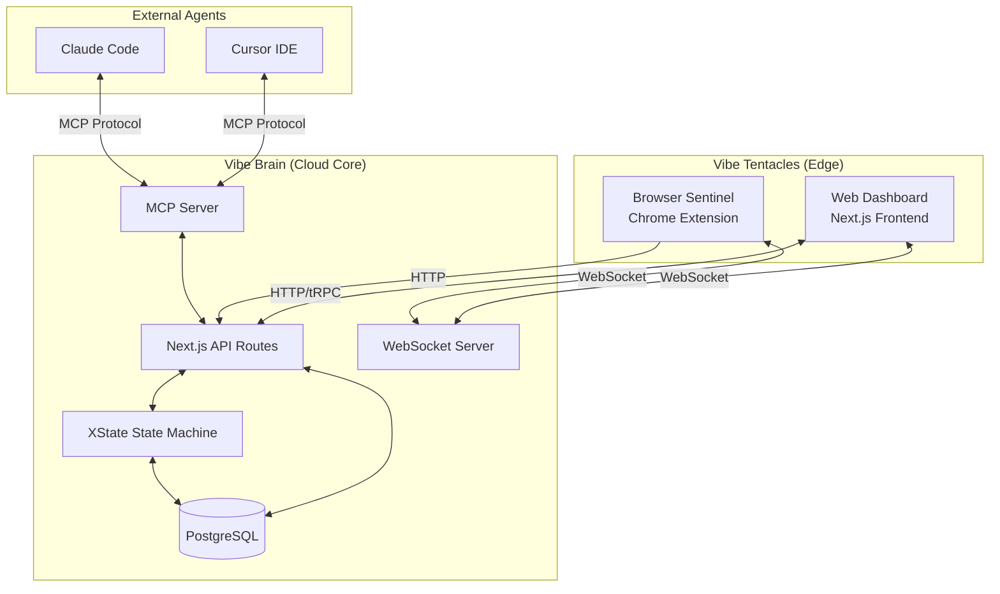
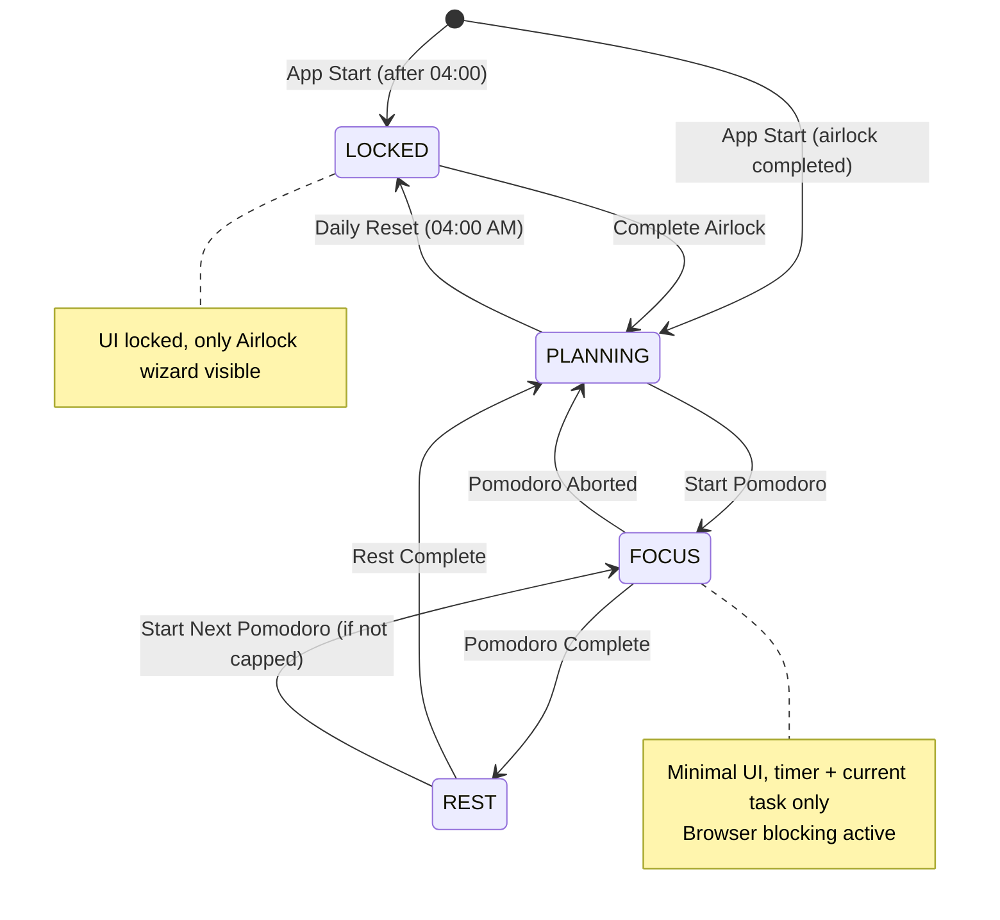

# Design Document: VibeFlow Foundation

## Overview

VibeFlow 是一个 AI 原生的产出引擎，采用"章鱼式拓扑 (Octopus Topology)"架构。本设计文档定义 Phase 1 的技术实现方案，包括云端大脑 (Vibe Brain)、边缘触手 (Browser Sentinel) 和神经接口 (MCP Server)。

### 技术栈

- **Frontend**: Next.js 14 (App Router) + React 18 + TypeScript
- **Backend**: Next.js API Routes + tRPC
- **Database**: PostgreSQL + Prisma ORM
- **State Management**: XState v5 (状态机) + Zustand (客户端状态)
- **Real-time**: WebSocket (Socket.io)
- **Browser Extension**: Chrome Extension Manifest V3
- **MCP Server**: @modelcontextprotocol/sdk
- **Authentication**: NextAuth.js
- **Styling**: Tailwind CSS + shadcn/ui

## Architecture

### 系统拓扑图



### 状态机设计 (XState)



## Components and Interfaces

### 1. Core Domain Services

#### 1.0 UserService (开发模式)

```typescript
interface UserService {
  // 开发阶段：通过 email 获取或创建用户，无需密码验证
  getOrCreateDevUser(email: string): Promise<User>;
  
  // 获取当前用户 (从 context 或 header 中提取)
  getCurrentUser(ctx: Context): Promise<User>;
  
  // 获取用户设置
  getSettings(userId: string): Promise<UserSettings>;
  
  // 更新用户设置
  updateSettings(userId: string, data: UpdateSettingsInput): Promise<UserSettings>;
}

// 开发模式配置
interface DevModeConfig {
  enabled: boolean;           // 是否启用开发模式
  defaultUserEmail: string;   // 默认用户 email
  skipAuth: boolean;          // 跳过认证检查
}

// Context 中的用户信息
interface UserContext {
  userId: string;
  email: string;
  isDevMode: boolean;
}
```

**开发模式行为：**
- 所有 API 请求通过 `X-Dev-User-Email` header 或默认用户获取 userId
- 数据查询自动添加 `userId` 过滤条件
- 无需登录即可访问系统
- 生产环境切换时只需启用真正的认证中间件

#### 1.1 ProjectService

```typescript
interface ProjectService {
  create(data: CreateProjectInput): Promise<Project>;
  update(id: string, data: UpdateProjectInput): Promise<Project>;
  archive(id: string): Promise<Project>;
  getByUser(userId: string): Promise<Project[]>;
  getById(id: string): Promise<Project | null>;
}

interface CreateProjectInput {
  title: string;
  deliverable: string;
  goalIds?: string[];  // 关联的目标
}
```

#### 1.2 TaskService

```typescript
interface TaskService {
  create(data: CreateTaskInput): Promise<Task>;
  update(id: string, data: UpdateTaskInput): Promise<Task>;
  updateStatus(id: string, status: TaskStatus): Promise<Task>;
  reorder(taskId: string, newIndex: number): Promise<void>;
  getByProject(projectId: string): Promise<Task[]>;
  getTodayTasks(userId: string): Promise<Task[]>;
  getBacklog(userId: string): Promise<Task[]>;
}

interface CreateTaskInput {
  title: string;
  projectId: string;
  parentId?: string;
  priority: 'P1' | 'P2' | 'P3';
  planDate?: Date;
}
```

#### 1.3 PomodoroService

```typescript
interface PomodoroService {
  start(taskId: string, duration?: number): Promise<Pomodoro>;
  complete(id: string): Promise<Pomodoro>;
  abort(id: string): Promise<Pomodoro>;
  interrupt(id: string, reason: string): Promise<Pomodoro>;
  getTodayCount(userId: string): Promise<number>;
  getByTask(taskId: string): Promise<Pomodoro[]>;
}
```

#### 1.4 GoalService

```typescript
interface GoalService {
  create(data: CreateGoalInput): Promise<Goal>;
  update(id: string, data: UpdateGoalInput): Promise<Goal>;
  archive(id: string): Promise<Goal>;
  getByUser(userId: string): Promise<Goal[]>;
  getProgress(id: string): Promise<GoalProgress>;
}

interface CreateGoalInput {
  title: string;
  description: string;
  type: 'LONG_TERM' | 'SHORT_TERM';
  targetDate: Date;
}

interface GoalProgress {
  goalId: string;
  linkedProjects: number;
  completedProjects: number;
  percentage: number;
}
```

### 2. State Machine (XState)

#### 2.1 VibeFlowMachine

```typescript
import { createMachine, assign } from 'xstate';

interface VibeFlowContext {
  userId: string;
  currentTaskId: string | null;
  currentPomodoroId: string | null;
  todayPomodoroCount: number;
  dailyCap: number;
  top3TaskIds: string[];
  airlockStep: 'REVIEW' | 'PLAN' | 'COMMIT' | null;
}

type VibeFlowEvent =
  | { type: 'COMPLETE_AIRLOCK'; top3TaskIds: string[] }
  | { type: 'START_POMODORO'; taskId: string }
  | { type: 'COMPLETE_POMODORO' }
  | { type: 'ABORT_POMODORO' }
  | { type: 'COMPLETE_REST' }
  | { type: 'DAILY_RESET' }
  | { type: 'OVERRIDE_CAP' };

const vibeFlowMachine = createMachine({
  id: 'vibeflow',
  initial: 'locked',
  context: {
    userId: '',
    currentTaskId: null,
    currentPomodoroId: null,
    todayPomodoroCount: 0,
    dailyCap: 8,
    top3TaskIds: [],
    airlockStep: 'REVIEW',
  },
  states: {
    locked: {
      on: {
        COMPLETE_AIRLOCK: {
          target: 'planning',
          actions: assign({
            top3TaskIds: ({ event }) => event.top3TaskIds,
            airlockStep: null,
          }),
        },
      },
    },
    planning: {
      on: {
        START_POMODORO: {
          target: 'focus',
          guard: 'canStartPomodoro',
          actions: assign({
            currentTaskId: ({ event }) => event.taskId,
          }),
        },
        DAILY_RESET: 'locked',
      },
    },
    focus: {
      on: {
        COMPLETE_POMODORO: {
          target: 'rest',
          actions: assign({
            todayPomodoroCount: ({ context }) => context.todayPomodoroCount + 1,
          }),
        },
        ABORT_POMODORO: {
          target: 'planning',
          actions: assign({
            currentTaskId: null,
            currentPomodoroId: null,
          }),
        },
      },
    },
    rest: {
      on: {
        COMPLETE_REST: [
          {
            target: 'planning',
            guard: 'isDailyCapped',
          },
          {
            target: 'planning',
          },
        ],
        OVERRIDE_CAP: 'planning',
      },
    },
  },
});
```

### 3. Browser Sentinel (Chrome Extension)

#### 3.1 Extension Architecture

```
vibeflow-extension/
├── manifest.json          # Manifest V3
├── background/
│   └── service-worker.ts  # Background service worker
├── content/
│   └── overlay.ts         # DOM injection for overlays
├── popup/
│   └── index.html         # Extension popup UI
└── lib/
    ├── policy-cache.ts    # Local policy storage
    ├── websocket.ts       # Server connection
    └── activity-tracker.ts # URL/duration tracking
```

#### 3.2 Policy Cache Interface

```typescript
interface PolicyCache {
  globalState: SystemState;
  blacklist: string[];
  whitelist: string[];
  sessionWhitelist: string[];  // 临时白名单
  lastSync: number;
}

interface PolicyManager {
  getPolicy(): Promise<PolicyCache>;
  updatePolicy(policy: Partial<PolicyCache>): Promise<void>;
  shouldBlock(url: string): boolean;
  addSessionWhitelist(url: string): void;
}
```

#### 3.3 Activity Tracker

```typescript
interface ActivityLog {
  url: string;
  title: string;
  startTime: number;
  duration: number;
  category: 'productive' | 'neutral' | 'distracting';
}

interface ActivityTracker {
  startTracking(tabId: number): void;
  stopTracking(tabId: number): ActivityLog;
  syncToServer(): Promise<void>;
}
```

### 4. MCP Server Interface

#### 4.1 MCP Server Setup

```typescript
import { Server } from '@modelcontextprotocol/sdk/server/index.js';
import { StdioServerTransport } from '@modelcontextprotocol/sdk/server/stdio.js';

const server = new Server(
  { name: 'vibeflow-mcp', version: '1.0.0' },
  { capabilities: { resources: {}, tools: {} } }
);
```

#### 4.2 Resources Definition

```typescript
// vibe://context/current
interface CurrentContext {
  project: {
    id: string;
    title: string;
    deliverable: string;
  } | null;
  task: {
    id: string;
    title: string;
    priority: string;
    parentPath: string[];  // 父任务链
  } | null;
  systemState: SystemState;
  pomodoroRemaining: number | null;  // 剩余秒数
}

// vibe://user/goals
interface UserGoals {
  longTerm: Goal[];
  shortTerm: Goal[];
}

// vibe://user/principles
interface UserPrinciples {
  codingStandards: string[];
  preferences: Record<string, string>;
}

// vibe://projects/active
interface ActiveProjects {
  projects: Project[];
}

// vibe://tasks/today
interface TodayTasks {
  top3: Task[];
  others: Task[];
}
```

#### 4.3 Tools Definition

```typescript
interface MCPTools {
  'vibe.complete_task': {
    input: { task_id: string; summary: string };
    output: { success: boolean; task: Task };
  };
  'vibe.add_subtask': {
    input: { parent_id: string; title: string; priority?: string };
    output: { success: boolean; task: Task };
  };
  'vibe.report_blocker': {
    input: { task_id: string; error_log: string };
    output: { success: boolean; blocker_id: string };
  };
  'vibe.start_pomodoro': {
    input: { task_id: string; duration?: number };
    output: { success: boolean; pomodoro: Pomodoro };
  };
  'vibe.get_task_context': {
    input: { task_id: string };
    output: { task: Task; project: Project; relatedDocs: string[] };
  };
}
```

### 5. WebSocket Protocol

#### 5.1 Message Types

```typescript
// Server -> Client
type ServerMessage =
  | { type: 'SYNC_POLICY'; payload: PolicyCache }
  | { type: 'STATE_CHANGE'; payload: { state: SystemState } }
  | { type: 'EXECUTE'; payload: ExecuteCommand };

type ExecuteCommand =
  | { action: 'INJECT_TOAST'; params: { msg: string; type: 'info' | 'warning' } }
  | { action: 'SHOW_OVERLAY'; params: { type: 'soft_block' | 'screensaver' } }
  | { action: 'REDIRECT'; params: { url: string } };

// Client -> Server
type ClientMessage =
  | { type: 'ACTIVITY_LOG'; payload: ActivityLog[] }
  | { type: 'URL_CHECK'; payload: { url: string } }
  | { type: 'USER_RESPONSE'; payload: { questionId: string; response: boolean } };
```

## Data Models

### Prisma Schema

```prisma
// schema.prisma

generator client {
  provider = "prisma-client-js"
}

datasource db {
  provider = "postgresql"
  url      = env("DATABASE_URL")
}

model User {
  id        String   @id @default(uuid())
  email     String   @unique
  password  String   // hashed
  createdAt DateTime @default(now())
  updatedAt DateTime @updatedAt
  
  projects    Project[]
  tasks       Task[]
  pomodoros   Pomodoro[]
  goals       Goal[]
  activityLogs ActivityLog[]
  settings    UserSettings?
}

model UserSettings {
  id                  String   @id @default(uuid())
  userId              String   @unique
  user                User     @relation(fields: [userId], references: [id])
  
  // Timer settings
  pomodoroDuration    Int      @default(25)  // minutes
  shortRestDuration   Int      @default(5)
  longRestDuration    Int      @default(15)
  longRestInterval    Int      @default(4)   // after N pomodoros
  dailyCap            Int      @default(8)   // max pomodoros per day
  
  // Browser settings
  blacklist           String[] @default([])
  whitelist           String[] @default([])
  
  // Principles
  codingStandards     String[] @default([])
  preferences         Json     @default("{}")
  
  createdAt           DateTime @default(now())
  updatedAt           DateTime @updatedAt
}

model Goal {
  id          String     @id @default(uuid())
  title       String
  description String
  type        GoalType
  targetDate  DateTime
  status      GoalStatus @default(ACTIVE)
  
  userId      String
  user        User       @relation(fields: [userId], references: [id])
  projects    ProjectGoal[]
  
  createdAt   DateTime   @default(now())
  updatedAt   DateTime   @updatedAt
}

enum GoalType {
  LONG_TERM
  SHORT_TERM
}

enum GoalStatus {
  ACTIVE
  COMPLETED
  ARCHIVED
}

model Project {
  id          String        @id @default(uuid())
  title       String
  deliverable String
  status      ProjectStatus @default(ACTIVE)
  
  userId      String
  user        User          @relation(fields: [userId], references: [id])
  tasks       Task[]
  goals       ProjectGoal[]
  
  createdAt   DateTime      @default(now())
  updatedAt   DateTime      @updatedAt
}

model ProjectGoal {
  id        String  @id @default(uuid())
  projectId String
  goalId    String
  project   Project @relation(fields: [projectId], references: [id])
  goal      Goal    @relation(fields: [goalId], references: [id])
  
  @@unique([projectId, goalId])
}

enum ProjectStatus {
  ACTIVE
  COMPLETED
  ARCHIVED
}

model Task {
  id          String     @id @default(uuid())
  title       String
  status      TaskStatus @default(TODO)
  priority    Priority   @default(P2)
  planDate    DateTime?
  sortOrder   Int        @default(0)
  
  projectId   String
  project     Project    @relation(fields: [projectId], references: [id])
  
  parentId    String?
  parent      Task?      @relation("SubTasks", fields: [parentId], references: [id])
  subTasks    Task[]     @relation("SubTasks")
  
  userId      String
  user        User       @relation(fields: [userId], references: [id])
  pomodoros   Pomodoro[]
  
  createdAt   DateTime   @default(now())
  updatedAt   DateTime   @updatedAt
}

enum TaskStatus {
  TODO
  IN_PROGRESS
  DONE
}

enum Priority {
  P1
  P2
  P3
}

model Pomodoro {
  id        String         @id @default(uuid())
  duration  Int            // planned duration in minutes
  startTime DateTime       @default(now())
  endTime   DateTime?
  status    PomodoroStatus @default(IN_PROGRESS)
  summary   String?        // completion summary
  
  taskId    String
  task      Task           @relation(fields: [taskId], references: [id])
  
  userId    String
  user      User           @relation(fields: [userId], references: [id])
  
  createdAt DateTime       @default(now())
}

enum PomodoroStatus {
  IN_PROGRESS
  COMPLETED
  ABORTED
  INTERRUPTED
}

model ActivityLog {
  id        String   @id @default(uuid())
  url       String
  title     String?
  duration  Int      // seconds
  category  String   // productive, neutral, distracting
  source    String   // chrome_ext, desktop_ghost
  
  userId    String
  user      User     @relation(fields: [userId], references: [id])
  
  timestamp DateTime @default(now())
}

model DailyState {
  id              String   @id @default(uuid())
  userId          String
  date            DateTime @db.Date
  systemState     String   // LOCKED, PLANNING, FOCUS, REST
  top3TaskIds     String[]
  pomodoroCount   Int      @default(0)
  capOverrideCount Int     @default(0)
  airlockCompleted Boolean @default(false)
  
  @@unique([userId, date])
}
```


## Correctness Properties

*A property is a characteristic or behavior that should hold true across all valid executions of a system—essentially, a formal statement about what the system should do. Properties serve as the bridge between human-readable specifications and machine-verifiable correctness guarantees.*


### Property 1: Project Round-Trip Consistency

*For any* valid Project with title and deliverable, creating it and then retrieving it by ID SHALL return an equivalent Project with the same title, deliverable, and ACTIVE status.

**Validates: Requirements 1.1, 1.2, 1.4**

### Property 2: Task-Project Binding Enforcement

*For any* Task creation attempt, if projectId is missing or references a non-existent Project, the creation SHALL be rejected with an error.

**Validates: Requirements 2.1, 2.2**

### Property 3: Task Hierarchy Invariant

*For any* Task with sub-tasks, the tree structure SHALL maintain:
- All sub-tasks reference the same projectId as their ancestors
- No circular references exist in the parent chain
- Depth-first traversal visits all descendants exactly once

**Validates: Requirements 2.3, 2.4**

### Property 4: Task Reorder Preservation

*For any* list of Tasks within a Project, after reordering operation:
- The total count of Tasks remains unchanged
- All original Task IDs are still present
- sortOrder values form a valid sequence

**Validates: Requirements 2.6**

### Property 5: State Machine Valid Transitions

*For any* sequence of events, the System_State SHALL only transition through valid paths:
- LOCKED → PLANNING (via COMPLETE_AIRLOCK)
- PLANNING → FOCUS (via START_POMODORO)
- FOCUS → REST (via COMPLETE_POMODORO)
- FOCUS → PLANNING (via ABORT_POMODORO)
- REST → PLANNING (via COMPLETE_REST)
- Any state → LOCKED (via DAILY_RESET)

**Validates: Requirements 3.2, 5.1, 5.2**

### Property 6: State Machine Action Guards

*For any* System_State:
- LOCKED state SHALL reject all actions except COMPLETE_AIRLOCK
- PLANNING state SHALL reject COMPLETE_POMODORO and COMPLETE_REST
- FOCUS state SHALL reject START_POMODORO and COMPLETE_AIRLOCK
- REST state SHALL reject START_POMODORO until rest completes

**Validates: Requirements 3.10, 5.3, 5.4, 5.5, 5.6**

### Property 7: Pomodoro Lifecycle Consistency

*For any* Pomodoro:
- startTime is always set on creation
- endTime is null while IN_PROGRESS, set otherwise
- status transitions: IN_PROGRESS → {COMPLETED, ABORTED, INTERRUPTED}
- duration is always >= configured minimum (10 minutes)

**Validates: Requirements 4.1, 4.3, 4.6, 4.8, 4.9**

### Property 8: URL Policy Matching Correctness

*For any* URL and policy configuration (blacklist, whitelist):
- If URL matches whitelist pattern, shouldBlock returns false
- If URL matches blacklist pattern and not whitelist, shouldBlock returns true
- If URL matches neither, shouldBlock returns 'soft_block' for intervention
- Pattern matching is case-insensitive and supports wildcards

**Validates: Requirements 6.4, 13.1, 13.2, 13.3, 13.4, 13.5**

### Property 9: Daily Cap Enforcement

*For any* day with dailyCap = N:
- After N completed Pomodoros, canStartPomodoro returns false
- pomodoroCount never exceeds N without explicit override
- Override increments capOverrideCount

**Validates: Requirements 12.1, 12.2, 12.3, 12.4**

### Property 10: Goal-Project Relationship Integrity

*For any* Project linked to Goals:
- All linked goalIds reference existing Goals owned by the same User
- Archiving a Goal does not delete linked Projects
- Goal progress percentage = (completed linked projects / total linked projects) * 100

**Validates: Requirements 11.4, 11.5, 11.9**

### Property 11: Timer Configuration Bounds

*For any* timer configuration:
- pomodoroDuration >= 10 minutes
- shortRestDuration >= 2 minutes
- longRestDuration >= shortRestDuration
- longRestInterval >= 1

**Validates: Requirements 14.1, 14.2, 14.3, 14.5**

### Property 12: MCP Resource Schema Consistency

*For any* MCP resource request:
- Response SHALL be valid JSON matching the defined schema
- `vibe://context/current` returns CurrentContext schema
- `vibe://user/goals` returns UserGoals schema
- `vibe://tasks/today` returns TodayTasks schema

**Validates: Requirements 9.3, 9.4, 10.1, 10.3**

### Property 13: MCP Tool Execution Correctness

*For any* MCP tool invocation:
- `vibe.complete_task(id, summary)` marks task as DONE and stores summary
- `vibe.add_subtask(parent_id, title)` creates task with correct parentId
- Invalid parameters return structured error response
- Successful execution returns success: true with affected entity

**Validates: Requirements 9.5, 9.6, 9.9, 10.2, 10.4**

### Property 14: Project Archive Cascade

*For any* Project with associated Tasks, archiving the Project SHALL:
- Set Project status to ARCHIVED
- Set all associated Tasks to archived state
- Preserve Task data for historical reference

**Validates: Requirements 1.5**

### Property 15: Morning Airlock Completion Invariant

*For any* successful Morning Airlock completion:
- Exactly 3 Tasks are selected as Top_3_Tasks
- All selected Tasks have planDate set to today
- System_State transitions from LOCKED to PLANNING
- airlockCompleted flag is set to true for the day

**Validates: Requirements 3.8, 3.9**

## Error Handling

### Error Categories

| Category | HTTP Status | Error Code | Description |
|----------|-------------|------------|-------------|
| Validation | 400 | VALIDATION_ERROR | Invalid input data |
| Authentication | 401 | AUTH_ERROR | Invalid or missing credentials |
| Authorization | 403 | FORBIDDEN | Action not allowed in current state |
| Not Found | 404 | NOT_FOUND | Resource does not exist |
| Conflict | 409 | CONFLICT | State conflict (e.g., duplicate) |
| Server | 500 | INTERNAL_ERROR | Unexpected server error |

### Error Response Schema

```typescript
interface ErrorResponse {
  success: false;
  error: {
    code: string;
    message: string;
    details?: Record<string, string[]>;  // field-level errors
  };
}
```

### State Machine Error Handling

```typescript
// Invalid transition attempts
const handleInvalidTransition = (currentState: SystemState, event: string) => {
  return {
    code: 'INVALID_TRANSITION',
    message: `Cannot perform ${event} while in ${currentState} state`,
    allowedEvents: getAllowedEvents(currentState),
  };
};
```

### Database Error Handling

```typescript
// Retry logic for transient failures
const withRetry = async <T>(
  operation: () => Promise<T>,
  maxRetries: number = 3
): Promise<T> => {
  for (let attempt = 1; attempt <= maxRetries; attempt++) {
    try {
      return await operation();
    } catch (error) {
      if (attempt === maxRetries || !isTransientError(error)) {
        throw error;
      }
      await delay(Math.pow(2, attempt) * 100);  // exponential backoff
    }
  }
  throw new Error('Max retries exceeded');
};
```

## Testing Strategy

### Testing Approach

本项目采用双重测试策略：
1. **Unit Tests**: 验证具体示例和边界情况
2. **Property-Based Tests**: 验证所有输入的通用属性

### Property-Based Testing Framework

- **Framework**: fast-check (TypeScript)
- **Minimum iterations**: 100 per property
- **Shrinking**: Enabled for minimal failing examples

### Test Structure

```
tests/
├── unit/
│   ├── services/
│   │   ├── project.test.ts
│   │   ├── task.test.ts
│   │   ├── pomodoro.test.ts
│   │   └── goal.test.ts
│   ├── state-machine/
│   │   └── vibeflow-machine.test.ts
│   └── mcp/
│       ├── resources.test.ts
│       └── tools.test.ts
├── property/
│   ├── project.property.ts
│   ├── task.property.ts
│   ├── state-machine.property.ts
│   ├── url-policy.property.ts
│   ├── daily-cap.property.ts
│   └── mcp.property.ts
└── integration/
    ├── airlock-flow.test.ts
    ├── pomodoro-flow.test.ts
    └── mcp-integration.test.ts
```

### Property Test Example

```typescript
import fc from 'fast-check';
import { describe, it, expect } from 'vitest';

describe('Property 2: Task-Project Binding Enforcement', () => {
  // Feature: vibeflow-foundation, Property 2: Task-Project Binding Enforcement
  // Validates: Requirements 2.1, 2.2
  it('should reject task creation without valid projectId', () => {
    fc.assert(
      fc.property(
        fc.record({
          title: fc.string({ minLength: 1 }),
          projectId: fc.oneof(
            fc.constant(undefined),
            fc.constant(null),
            fc.constant(''),
            fc.uuid()  // non-existent project
          ),
          priority: fc.constantFrom('P1', 'P2', 'P3'),
        }),
        async (input) => {
          const result = await taskService.create(input);
          expect(result.success).toBe(false);
          expect(result.error.code).toBe('VALIDATION_ERROR');
        }
      ),
      { numRuns: 100 }
    );
  });
});
```

### Unit Test Coverage Requirements

- Services: 90% line coverage
- State Machine: 100% transition coverage
- MCP Handlers: 100% endpoint coverage
- Validators: 100% branch coverage

### Integration Test Scenarios

1. **Complete Airlock Flow**: LOCKED → Review → Plan → Commit → PLANNING
2. **Pomodoro Cycle**: PLANNING → Start → FOCUS → Complete → REST → PLANNING
3. **MCP Context Sync**: External agent reads context during active Pomodoro
4. **Browser Blocking**: URL navigation during FOCUS triggers appropriate response
